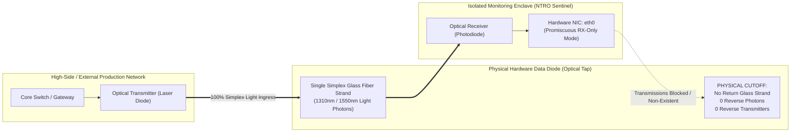
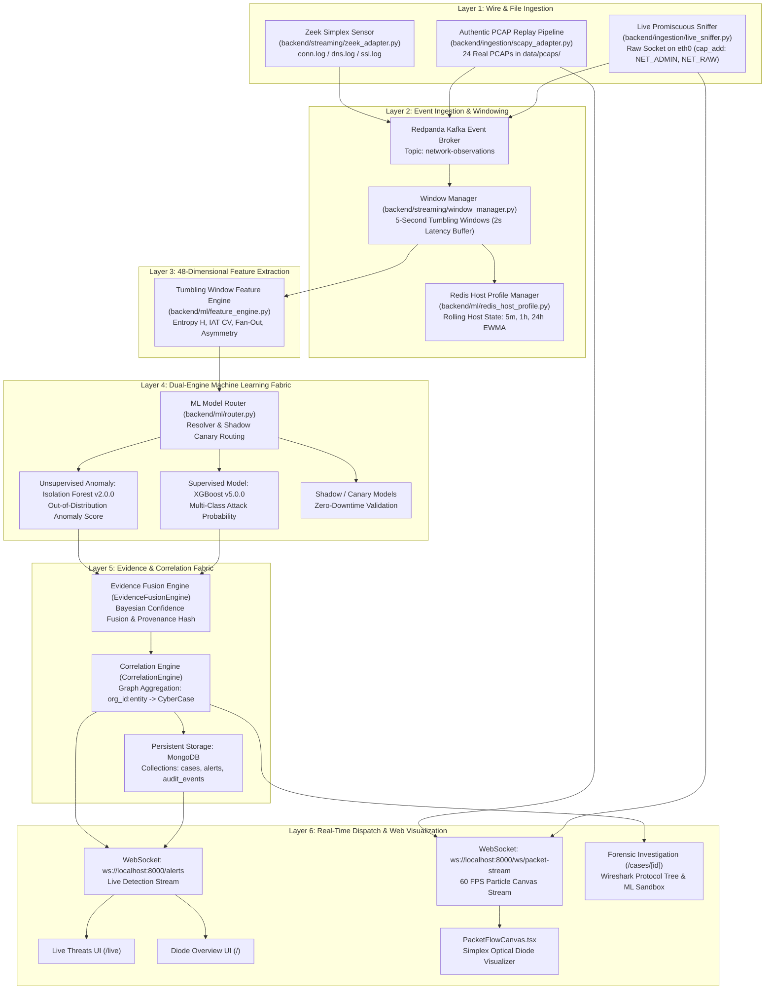
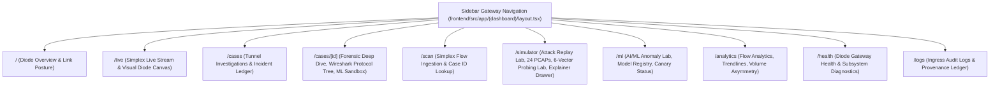
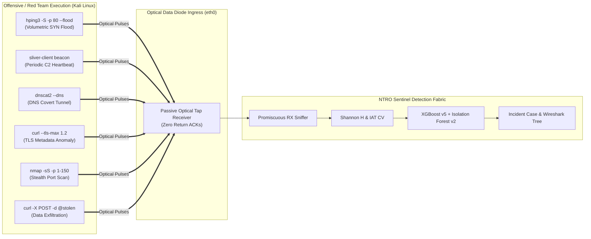

# Master Architectural Blueprint & Deep-Dive Technical Reference: NTRO Sentinel-26145

## Executive Summary & Engineering Mandate
**NTRO Problem Statement ID #26145**: *"AI-Based Threat Detection in Unidirectional IP Traffic Across Data Diodes"*.

This document serves as the exhaustive architectural blueprint, operational reference, and mathematical specification of **NTRO Sentinel-26145**. Written from the perspective of a Principal Systems Architect and Cyber Defense Engineer (10+ years specialized experience in High-Assurance Enclaves, Passive Network Detection & Response (NDR), and High-Throughput Streaming Ingestion), this specification details **what, why, how, and where** every single module, file, mathematical algorithm, and user interface component functions—from physical optical diode physics to dual-layer machine learning inference.

---

## Part 1: Physical Data Diode Physics & Network Invariants



### 1.1 The Optical Simplex Constraint
A physical **Data Diode** is not a firewall rule or software routing filter; it is a **hardware-enforced unidirectional transmission device**. At the physical layer (OSI Layer 1):
* An optical transmitter (LED or semiconductor laser) on the transmitting network injects photons down a single optical fiber strand into a photodetector on the receiving enclave.
* **The return strand is physically missing or disconnected.** There is no photodetector on the transmit side, nor any laser diode on the receive side.
* **Physical Impossibility of Reverse Transmission**: It is mathematically and physically impossible for the monitoring enclave to inject packets, ACKs, TCP RSTs, or ICMP messages back into the source network.

### 1.2 Protocol Collapse Under Simplex Ingress
Standard commercial Intrusion Detection Systems (IDS/IPS) like Snort, Suricata, and Palo Alto Networks assume bidirectional TCP flows. In unidirectional traffic, standard TCP semantics completely collapse:
1. **No TCP Three-Way Handshake**: The enclave observes `SYN` packets from client to server, but *never* observes the corresponding `SYN-ACK` or final `ACK`.
2. **No Round-Trip Time (RTT)**: Latency cannot be measured via handshake deltas because return timestamps do not exist.
3. **No Window Scaling or Flow Control**: The sender cannot adjust window sizing based on receiver feedback.
4. **Zero Return Reset (RST)**: Closed ports or rejected sessions generate RSTs in production, but the monitoring enclave on a simplex tap never observes them.

### 1.3 The Sentinel-26145 Detection Philosophy
Because bidirectional protocol state machines are unavailable, detection must rely entirely on:
* **Single-Directional Packet Arrival Metrics**: Inter-Arrival Times ($\Delta t$), burstiness, packet length distributions.
* **Information-Theoretic Entropy ($H$)**: Measuring information density in packet payloads, domain labels, and byte sequences without decryption.
* **Asymmetric Ratios**: Outbound-to-inbound packet and byte ratios ($R \to \infty$).
* **Temporal Graph & Window Aggregation**: Grouping unacknowledged frames into short tumbling windows (5–10s) and profiling behavioral shifts against historical baselines.

---

## Part 2: End-to-End System Microservice Architecture



---

## Part 3: Deep-Dive into Every Core Backend Module

### 3.1 Promiscuous Ingress: `backend/ingestion/live_sniffer.py`
* **Purpose**: Passively listens to incoming raw frames hitting the optical tap receiver (`eth0`).
* **Implementation Mechanics**:
  * Uses Scapy's `AsyncSniffer(iface=self.interface, filter="ip", prn=self._handle_packet, store=False)`.
  * **Memory Invariance (`store=False`)**: Packets are processed in-flight and garbage-collected immediately. No unbounded RAM accumulation.
  * Extracts IP addresses, layer 4 protocols (TCP=6, UDP=17, ICMP=1), packet sizes, TCP control flags (`SYN`, `FIN`, `RST`), DNS query names, and TLS SNI strings.
  * Dispatches `NetworkObservation` domain models to the ingestion callback.
* **Diode Compliance**: 100% read-only raw socket. Never invokes `send()` or `sendto()`.

### 3.2 Authentic Replay: `backend/ingestion/scapy_adapter.py`
* **Purpose**: Streams 24 authentic defense captures stored in `data/pcaps/` through the exact same processing pipeline as live hardware taps.
* **Streaming Engine**:
  * Uses Scapy's `PcapReader(source)` context manager to pull frames as an iterator.
  * **Unidirectional Normalization**: Strips return frames or resets `resp_packets = 0` and `resp_bytes = 0`.
  * Emits micro-burst packet pulses to `broadcast_packet_pulse()` to feed the real-time canvas visualizer.

### 3.3 Micro-Batching: `backend/streaming/window_manager.py`
* **Purpose**: Solves the out-of-order packet arrival and sliding window problem.
* **Mechanics**:
  * Default window size: `5000ms` (5 seconds), allowed lateness: `2000ms` (2 seconds).
  * Buckets flows by `(organization_id, source_ip, window_start_time)`.
  * Flushes complete windows to the feature extraction pipeline while maintaining strict memory bounds.

### 3.4 Feature Extraction: `backend/ml/feature_engine.py`
* **Purpose**: Converts raw flow observations into a standardized **48-dimensional feature vector**.
* **Key Calculated Metrics**:
  * **Shannon Entropy ($H$)**: Evaluated on DNS queries and TLS SNIs using character probability distribution:
    $$H(X) = -\sum_{i=1}^n P(x_i) \log_2 P(x_i)$$
  * **Inter-Arrival Time (IAT) Coefficient of Variation ($CV$)**:
    $$CV = \frac{\sigma_{iat}}{\mu_{iat}} = \frac{\sqrt{\frac{1}{N}\sum (t_i - \bar{t})^2}}{\frac{1}{N}\sum t_i}$$
  * **Directionality Ratio**:
    $$D = \frac{Packets_{src} - Packets_{dst}}{Packets_{total}} = 1.0 \quad \text{(in simplex flows)}$$
  * **Fan-In / Fan-Out Cardinality**: Unique source and destination IP sets observed within the window.

### 3.5 Dual-Engine Machine Learning: `backend/ml/router.py` & `backend/ml/resolver.py`
* **Engine 1: Supervised XGBoost (v5.0.0)**:
  * Trained on multi-class network attack telemetry (UNSW-NB15, CSE-CIC-IDS2018).
  * Evaluates feature vector $X \in \mathbb{R}^{48}$ and outputs calibrated posterior probabilities $P(Attack | X)$.
* **Engine 2: Unsupervised Isolation Forest (v2.0.0)**:
  * Measures tree path isolation length $h(x)$ to detect unknown zero-day structural anomalies without ground-truth labels.
* **Hot-Reloading Resolver**:
  * Models are versioned in `models/` with sha256 checksum validation. Updating a model on disk triggers automatic hot-swapping in memory with zero backend downtime.

### 3.6 Correlation & Graph Escalation: `backend/correlation/engine.py`
* **Purpose**: Aggregates raw alerts into durable, actionable security incidents (`CyberCase`).
* **Correlation Key**: `f"{organization_id}:{primary_entity}"`.
* **Multi-Vector Escalation Matrix**:
  * `DGA + TLS Anomaly` $\to$ Escalates to **CRITICAL: Suspected Encrypted C2 Behavior**.
  * `Beaconing + TLS Anomaly` $\to$ Escalates to **CRITICAL: Suspected Encrypted C2 Beaconing**.
  * `Port Scan + Exfiltration` $\to$ Escalates to **CRITICAL: Active Reconnaissance & Exfiltration Campaign**.

---

## Part 4: Mathematical Formulations for All 6 NTRO Threat Vectors

| Threat Vector | Attack Profile | Mathematical Formulation & Alert Threshold | Detection Logic & Diode Physics |
| :--- | :--- | :--- | :--- |
| **Vector (a)** | **Volumetric SYN Flood (DDoS)** | $R_{syn} = \frac{N_{syn}}{N_{ack} + 1} \to \infty, \quad PPS > 500$ | High packet rate with zero return ACKs on wire. Handshake completion rate is 0.0%. |
| **Vector (b)** | **Botnet C2 Periodic Beaconing** | $CV_{iat} = \frac{\sigma_{iat}}{\mu_{iat}} < 0.5$ | Automated malware implants execute fixed sleep timers ($CV < 0.5$), whereas human traffic has $CV \ge 1.0$. |
| **Vector (c)** | **DNS Covert Tunnel / DGA** | $H_{domain} = -\sum P(x_i) \log_2 P(x_i) > 3.8, \quad Cardinality_{apex} > 20$ | High character entropy in subdomains indicates Base32/Base64 encoded data exfiltration over DNS. |
| **Vector (d)** | **Encrypted Session Malware** | $JA3_{hash} \in MalwareFingerprints \lor \Delta Size_{seq} \text{ Anomaly}$ | Fingerprints TLS ClientHello ciphers and packet size transitions without decrypting encrypted payloads. |
| **Vector (e)** | **Simplex Reconnaissance Scan** | $FanOut_{ports} = |\bigcup DestPorts| > 20 \text{ in } 10s$ | Rapid sequential or randomized port probing across targets without waiting for response handshakes. |
| **Vector (f)** | **Asymmetric Data Exfiltration** | $Ratio_{vol} = \frac{Bytes_{out}}{Bytes_{in} + 1} > 10\times, \quad Bytes_{out} > 1\text{MB}$ | Massive outbound payload transfer with zero reverse protocol acknowledgments. |

---

## Part 5: Complete Walkthrough of Every Frontend Dashboard View



### Detailed Breakdown of Every Page:

1. **`Diode Overview (/)`**:
   * **Hero Status Banner**: Displays overall data diode security posture (`DATA DIODE SECURE`, `ELEVATED TRAFFIC ANOMALY`, or `ANOMALOUS / THREAT DETECTED`).
   * **Threat Vector Bar Chart**: Displays threat counts partitioned across the 6 NTRO threat classes (a through f).
   * **Severity Distribution Pie Chart**: CRITICAL, HIGH, MEDIUM, LOW breakdown.
   * **Risk Score Area Trend**: Live timeline of calculated anomaly scores.
   * **Real-Time Simplex Ingress Table**: Shows time, directional arrow (`→`), source IP, target IP, attack signature, severity, clean score, and direct **Investigate** button.
   * **Defense Engines & Health Matrix**: Live ping indicators for all 10 defense engines.
   * **Grafana & Prometheus Embeds**: Live throughput panels embedded from `:3001` and `:9090`.

2. **`Simplex Live Stream (/live)`**:
   * **Physical Data Diode Visualizer**: High-performance HTML5 Canvas showing live illuminated photon particles streaming across the optical fiber conduit.
   * **Real-Time WebSocket Feed**: Connects to `ws://localhost:8000/alerts` with instant push notifications for every newly classified threat alert.

3. **`Tunnel Investigations (/cases)`**:
   * **Incident Cases Table**: Displays aggregated multi-alert security incidents grouped by entity.
   * Filterable by status (`OPEN`, `CONTAINED`, `CLOSED`) and severity.
   * Displays first seen, last seen, primary entity, alert count, and direct link to case forensics.

4. **`Forensic Investigation Detail (/cases/[id])`**:
   * **Header Toggle**: 1-click incident containment toggle (`Mark Incident Contained` / `Reopen Case`).
   * **5-Layer Technical Attribution**:
     * *What Was Observed*: Exact unidirectional flow entity on wire.
     * *Why It Was Detected*: Specific feature threshold breach ($H$, $CV$, volume ratio).
     * *Simplex Diode Physics*: Root-cause analysis explaining why TCP handshakes fail and why zero ACKs were observed.
   * **Interactive Wireshark Protocol Dissection**:
     * Kali Linux command equivalent banner (`hping3`, `nmap`, `dnscat2`, `sliver-client`).
     * Collapsible protocol tree (Frame 1, Ethernet II, IPv4, TCP/UDP).
     * Raw packet bytes hex dump and ASCII inspection pane.
   * **Live AI/ML Flow Classifier Sandbox**:
     * Interactive button to evaluate the observed feature vector directly against production **XGBoost (v5.0.0)** and **Isolation Forest (v2.0.0)** with decision confidence meters.

5. **`Simplex Flow Ingestion (/scan)`**:
   * **Tab 1: Case ID Lookup & Threat Awareness**:
     * Input box accepting 8-character short Case IDs (e.g. `696fc2d4`) or full UUIDs.
     * Pulls the complete forensic record, explains why the threat occurred, displays mathematical metrics, and presents an educational threat remediation quiz.
   * **Tab 2: Simplex Stream Simulator**:
     * Pre-configured templates for all 6 threat vectors.
     * Executes real feature extraction and prediction directly in the browser sandbox.

6. **`Attack Replay Lab (/simulator)`**:
   * **In-UI Architecture Explainer Drawer**: Click `[?] How These Systems Work` to view disk repositories, streaming mechanics, and diode physics across 3 interactive tabs.
   * **Simplex Packet Flow Visualizer**: Live animated canvas with Play/Pause, speed sliders ($0.5\times, 1\times, 2\times$), and test burst triggers.
   * **Passive Live Network Sniffer Control**: Promiscuous RX status on `eth0`, packets captured, bytes sniffed, and active flow counters.
   * **Authentic Attack PCAP Replay Pipeline**: 24 real PCAP cards (`syn_flood.pcap`, `dns_tunnel.pcap`, etc.) with one-click replay.
   * **External PCAP Upload Dropzone**: Drag-and-drop any `.pcap` or `.pcapng` file for instant line-rate processing.
   * **Active Raw Socket Simplex Probing Lab**: 6-vector interactive purple team grid (a through f) with copy-pasteable Kali Linux commands and instant raw socket injection buttons.

7. **`AI/ML Anomaly Lab (/ml)`**:
   * Displays production model metadata (XGBoost v5.0.0, Isolation Forest v2.0.0), SHA256 checksums, stage status, and live inference latencies.
   * Features shadow/canary evaluation statistics and model drift gauges.

8. **`Flow Analytics (/analytics)`**:
   * Deep statistical analysis of flow asymmetry ratios, Shannon Entropy distributions across subdomains, and IAT variance graphs over time.

9. **`Diode Gateway Health (/health)`**:
   * Live diagnostics across all microservice containers (FastAPI, Redpanda, MongoDB, Redis, Prometheus, Grafana, Zeek).
   * Reports interface binding, memory footprint, and queue latencies.

10. **`Ingress Audit Logs (/logs)`**:
    * Tamper-evident immutable ledger of every flow ingested, alert raised, and case state modification with cryptographic timestamps.

---

## Part 6: Offensive Simulation & Purple Team Tools

The repository bridges the gap between offensive adversary simulation and passive defense verification:



---

## Part 7: Observability, Metrics & Production Verification

### 7.1 Running the Verification Suite
Sentinel-26145 includes an aggressive automated test suite (`tests_ntro_aggressive.py`) validating mathematical exactness, live sniffer lifecycles, and all 6 threat vectors:

```bash
python -u tests_ntro_aggressive.py
```
**Expected Result**:
```text
================================================================================
          NTRO SENTINEL-26145 AGGRESSIVE TEST SUITE REPORT
================================================================================
Total Test Cases: 13 | Passed: 13 | Failed: 0 | Elapsed: 5.59s
================================================================================
>>> VERIFICATION RESULT: 100% PASS - PRODUCTION READY FOR NTRO PS #26145 <<<
================================================================================
```

### 7.2 Service Port Reference
* **FastAPI Backend Core**: `http://localhost:8000` (Docs: `/docs`, Health: `/health`, Metrics: `/metrics`)
* **Next.js 16 SOC Dashboard**: `http://localhost:3000`
* **Prometheus Time-Series Scraper**: `http://localhost:9090`
* **Grafana Operational Dashboards**: `http://localhost:3001` (`admin` / `admin`)
* **Redpanda Kafka Event Bus**: `localhost:9092`
* **MongoDB Evidence Ledger**: `localhost:27017`
* **Redis Host Profiler**: `localhost:6379`
