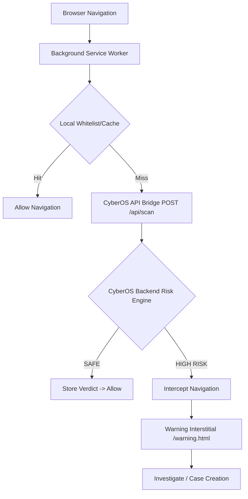

# BROWSER SHIELD ARCHITECTURE

## Core Philosophy
The extension is the **CLIENT**. CyberOS remains the **SECURITY BRAIN**. The browser does not duplicate the risk engine, graph, or full threat intelligence database. 

## Component Flow

## Progressive Analysis
1. **Phase 1 (ms)**: Local caching.
2. **Phase 2 (fast)**: API bridge to CyberOS `scan` endpoint.
3. **Phase 3 (deep)**: CyberOS fetches Threat Intel, local XGBoost evaluation, and correlates evidence.
