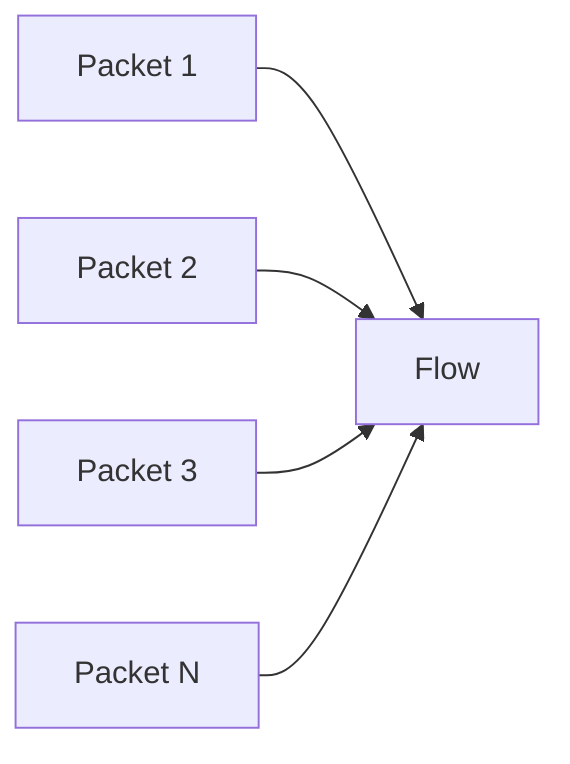

# Computer Networks from Zero

> "I know almost nothing about cybersecurity."

Welcome. To understand Network Detection and Response (NDR), we must first understand the network.

## What is a network?
A network is two or more computers connected together to share data. 

## Key Concepts

* **IP Address**: The logical address of a computer. Example: `192.168.1.5`.
* **Port**: A logical channel on a computer. Example: Port `443` is for secure web traffic (HTTPS).
* **Packet**: The single unit of network communication. When you send a file, it is broken down into packets.
* **TCP (Transmission Control Protocol)**: A reliable way to send packets. It ensures packets arrive in order.
* **UDP (User Datagram Protocol)**: A fast, best-effort way to send packets. Used for video streams or DNS.
* **DNS (Domain Name System)**: The phonebook of the internet (translates `google.com` to `142.250.190.46`).

## Packets vs. Flows

A **Packet** is a single unit. A **Flow** is multiple packets belonging to the same communication (same source IP, destination IP, source port, destination port, and protocol).

NDR systems process *flows* because threats are behavioral over time. A single packet doesn't show a pattern; a flow does.