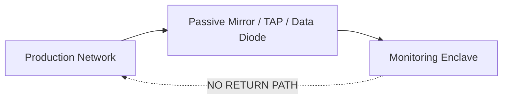

# PS26145 — The Actual Problem

## Why Unidirectional Network Monitoring?
High-security environments (like Government enclaves) cannot risk an attacker using the security tool itself to send data *back* into the production network.

We use **SPAN/TAPs** or **Hardware Data Diodes** to enforce this physically.

*Note: Software passivity (read-only code) and physical one-way enforcement (data diode) are separate concepts. This project implements software passivity, pending physical diode hardware validation.*

## The PS26145 Requirement Matrix

| PS Requirement | Implementation | Evidence | Status |
| :--- | :--- | :--- | :--- |
| Passive Ingestion | `zeek_adapter.py` | Container PCAP replay | VERIFIED |
| No Payload Decryption | Metadata only | `NetworkObservation` schema | VERIFIED |
| Volumetric DDoS | `ddos_stat_v1` | T3, T4, T15 | VERIFIED |
| C2 Beaconing | `beacon_stateful_v2`| T5, T6 | VERIFIED |
| DGA / Tunnelling | `dga_lexical_v1` | T7, T8 | VERIFIED |
| Encrypted Sessions | `tls_behavioral_v1`| T9 | VERIFIED |
| Reconnaissance | `scan_v2` | T10 | VERIFIED |
| Data Exfiltration | `exfil_v1` | T12 | VERIFIED |

## Why Passive Detection is Hard
Passive systems cannot:
* Probe a host to see if it is alive.
* Grab banners from ports.
* Send TCP RST to kill a bad connection.

We must infer behavior purely from metadata: timing, entropy, state, and bytes.