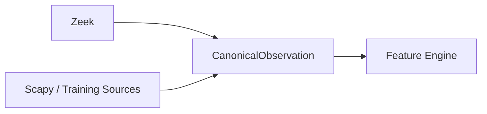

# Canonical Observation

Our machine learning pipeline originally failed because it was trained on PCAP features extracted by Python's `Scapy`, but deployed on production streams from `Zeek`. 

## The Parity Failure
* `byte_count` on Scapy included L2 Ethernet headers (e.g., 13,600).
* `byte_count` on Zeek only counted L3 IP payloads (e.g., 1,500).

The **CanonicalObservation** is an intermediate schema that forces both training data and production data into the exact same semantic representation.