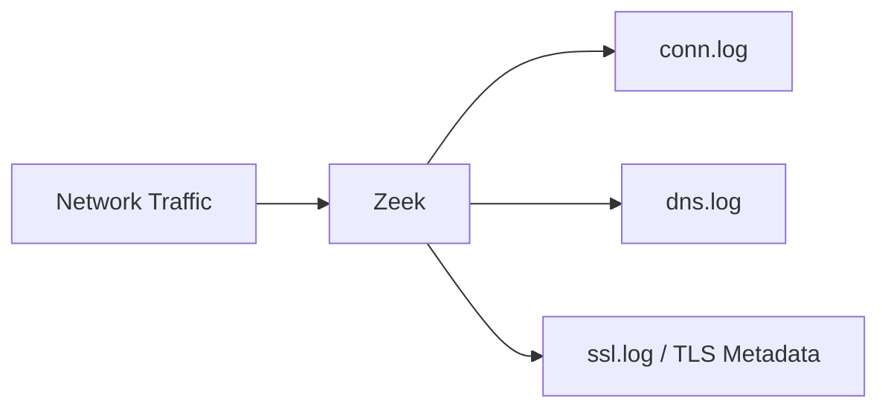

# Zeek Network Security Monitor

## What is Zeek?
Zeek is a passive, open-source network traffic analyzer. Unlike Wireshark, which shows you raw packets, Zeek provides highly structured metadata logs.

## Zeek Semantics
* **Originator**: The IP that started the connection (the client).
* **Responder**: The IP that received the connection (the server).
* **TCP History**: A string (e.g., `ShADadFf`) describing the sequence of TCP flags seen.

Zeek clusters can scale to 100Gbps on physical interfaces using AF_PACKET or PF_RING.