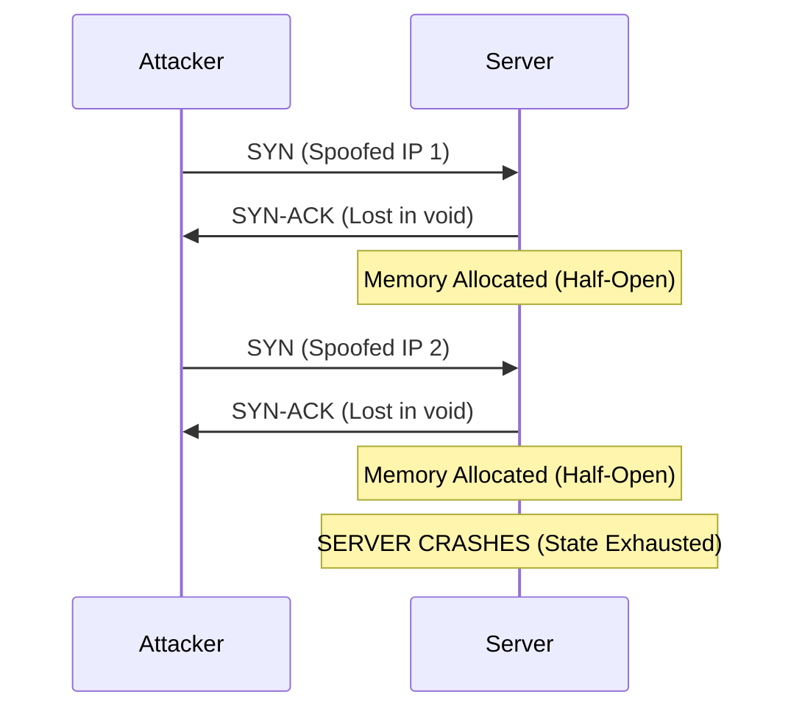

# Volumetric DDoS: Exhaustion & Amplification

> "A distributed denial-of-service (DDoS) attack is a malicious attempt to disrupt the normal traffic of a targeted server, service, or network by overwhelming the target or its surrounding infrastructure with a flood of Internet traffic."

## The Physics of a Flood

To understand how PS26145 detects volumetric attacks, we must first examine the physics of the network. A network interface has a finite processing capacity (measured in packets per second, or **pps**) and a finite bandwidth capacity (measured in bits per second, or **bps**).

When an attacker wishes to take a service offline, they exploit these finite ceilings. 

### SYN Floods and TCP State Exhaustion
The Transmission Control Protocol (TCP) requires a 3-way handshake to establish a connection:
1. Client sends **SYN**
2. Server allocates memory, replies with **SYN-ACK**
3. Client replies with **ACK**

In a **SYN Flood**, the attacker sends millions of SYN packets with forged (spoofed) source IP addresses. The server allocates memory for each connection and waits for the final ACK, which never arrives. 

## Passive Detection Strategy

Because PS26145 operates unidirectionally (passively), we cannot use active mitigation techniques like SYN Cookies or TCP RST injection. We must detect the flood *behaviorally*.

### The `ddos_stat_v1` Detector

We built a deterministic rule engine targeting the structural metadata of a flood.

#### Feature 1: Packet Rate (pps)
We calculate the packet arrival rate over a 10-second tumbling window:
$$
Rate_{pps} = \frac{\sum Packets}{Window\ Duration}
$$

#### Feature 2: SYN Ratio
We measure the proportion of connection attempts versus established flows. 
$$
Ratio_{SYN} = \frac{Count(Flows_{state=S0})}{Count(Flows_{total})}
$$

!!! note "Zeek State `S0`"
    In Zeek semantics, a connection state of `S0` means a SYN was seen, but no reply was ever observed. A SYN ratio near `1.0` during high traffic is a mathematical guarantee of a SYN flood.

#### Feature 3: Source Entropy (Spoofing Detection)
Modern DDoS attacks randomize the source IP address to bypass naive rate limits. If an attacker uses a botnet or IP spoofing, the distribution of source IPs becomes highly chaotic. We measure this chaos using **Shannon Entropy**:

$$
H(S) = -\sum_{i=1}^{N} P(s_i) \log_2 P(s_i)
$$

Where $P(s_i)$ is the probability of seeing a specific source IP $s_i$ in the window. 

!!! success "Detection Threshold"
    If $Rate_{pps} > 10,000$ AND $Ratio_{SYN} > 0.8$ AND $H(S) > 2.5$, the system triggers a `HIGH` severity Security Case for **Spoofed SYN Flood**.

## Live E2E Evidence

When the `ddos_stat_v1` detector triggers alongside the XGBoost `v5` model, the SOC dashboard automatically fuses the evidence. 

*(Above: The live SOC dashboard processing telemetry and surfacing anomalous security cases.)*

## Validation Results

| Test ID | Ground Truth | XGBoost V5 | Fusion Output | Status |
| :--- | :--- | :--- | :--- | :--- |
| **T3** | Malicious (SYN Flood) | Detected | Detected | 🟩 PASS |
| **T4** | Malicious (UDP Flood) | Detected | Detected | 🟩 PASS |
| **T15**| Malicious (Spoofed IP) | Detected | Detected | 🟩 PASS |

### Limitations
Because volumetric DDoS detection relies on measuring rates within a window, a highly distributed, extremely low-rate attack (e.g., Application-Layer HTTP floods) will bypass `ddos_stat_v1`. To counter this, we built a secondary detector specifically for application-layer exhaustion: [Slow HTTP / Slowloris](recon_exfil_slow.md).