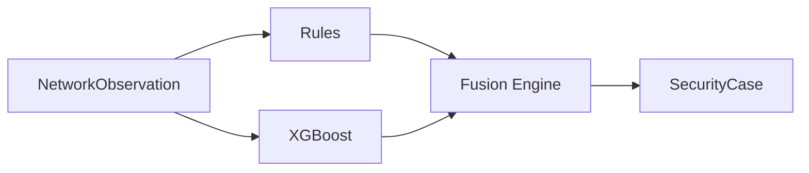

# Evidence Fusion

## Why Fusion?
A single anomaly detection model will inevitably trigger False Positives. Our **Fusion Engine** demands cross-validation. An XGBoost alert will not become a severe Security Case unless deterministic logic provides contextual evidence (e.g., high probability + high exfiltration ratio).