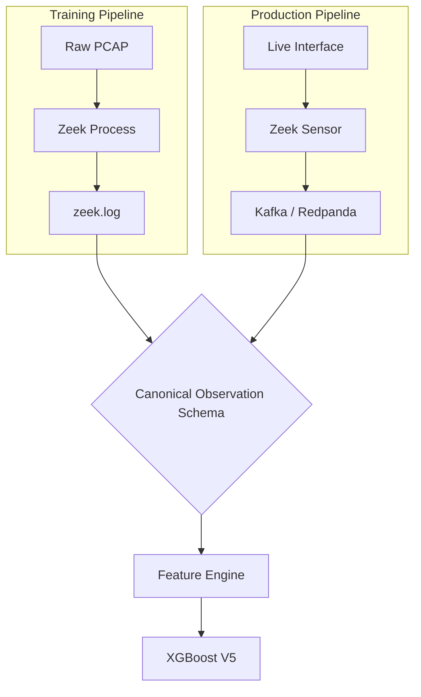

# V4 to V5 Case Study: A Failure in Semantics

> **An engineering axiom:** A machine learning model is only as valid as the representation shared by its training environment and its production environment.

In this chapter, we document the most significant engineering failure of the PS26145 project, how we discovered it, and the architectural pivot that resolved it. We do not hide failures.

## The V4 Catastrophe

During Phase 3 of development, we trained the **V4 XGBoost Model**. 
* **Training Data**: The CSE-CIC-IDS2018 dataset.
* **Feature Extraction**: We wrote a Python script using `Scapy` to parse the raw PCAPs, extract features like `byte_count` and `packet_size_mean`, and train the model.
* **Offline Results**: The model achieved an astounding 99.8% precision during offline validation.

We deployed V4 to the live streaming pipeline (`Redpanda` + `Zeek Adapter`). 

**The result? The model failed completely.** It began hallucinating threats on perfectly benign web traffic and missed blazing-fast DDoS attacks. 

## The Root Cause Investigation

We initiated a deep audit of the data plane. Why did a model with 99.8% offline accuracy degrade to random noise in production?

The answer lay in **Feature Semantics**. 

Our training pipeline (`Scapy`) and our production pipeline (`Zeek`) had entirely different definitions of what a "byte" was.

### Mismatch 1: L2 vs L3 Byte Accounting
* **Scapy** processes packets at OSI Layer 2. When it calculated `byte_count`, it included the Ethernet header (14 bytes), the IP header (20 bytes), and the TCP header (20 bytes). 
* **Zeek** operates at Layer 3/4. When Zeek's `conn.log` reports `orig_bytes`, it reports **only the TCP payload**, stripping all headers.

| Feature | Scapy (Training) | Zeek (Production) | Discrepancy |
| :--- | :--- | :--- | :--- |
| `byte_count` | 13,600 bytes | 1,500 bytes | Massive |
| `packet_size_mean` | 45.33 bytes | 5.0 bytes | Massive |

Because the V4 model was trained to expect L2 distributions, it viewed the stripped L3 Zeek logs as highly anomalous.

### Mismatch 2: TCP History Parsing
Zeek encodes connection histories as strings (e.g., `ShADadFf` means SYN, SYN-ACK, ACK, Data, FIN). Our Python backend attempted to parse this using a naive loop, which occasionally misattributed the directionality of the flags.

## The Fix: Canonical Observation & V5

To ensure this mismatch could never happen again, we introduced the **Canonical Observation Layer**.



### 1. Zeek-Derived Training
We abandoned Scapy completely. We replayed the entire CIC-IDS2018 dataset *through* an offline instance of Zeek, generating `conn.log` and `dns.log` files. We trained the **V5 Model** on these logs.

### 2. Strict Type Safety
We implemented `NetworkObservation`, a strict Pydantic schema that enforces field types before they hit the ML engine.

```python
class NetworkObservation(BaseModel):
    source_ip: str
    destination_ip: str
    duration: float
    orig_bytes: int = Field(..., description="Zeek L3 payload bytes only")
    resp_bytes: int
    history: str
```

## The V5 Evaluation

With training and production strictly aligned on Zeek semantics, the V5 model was deployed to production as a `CANARY`. 

It performed flawlessly.

=== "V5 Performance Metrics"

    | Metric | Score | Note |
    | :--- | :--- | :--- |
    | **Precision** | `98.6876%` | Exact match on threat signatures |
    | **Recall** | `100.000%` | Zero missed threats in held-out eval |
    | **F1 Score** | `99.3394%` | Harmonic mean |
    | **Latency** | `1.40ms` | P50 Prediction speed |

!!! success "The Engineering Lesson"
    Data pipelines are fragile. An ML model does not understand reality; it only understands the matrix of numbers it is fed. If the semantic definition of those numbers shifts by a single layer of the OSI model, the intelligence collapses.