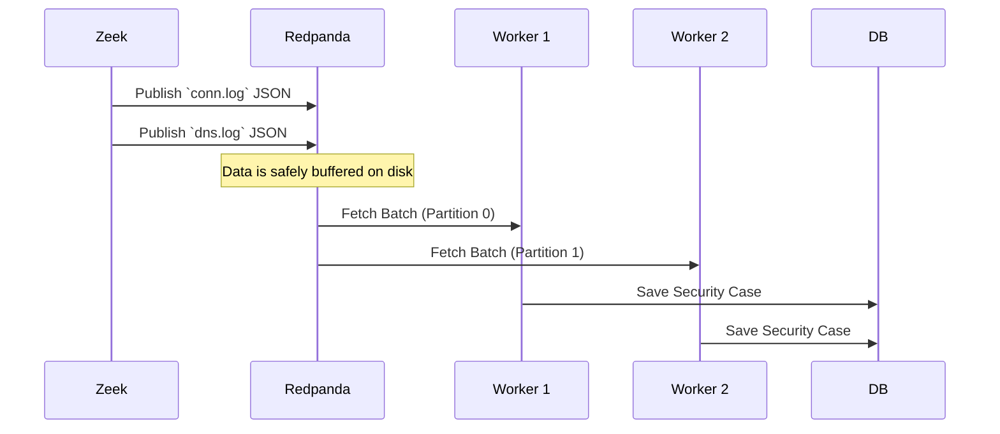

# Streaming Architecture: Decoupling the Data Plane

> "In a 10Gbps enterprise environment, sequential processing is a death sentence. To survive, you must decouple ingestion from intelligence."

When dealing with unidirectional IP traffic, the ingestion engine (Zeek) generates logs at a ferocious rate. If the intelligence engine (the Python backend running XGBoost) processes these logs synchronously, any spike in traffic will cause the ingestion engine to block, leading to dropped packets and memory exhaustion.

To solve this, PS26145 implements a **Distributed Streaming Architecture**.

## The Asynchronous Broker: Redpanda

We placed a high-performance message broker between Zeek and the backend. We chose **Redpanda** (a Kafka API-compatible broker written in C++) because it avoids JVM garbage collection pauses, delivering predictable sub-millisecond tail latencies.



## Anatomy of the Stream

### Topics and Partitions
All network observations are published to a topic named `network_telemetry`. To allow multiple ML workers to process the traffic simultaneously, the topic is split into **Partitions** (e.g., 4 partitions).

### Consumer Groups
Our backend workers all join a single **Consumer Group** (`ps26145-group`). Redpanda automatically assigns one partition to each worker. 
* If a worker crashes, Redpanda reassigns its partition to a surviving worker. 
* If traffic spikes, we can simply spin up `Worker 3` and `Worker 4`, and Redpanda will rebalance the load instantly.

## The Zeek Adapter

Because Zeek natively writes to disk (or stdout), we built a lightweight Go/Python adapter that tails Zeek's output and pushes it to Redpanda. 

```python
# Simplified Zeek Adapter Logic
def tail_zeek_logs():
    producer = KafkaProducer(bootstrap_servers='redpanda:9092')
    with open('/opt/zeek/logs/current/conn.log', 'r') as f:
        # Move to end of file
        f.seek(0, os.SEEK_END)
        while True:
            line = f.readline()
            if line:
                payload = parse_zeek_json(line)
                producer.send('network_telemetry', value=payload)
            else:
                time.sleep(0.01) # Yield
```

## Failure Recovery and At-Least-Once Delivery

What happens if the database goes down? Or an ML worker crashes mid-prediction?

We enforce **At-Least-Once Delivery** using Kafka Offsets:
1. The worker pulls a batch of 100 observations from Redpanda.
2. The worker extracts features, runs XGBoost, and generates cases.
3. The worker writes the cases to MongoDB.
4. **ONLY THEN** does the worker commit its offset back to Redpanda.

If the worker crashes at step 3, the offset is never committed. When the worker restarts, Redpanda gives it the same 100 observations again. 

!!! warning "Duplicate Safety"
    Because of At-Least-Once delivery, MongoDB might receive the exact same Security Case twice during a crash recovery. We handle this by using the deterministic Hash of the flow as the MongoDB `_id`. The database performs an **Upsert**, making the recovery completely duplicate-safe.