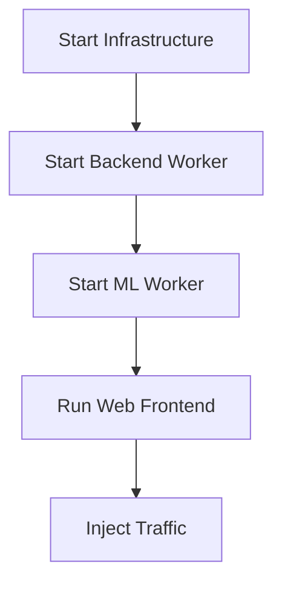

# Running the System

```mermaid
flowchart TD
    A[Start Infrastructure] --> B[Start Backend Worker]
    B --> C[Start ML Worker]
    C --> D[Run Web Frontend]
    D --> E[Inject Traffic]
```

## Start Services
1. `python backend/main.py`
2. `python backend/ml_worker.py`
3. `cd frontend && npm start`