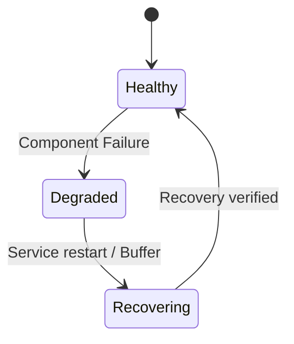

# Troubleshooting & Recovery

## Failure Recovery Matrix

* **Zeek Failure**: Adapter degrades. On restart, resumes processing trailing logs.
* **Redpanda Failure**: Adapter queues memory. At-least-once delivery guaranteed.
* **Mongo Failure**: Fusion engine retries. Duplicate-safe operations.