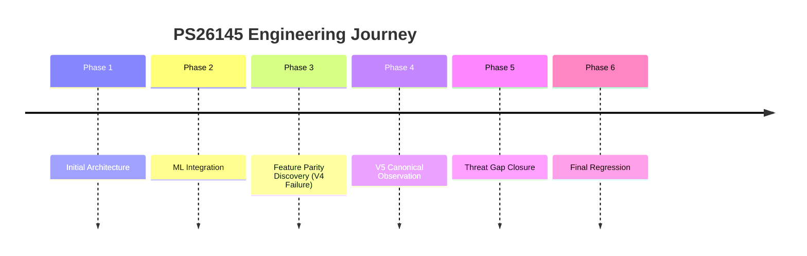

# History and Final Verdict

## The Final Verdict

### VERIFIED
* Functional prototype
* XGBoost V5 (99.34% F1)
* Threat detection (11/12 Malicious)
* Streaming & Dashboard

### LIMITATIONS
* Slow scan (T11 FN)
* Physical hardware (Pending)