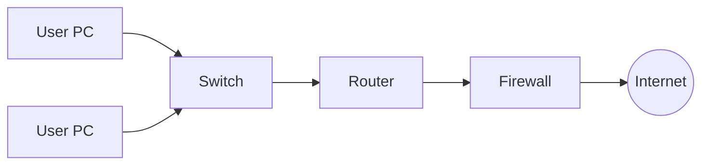
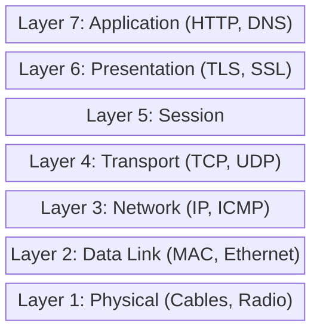
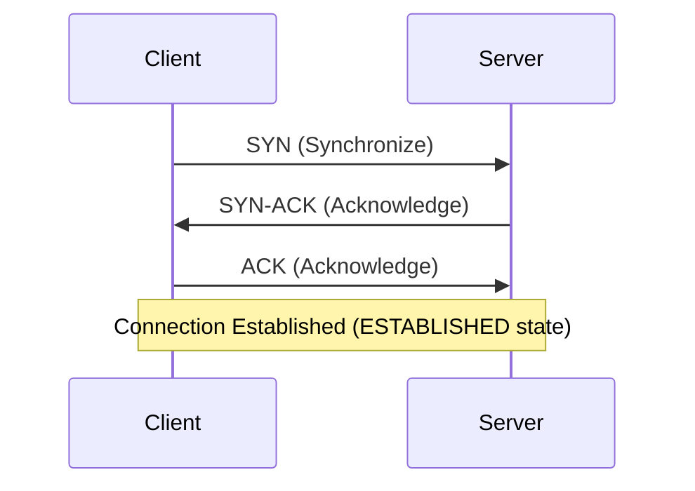
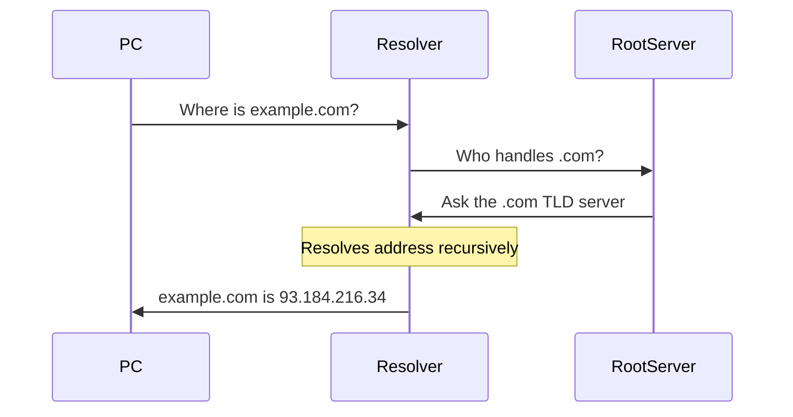
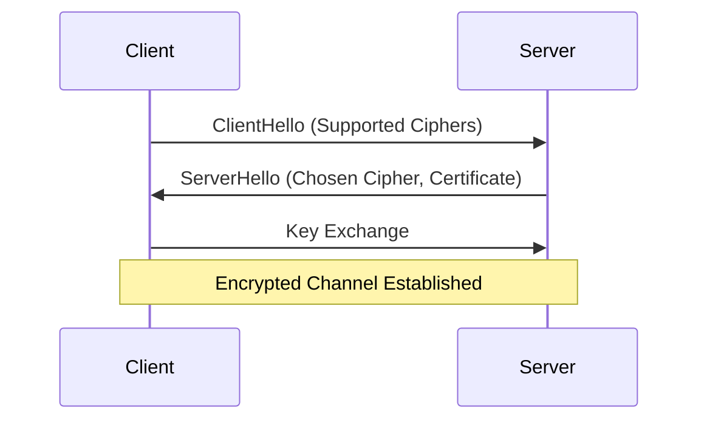

# Volume 1: The Foundations of Cyberspace

## Chapter 1: The Anatomy of a Network
To understand how PS26145 defends a network, we must first understand what a network is from absolute zero. A network is a collection of computers, servers, mainframes, network devices, or other devices connected to one another to allow the sharing of data.

At its core, all data is binary—1s and 0s sent via electrical pulses over copper wire, light pulses over fiber optics, or radio waves via Wi-Fi.

## Chapter 2: The OSI & TCP/IP Models
The Open Systems Interconnection (OSI) model standardizes the communication functions of a telecommunication system without regard to its underlying internal structure.

PS26145 primarily extracts metadata from Layers 3, 4, and 7.

## Chapter 3: IP Addressing & Subnets
Every device on a network needs a logical address. In IPv4, this is a 32-bit number, usually represented in dotted-decimal format (e.g., `192.168.1.10`). A subnet mask (e.g., `255.255.255.0`) divides the IP address into a network portion and a host portion, dictating how packets are routed locally versus globally.

## Chapter 4: The TCP 3-Way Handshake
The Transmission Control Protocol (TCP) ensures reliable delivery. Before data is sent, a connection must be established. This is the cornerstone of stateful networking.

## Chapter 5: UDP - The Best Effort Protocol
Unlike TCP, the User Datagram Protocol (UDP) does not establish a connection. It simply fires packets at the destination. It is fast but unreliable. DNS and video streaming heavily utilize UDP. Because UDP has no state, detecting UDP anomalies requires purely statistical modeling rather than state-tracking.

## Chapter 6: Ports and Sockets
An IP address gets data to the right computer. A **Port** gets data to the right application on that computer. 
* Port 80 = HTTP Web Traffic
* Port 443 = HTTPS Secure Web Traffic
* Port 53 = DNS
An IP address paired with a port (e.g., `192.168.1.10:443`) is called a **Socket**.

## Chapter 7: DNS - The Phonebook of the Internet
Humans cannot remember IP addresses like `142.250.190.46`. We remember `google.com`. The Domain Name System (DNS) translates domains to IP addresses.

*Cyber Context*: Attackers abuse DNS to tunnel data or dynamically locate C2 servers via Domain Generation Algorithms (DGA).

## Chapter 8: HTTP & The Web
Hypertext Transfer Protocol (HTTP) is a Layer 7 protocol used to transmit hypermedia documents, such as HTML. It follows a classic client-server model, where a client opens a connection to make a request, then waits until it receives a response.

## Chapter 9: Encryption, TLS, and SSL
Transport Layer Security (TLS) encrypts HTTP traffic. 

PS26145 operates under a strict "No Decryption" mandate. We use the unencrypted `ClientHello` metadata (like SNI and JA3 fingerprints) to classify threats.

## Chapter 10: Packets vs. Flows
A **Packet** is a single unit of data. A **Flow** is a sequence of packets between two sockets (Source IP/Port to Dest IP/Port) over a period of time.
Network Detection and Response (NDR) systems like PS26145 analyze flows, not packets. Threats manifest over time; a single packet is rarely malicious on its own, but a sequence of packets reveals intent.
