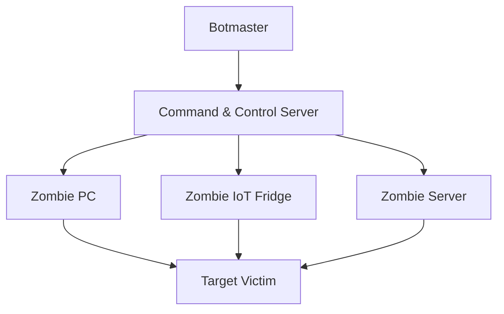
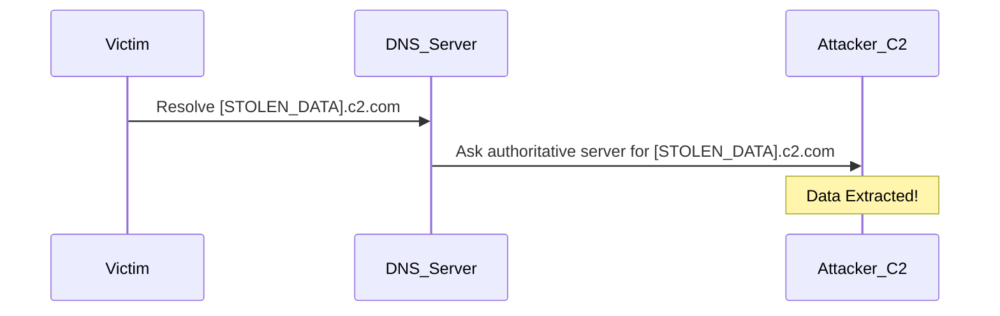

# Volume 2: The Attack Surface

## Chapter 11: The History of Network Attacks
Cyber threats have evolved from simple defacements in the 1990s to highly automated, state-sponsored botnets today. Modern attacks do not rely on isolated malware binaries; they rely on networked infrastructure. The network is the ultimate source of truth.

## Chapter 12: Reconnaissance & Port Scanning
Before an attacker strikes, they map the target. A port scan systematically probes a server's ports to find open services.

```mermaid
flowchart TD
    A[Attacker] -->|SYN Port 21| T[Target]
    T -->|RST| A
    A -->|SYN Port 22| T
    T -->|SYN-ACK (Open!)| A
    A -->|SYN Port 23| T
    T -->|RST| A
```
*Detection*: PS26145 flags high fan-out (one source to many unique destination ports) over tumbling time windows.

## Chapter 13: Botnets & The Zombie Army
A botnet is a network of compromised computers (zombies) controlled by a single attacker (the Botmaster). They are used to execute coordinated tasks, primarily DDoS attacks.



## Chapter 14: Command & Control (C2) Beacons
A compromised host must ask the C2 server for instructions. To bypass firewalls, the host initiates the connection outward periodically. This is called a **Beacon**. 
Mathematical detection relies on Inter-Arrival Time (IAT). If $IAT_{variance} \approx 0$, the connection is a highly suspicious mechanical beacon.

## Chapter 15: Volumetric DDoS & Amplification
Volumetric attacks overwhelm bandwidth. In an **Amplification Attack**, an attacker sends a small forged packet (e.g., DNS request) to a vulnerable server, which replies with a massive packet sent to the victim.
* **Amplification Factor**: The ratio of the response size to the request size. NTP and Memcached can amplify traffic by 50,000x.

## Chapter 16: TCP State Exhaustion (SYN Floods)
As introduced in Chapter 4, the TCP handshake requires memory. By sending millions of SYN packets but never replying with the final ACK, an attacker fills the server's connection table until it crashes. 

*(PS26145 detecting a massive Volumetric Flood in real-time)*

## Chapter 17: Application Layer Exhaustion (Slowloris)
Unlike a volumetric attack, a Slowloris attack requires virtually no bandwidth. The attacker opens hundreds of valid HTTP connections but sends data at an excruciatingly slow rate (1 byte every 10 seconds). The server keeps the sockets open, eventually exhausting its connection pool.

## Chapter 18: Data Exfiltration
Once an attacker accesses a sensitive database, they must remove the data. Exfiltration often manifests as massive Byte Asymmetry.
$$ Asymmetry = \frac{Bytes\ Out}{Bytes\ In} $$
If a workstation uploads 50GB to an unknown offshore IP but downloads 2MB, it is highly anomalous.

## Chapter 19: DNS Tunneling
Firewalls often block all outbound ports except 80 (HTTP), 443 (HTTPS), and 53 (DNS). Attackers bypass firewalls by encoding stolen data inside DNS queries.
`query: 59382data_chunk_base64.attacker.com`


## Chapter 20: IP Spoofing
IP Spoofing is the creation of IP packets with a false source IP address, used to hide the identity of the sender or to impersonate another computing system. This breaks standard rate-limiting firewalls. PS26145 calculates the Shannon Entropy of source IPs to detect randomized spoofing mathematically.
