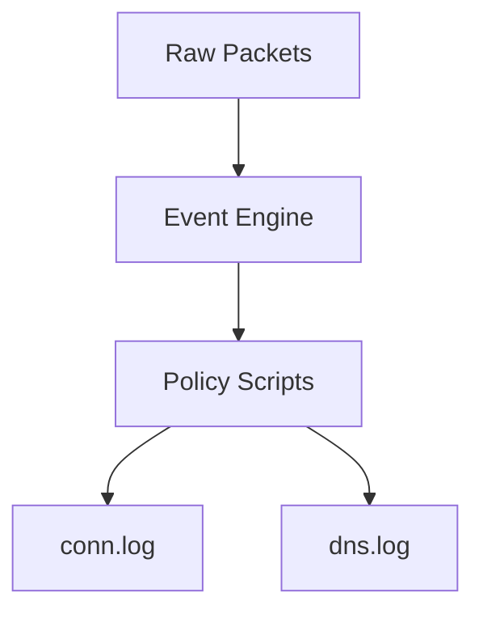

# Volume 3: Network Defense & NDR

## Chapter 21: Firewalls (The Perimeter)
A firewall sits at the edge of the network, acting as a bouncer. It uses stateful inspection to permit or deny traffic based on IP, Port, and Protocol. However, firewalls only look at the envelope, not the letter. If an attacker tunnels data over port 443, the firewall blindly permits it.

## Chapter 22: IDS and IPS
* **Intrusion Detection System (IDS)**: Analyzes traffic for known threat signatures (like an antivirus). It is passive and alerts the SOC.
* **Intrusion Prevention System (IPS)**: Sits inline and blocks traffic immediately if it matches a signature.
The flaw in legacy IDS/IPS is their reliance on signatures. If the malware is a zero-day (never seen before), the signature engine fails.

## Chapter 23: SIEM
Security Information and Event Management (SIEM) aggregates logs from endpoints, firewalls, and active directories. SIEMs lack deep visibility into the raw network wires.

## Chapter 24: Passive vs Active Defense
Active defense actively blocks traffic (IPS, Firewalls). Passive defense merely observes, generating intelligence without risking network disruption. PS26145 is strictly passive.

## Chapter 25: The SOC
The Security Operations Center (SOC) is the human element. An NDR system must not flood the SOC with false positives. Alert fatigue causes analysts to ignore critical warnings.

## Chapter 26: The Architecture of Zeek
Zeek is a passive network traffic analyzer. Unlike Wireshark which decodes raw packets, Zeek produces structured, semantic metadata.

## Chapter 27: Taps and SPAN Ports
To monitor a network passively, you must copy the traffic. 
* **SPAN Port (Port Mirroring)**: The network switch sends a copy of all traffic to a monitoring port.
* **Network TAP**: A physical hardware device spliced into the fiber optic cable that duplicates the light signal. TAPs are completely invisible to the network.

## Chapter 28: PCAP Analysis
Packet Capture (PCAP) files are the ground truth of network analysis. When a SOC analyst investigates a PS26145 alert, they pull the raw PCAP to verify the telemetry.

## Chapter 29: Behavioral Heuristics
Instead of looking for a specific malware signature (`hash=XYZ123`), behavioral heuristics look for the *actions* of malware. (e.g., "This device is contacting 500 IPs per second").

## Chapter 30: Threat Intelligence Fusion
No single detection is absolute. True NDR systems cross-reference internal heuristics with external Threat Intelligence (lists of known bad IPs and domains) to increase confidence.
