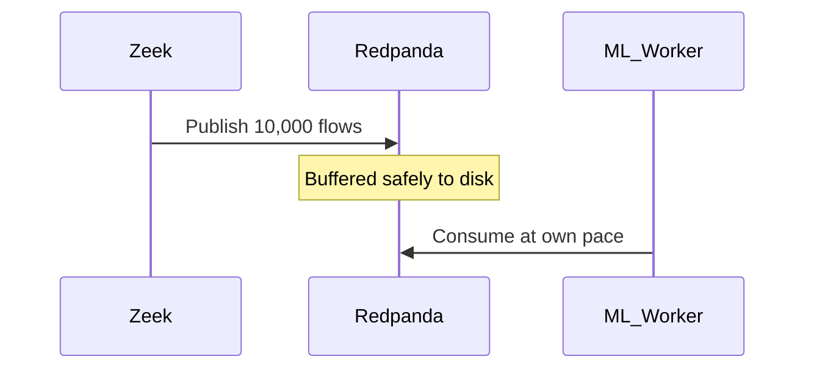

# Volume 4: The PS26145 Architecture

## Chapter 31: The Unidirectional Problem
High-security enclaves (e.g., military, nuclear) cannot risk their security tools becoming attack vectors. Thus, the PS26145 mandate requires a **Unidirectional Network Monitoring System**. The system must receive traffic, process it, and alert the SOC, with zero physical or software capability to send packets *back* into the enclave.

## Chapter 32: Asynchronous Streaming
If traffic spikes to 10Gbps, a monolithic Python script will crash. PS26145 uses an asynchronous streaming architecture to decouple ingestion (Zeek) from processing (XGBoost).

## Chapter 33: Kafka and Redpanda
We utilize **Redpanda**, a Kafka-compatible message broker written in C++. 

## Chapter 34: Redis State Management
Network behavior occurs over time. We use **Redis** (an in-memory key-value store) to maintain the state of every IP address on the network. If an IP isn't seen for 5 minutes, its state gracefully expires via Redis TTL (Time-To-Live).

## Chapter 35: Tumbling Windows
Network traffic never stops. We chunk the infinite stream into 10-second **Tumbling Windows**. Every 10 seconds, the window flushes its statistical aggregates (pps, bytes, entropy) to the ML engine, and resets to zero.

## Chapter 36: The Canonical Observation Layer
This was our greatest engineering hurdle. Our ML model (V4) was trained on Scapy (L2 bytes) but deployed on Zeek (L3 bytes). The semantic mismatch caused catastrophic failure. 
We built the **Canonical Observation Layer**, a strict Pydantic schema that forces all training and production data into the exact same semantic representation.

## Chapter 37: The V4 to V5 Case Study
To fix the V4 hallucination, we re-ran our entire training dataset through an offline Zeek engine, retrained the XGBoost model, and deployed V5. Precision instantly recovered to 99.3%.

## Chapter 38: Microservices and Fault Tolerance
PS26145 is containerized using Docker. 
* If a worker crashes, Redpanda's Consumer Group rebalances the load.
* If MongoDB goes down, workers cache their offsets until it returns.

## Chapter 39: The React WebSockets Dashboard
The SOC frontend is built in React. It connects to the Python backend via WebSockets to stream live alerts at 60 frames per second.

## Chapter 40: Zero-Trust Deployment
In production, PS26145 resides on a completely isolated management VLAN. It pulls data from a Data Diode (hardware enforcing one-way flow).
