# PS26145: Passive Threat Detection Master Course

## System Architecture Gallery

### 01 Hero Solution
<div style="margin-bottom: 50px; background: white; page-break-inside: avoid; border: 1px solid #ddd; border-radius: 8px;">
            <iframe src="" style="width: 1600px; height: 900px; zoom: 0.55; border: none; background: transparent; display: block;" scrolling="no"></iframe>
        </div>

### 02 Problem Boundary
<div style="margin-bottom: 50px; background: white; page-break-inside: avoid; border: 1px solid #ddd; border-radius: 8px;">
            <iframe src="" style="width: 1600px; height: 900px; zoom: 0.55; border: none; background: transparent; display: block;" scrolling="no"></iframe>
        </div>

### 03 Technical Pipeline
<div style="margin-bottom: 50px; background: white; page-break-inside: avoid; border: 1px solid #ddd; border-radius: 8px;">
            <iframe src="" style="width: 1600px; height: 900px; zoom: 0.55; border: none; background: transparent; display: block;" scrolling="no"></iframe>
        </div>

### 04 Feature Engineering
<div style="margin-bottom: 50px; background: white; page-break-inside: avoid; border: 1px solid #ddd; border-radius: 8px;">
            <iframe src="" style="width: 1600px; height: 900px; zoom: 0.55; border: none; background: transparent; display: block;" scrolling="no"></iframe>
        </div>

### 05 Hybrid Detection
<div style="margin-bottom: 50px; background: white; page-break-inside: avoid; border: 1px solid #ddd; border-radius: 8px;">
            <iframe src="" style="width: 1600px; height: 900px; zoom: 0.55; border: none; background: transparent; display: block;" scrolling="no"></iframe>
        </div>

### 06 Threat Matrix
<div style="margin-bottom: 50px; background: white; page-break-inside: avoid; border: 1px solid #ddd; border-radius: 8px;">
            <iframe src="" style="width: 1600px; height: 900px; zoom: 0.55; border: none; background: transparent; display: block;" scrolling="no"></iframe>
        </div>

### 07 Infrastructure Architecture
<div style="margin-bottom: 50px; background: white; page-break-inside: avoid; border: 1px solid #ddd; border-radius: 8px;">
            <iframe src="" style="width: 1600px; height: 900px; zoom: 0.55; border: none; background: transparent; display: block;" scrolling="no"></iframe>
        </div>

### 08 Failure Recovery
<div style="margin-bottom: 50px; background: white; page-break-inside: avoid; border: 1px solid #ddd; border-radius: 8px;">
            <iframe src="" style="width: 1600px; height: 900px; zoom: 0.55; border: none; background: transparent; display: block;" scrolling="no"></iframe>
        </div>

### 09 Impact Before After
<div style="margin-bottom: 50px; background: white; page-break-inside: avoid; border: 1px solid #ddd; border-radius: 8px;">
            <iframe src="" style="width: 1600px; height: 900px; zoom: 0.55; border: none; background: transparent; display: block;" scrolling="no"></iframe>
        </div>

### 10 Research Map
<div style="margin-bottom: 50px; background: white; page-break-inside: avoid; border: 1px solid #ddd; border-radius: 8px;">
            <iframe src="" style="width: 1600px; height: 900px; zoom: 0.55; border: none; background: transparent; display: block;" scrolling="no"></iframe>
        </div>

### 11 Metrics
<div style="margin-bottom: 50px; background: white; page-break-inside: avoid; border: 1px solid #ddd; border-radius: 8px;">
            <iframe src="" style="width: 1600px; height: 900px; zoom: 0.55; border: none; background: transparent; display: block;" scrolling="no"></iframe>
        </div>

<div style='page-break-after: always;'></div>

# Module 001: What is a Network? (OSI vs TCP/IP)

## 1. What is it? (Explain from scratch for a complete beginner)
Imagine a network as a postal system, but for computers. When you write a letter to a friend, you put it in an envelope, write the address on it, and hand it over to the post office. The post office then figures out the best way to get that letter to your friend's house, whether it's via a truck, plane, or local mail carrier. 
In the digital world, a **Network** is simply two or more computers connected together so they can share information, just like the postal system shares letters. The internet itself is just one massive, global network of networks!
To make sure every computer understands each other (like speaking the same language), they use special rules called **Protocols**. The two most famous frameworks for understanding these rules are the **OSI Model** (a theoretical 7-layer concept) and the **TCP/IP Model** (a practical 4-layer model used on the internet today).

## 2. System Architecture / Flow (MUST include a Mermaid flowchart/sequence diagram)
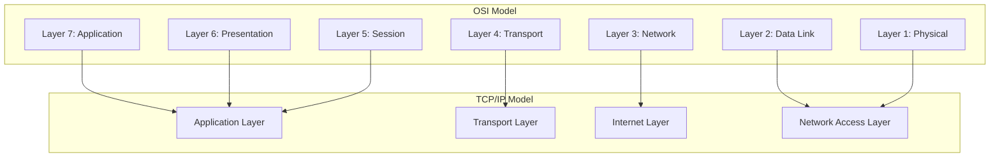
```mermaid

flowchart TD
    subgraph OSI Model
        A1["Layer 7: Application"]
        A2["Layer 6: Presentation"]
        A3["Layer 5: Session"]
        A4["Layer 4: Transport"]
        A5["Layer 3: Network"]
        A6["Layer 2: Data Link"]
        A7["Layer 1: Physical"]
    end
    
    subgraph TCP/IP Model
        B1["Application Layer"]
        B4["Transport Layer"]
        B5["Internet Layer"]
        B6["Network Access Layer"]
    end
    
    A1 & A2 & A3 --> B1
    A4 --> B4
    A5 --> B5
    A6 & A7 --> B6
```

## 3. Implementation / Configuration (Include Python/CLI examples)
To see your computer's connection in a network, you can use built-in command-line tools.
**Windows Command Prompt:**
```cmd
ipconfig
```
**Linux/macOS Terminal:**
```bash
ifconfig
# or modern alternative
ip a
```

## 4. Line-by-Line Explanation
- `ipconfig`: This Windows command stands for "Internet Protocol Configuration". When you run it, your computer asks the operating system to print out the current network settings.
- `ifconfig`: This is the older Linux/macOS equivalent (Interface Configuration).
- `ip a`: The modern Linux command to show IP addresses. It lists all network interfaces (like Wi-Fi or Ethernet) and the addresses assigned to them, showing how you are connected to the network.

## 5. Summary
A network connects computers to share data using standard protocols. The OSI model describes how networks work theoretically using 7 layers, while TCP/IP is the practical 4-layer model used by the internet today. You can check your own network connection using commands like `ipconfig` or `ip a`.


<div style='page-break-after: always;'></div>

# Module 002: Packets, Frames, and Bits

## 1. What is it? (Explain from scratch for a complete beginner)
When you send a large file like a photo over the internet, it doesn't travel as one giant block. That would easily clog up the network! Instead, the photo is chopped up into tiny, manageable pieces. 
These pieces have different names depending on where they are in the network process:
- **Bits:** The smallest unit of data, represented as 1s and 0s. This is how data physically travels over cables (as electrical pulses) or Wi-Fi (as radio waves).
- **Frames:** When bits are grouped together on a local network (like your home Wi-Fi), they are called a Frame. Frames contain physical addresses (MAC addresses) so computers on the same network can find each other.
- **Packets:** When a frame needs to leave your home network and travel across the internet, it is wrapped in an IP (Internet Protocol) address. This wrapped data is called a Packet. Think of a packet as an envelope with a global address on it!

## 2. System Architecture / Flow (MUST include a Mermaid flowchart/sequence diagram)
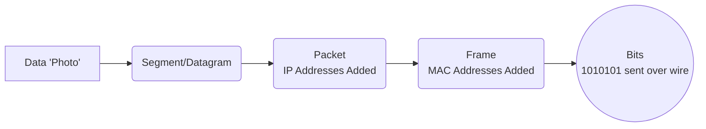
```mermaid

flowchart LR
    A["Data 'Photo'"] --> B(Segment/Datagram)
    B --> C(Packet<br/>IP Addresses Added)
    C --> D(Frame<br/>MAC Addresses Added)
    D --> E((Bits<br/>1010101 sent over wire))
```

## 3. Implementation / Configuration (Include Python/CLI examples)
You can see packets flowing through your network by sending small test packets to another computer using the `ping` command.
**CLI Command (Windows/Linux/macOS):**
```bash
ping google.com -c 4
```

## 4. Line-by-Line Explanation
- `ping`: The command used to test if another computer is reachable across a network. It sends a special type of packet called an ICMP Echo Request.
- `google.com`: The destination we are sending our packets to.
- `-c 4`: This flag tells the command to send exactly 4 packets (Count = 4). (Note: On Windows, use `-n 4`).
- Output: The terminal will show each packet as it returns from Google, displaying how long it took in milliseconds. If the packet gets lost, it will say "Request timed out".

## 5. Summary
Data travels across networks by being broken down. The smallest unit is a Bit (1s and 0s), which forms Frames for local networks, and Packets for global internet travel. The `ping` command is a simple way to test if your packets are successfully reaching their destination.


<div style='page-break-after: always;'></div>

# Module 003: IP Addresses and Subnetting

## 1. What is it? (Explain from scratch for a complete beginner)
Just as every house needs a mailing address for the postman to deliver letters, every computer connected to a network needs an address so other computers can send it data. This is called an **IP Address** (Internet Protocol Address).
An IPv4 address looks like four numbers separated by dots, like `192.168.1.10`.
**Subnetting** is a way of dividing a large network into smaller, more efficient networks (called subnets). Imagine a large city divided into zip codes. If a post office only had to deliver mail to a specific zip code rather than the entire city, it would be much faster. Subnetting does exactly this for computer networks, keeping traffic localized and secure.

## 2. System Architecture / Flow (MUST include a Mermaid flowchart/sequence diagram)
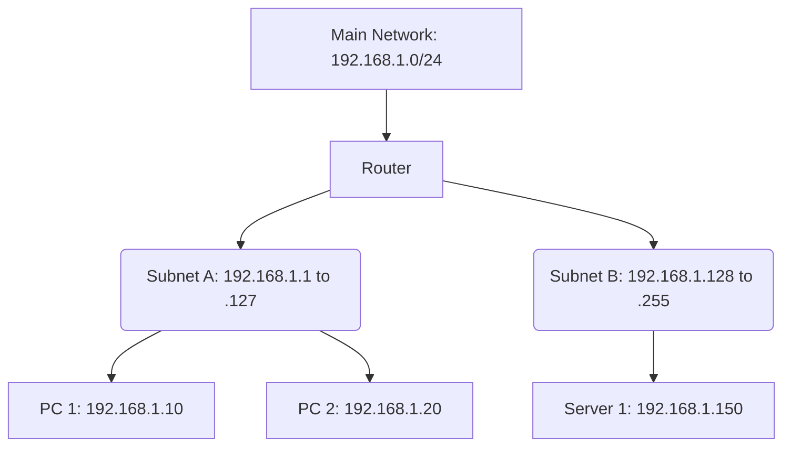
```mermaid

flowchart TD
    A["Main Network: 192.168.1.0/24"]
    A --> B[Router]
    B --> C(Subnet A: 192.168.1.1 to .127)
    B --> D(Subnet B: 192.168.1.128 to .255)
    
    C --> E["PC 1: 192.168.1.10"]
    C --> F["PC 2: 192.168.1.20"]
    
    D --> G["Server 1: 192.168.1.150"]
```

## 3. Implementation / Configuration (Include Python/CLI examples)
Python has a great built-in library for calculating IP addresses and subnets.
**Python Script:**
```python
import ipaddress

network = ipaddress.ip_network('192.168.1.0/24')
print(f"Total IPs in network: {network.num_addresses}")
print(f"First usable IP: {network[1]}")
print(f"Subnet Mask: {network.netmask}")
```

## 4. Line-by-Line Explanation
- `import ipaddress`: Imports Python's built-in module specifically designed for inspecting and manipulating IP addresses.
- `ip_network('192.168.1.0/24')`: We define a network. The `/24` tells us the size of the subnet mask, which dictates how many addresses belong to this network.
- `network.num_addresses`: Calculates the total number of IP addresses available in this specific subnet (in a /24, it's 256).
- `network[1]`: Grabs the first usable IP address in the network (often assigned to the router).
- `network.netmask`: Displays the subnet mask (which would be 255.255.255.0), the mechanism used to separate the network portion from the host portion of the address.

## 5. Summary
IP addresses are the unique identifiers for devices on a network. Subnetting allows us to break large networks down into smaller, manageable, and more secure segments. We can use tools like Python's `ipaddress` module to easily calculate network sizes and available IPs.


<div style='page-break-after: always;'></div>

# Module 004: The TCP 3-Way Handshake

## 1. What is it? (Explain from scratch for a complete beginner)
Imagine you want to make a phone call. Before you can start talking, you dial the number, wait for the other person to say "Hello?", and then you say "Hi, it's me!". Only after this polite introduction do you begin your conversation.
Computers use a very similar polite introduction when they want to send data reliably. This process is called the **TCP 3-Way Handshake**. 
TCP (Transmission Control Protocol) is a set of rules that ensures data arrives perfectly, without missing any pieces. To guarantee this, the two computers must first agree to a connection using three steps:
1. **SYN (Synchronize):** Computer A says, "Hello, can we talk?"
2. **SYN-ACK (Synchronize-Acknowledge):** Computer B replies, "Yes, I hear you, we can talk!"
3. **ACK (Acknowledge):** Computer A says, "Great, I'm starting to send data now."

## 2. System Architecture / Flow (MUST include a Mermaid flowchart/sequence diagram)
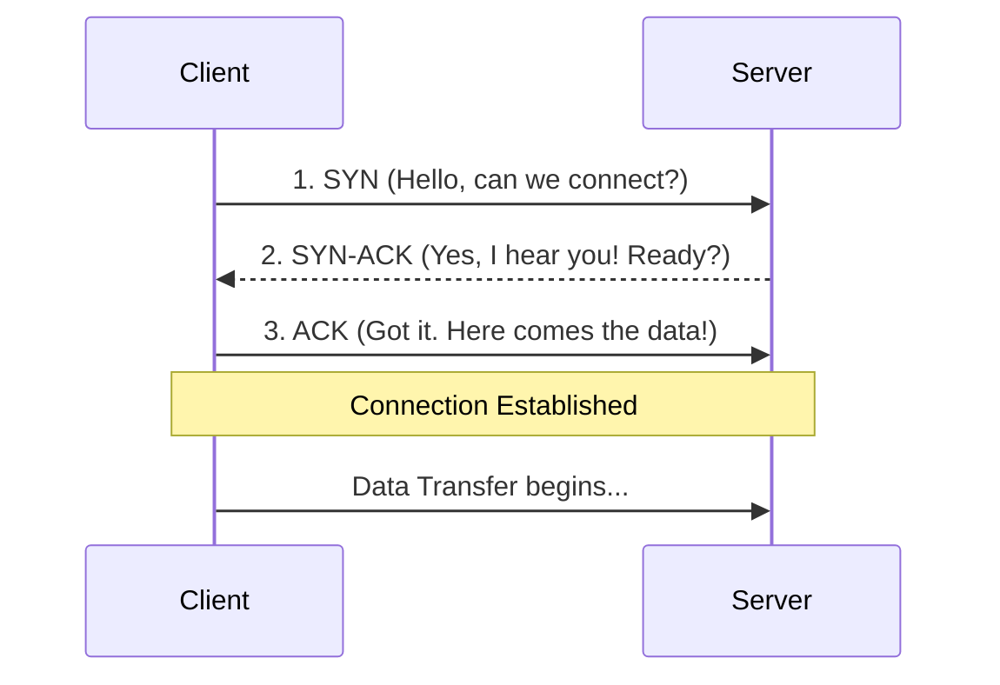
```mermaid

sequenceDiagram
    participant Client
    participant Server
    Client->>Server: 1. SYN (Hello, can we connect?)
    Server-->>Client: 2. SYN-ACK (Yes, I hear you! Ready?)
    Client->>Server: 3. ACK (Got it. Here comes the data!)
    Note over Client,Server: Connection Established
    Client->>Server: Data Transfer begins...
```

## 3. Implementation / Configuration (Include Python/CLI examples)
We can create a simple TCP connection in Python using sockets to trigger this handshake.
**Python Script:**
```python
import socket

# Create a TCP socket
client_socket = socket.socket(socket.AF_INET, socket.SOCK_STREAM)

# This single line triggers the 3-Way Handshake!
client_socket.connect(("google.com", 80))

print("Handshake successful, connected to Google on port 80!")
client_socket.close()
```

## 4. Line-by-Line Explanation
- `import socket`: Brings in the Python module used for network connections.
- `socket.socket(...)`: Creates a new "socket", which is basically a software plug. `AF_INET` means we are using IPv4 addresses, and `SOCK_STREAM` means we specifically want to use TCP (which requires the handshake).
- `client_socket.connect(...)`: This is where the magic happens. By calling `connect`, your computer automatically sends the SYN packet to `google.com` on port 80 (web traffic). Google responds with SYN-ACK, and your computer automatically replies with ACK.
- `print(...)`: Confirms that the 3-way handshake completed without any errors.
- `client_socket.close()`: Politely closes the connection when we are done.

## 5. Summary
The TCP 3-Way Handshake is a reliable introduction protocol (SYN, SYN-ACK, ACK) that two computers perform before sending data to ensure both sides are ready and listening. This reliability makes TCP the backbone of the internet for things like loading web pages and downloading files.


<div style='page-break-after: always;'></div>

# Module 005: UDP: The Best Effort Protocol

## 1. What is it? (Explain from scratch for a complete beginner)
If TCP is like a registered mail service where you get a signature confirming delivery, **UDP** (User Datagram Protocol) is like throwing a postcard out of a moving car window towards someone's mailbox. You hope it gets there, but you don't stick around to check!
UDP is a "connectionless" protocol. It doesn't use the polite TCP 3-way handshake. It just starts blasting data at the destination immediately. 
Why would we want a protocol that might lose data? **Speed!** Because UDP skips the handshakes and the delivery confirmations, it is incredibly fast. It's used for things where a missing packet doesn't ruin the whole experience, like live video streaming (a dropped frame just causes a brief glitch), online gaming (you want the newest location data instantly), or Voice over IP phone calls.

## 2. System Architecture / Flow (MUST include a Mermaid flowchart/sequence diagram)
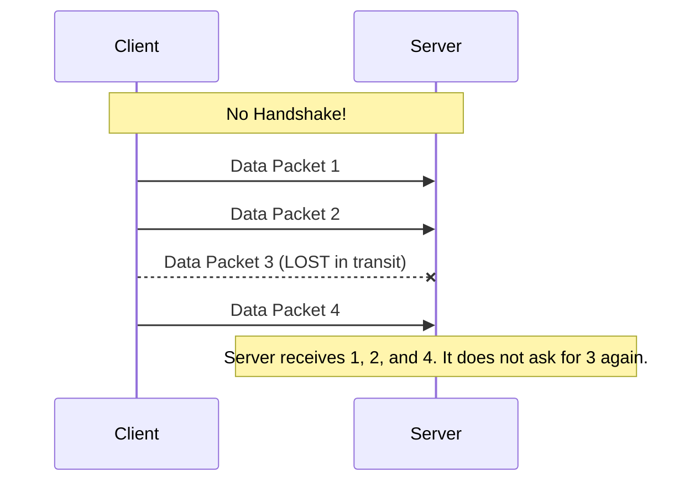
```mermaid

sequenceDiagram
    participant Client
    participant Server
    Note over Client,Server: No Handshake!
    Client->>Server: Data Packet 1
    Client->>Server: Data Packet 2
    Client--xServer: Data Packet 3 (LOST in transit)
    Client->>Server: Data Packet 4
    Note over Server: Server receives 1, 2, and 4. It does not ask for 3 again.
```

## 3. Implementation / Configuration (Include Python/CLI examples)
Creating a UDP connection in Python is very simple since there is no connection setup phase.
**Python Script:**
```python
import socket

# Create a UDP socket
udp_socket = socket.socket(socket.AF_INET, socket.SOCK_DGRAM)

# Message to send
message = b"Hello Server, catching this?"

# Blast the data immediately without connect()
udp_socket.sendto(message, ("127.0.0.1", 9999))
print("Message sent via UDP!")
```

## 4. Line-by-Line Explanation
- `socket.socket(...)`: Creates the network plug. This time we use `SOCK_DGRAM`, which tells Python we want to use UDP instead of TCP.
- `message = b"..."`: The `b` converts the text into bytes, which is the raw format data needs to be in to travel over a network.
- `udp_socket.sendto(...)`: Notice we didn't use `connect()`! We use `sendto()` to simply aim the data at an IP (`127.0.0.1`, which is local loopback) and a port (`9999`), and fire it off immediately. There is no check to see if anyone is listening on port 9999.
- `print(...)`: Confirms our code executed.

## 5. Summary
UDP is a fast, connectionless protocol that sacrifices reliability for speed. It is perfect for real-time applications like video games and live streaming where getting data instantly is more important than getting every single piece perfectly.


<div style='page-break-after: always;'></div>

# Module 006: Ports and Sockets

## 1. What is it? (Explain from scratch for a complete beginner)
Imagine an IP address is an apartment building. A package (packet) arrives at the building because it has the correct street address (IP address). But how does the postman know *which* apartment door to deliver it to? That's where **Ports** come in!
A Port is simply an apartment number for a computer. When data arrives at your computer's IP address, the Port number tells the computer which specific application should receive that data. 
- Port 80 goes to the Web Server application.
- Port 25 goes to the Email application.
A **Socket** is the combination of an IP Address and a Port number (e.g., `192.168.1.10:80`). It represents a single, complete destination for data.

## 2. System Architecture / Flow (MUST include a Mermaid flowchart/sequence diagram)
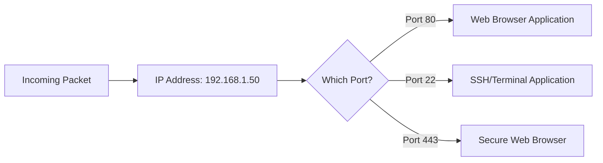
```mermaid

flowchart LR
    A["Incoming Packet"] --> B["IP Address: 192.168.1.50"]
    B --> C{"Which Port?"}
    C -- Port 80 --> D["Web Browser Application"]
    C -- Port 22 --> E["SSH/Terminal Application"]
    C -- Port 443 --> F["Secure Web Browser"]
```

## 3. Implementation / Configuration (Include Python/CLI examples)
You can see which ports are currently open and listening on your computer using the command line.
**CLI Command (Windows/Linux/macOS):**
```bash
netstat -an
```

## 4. Line-by-Line Explanation
- `netstat`: Network Statistics. This is a classic command-line tool used to display active network connections and listening ports.
- `-a`: Displays **A**ll active connections and listening ports on your machine.
- `-n`: Displays addresses and port numbers in **N**umerical form, rather than trying to look up the names (which makes the command run much faster).
- The output will show columns for Protocol (TCP/UDP), Local Address (your IP and Port, e.g., 127.0.0.1:443), and the State of the connection (e.g., LISTENING, ESTABLISHED).

## 5. Summary
While an IP Address gets data to the right computer, a Port gets data to the right application on that computer. A Socket is the combination of an IP and a Port, forming a complete digital address. You can view your computer's open ports using tools like `netstat`.


<div style='page-break-after: always;'></div>

# Module 007: DNS: The Phonebook of the Internet

## 1. What is it? (Explain from scratch for a complete beginner)
Computers communicate using IP Addresses (like `142.250.190.46`). However, humans are terrible at remembering random strings of numbers! We prefer names like `google.com` or `amazon.com`. 
To solve this problem, we created the **Domain Name System (DNS)**. DNS is literally the phonebook of the internet. When you type `google.com` into your browser, your computer secretly asks a DNS server, "Hey, what is the IP address for google.com?" The DNS server looks up the name, finds the number `142.250.190.46`, and hands it back to your computer so it can make the connection.

## 2. System Architecture / Flow (MUST include a Mermaid flowchart/sequence diagram)
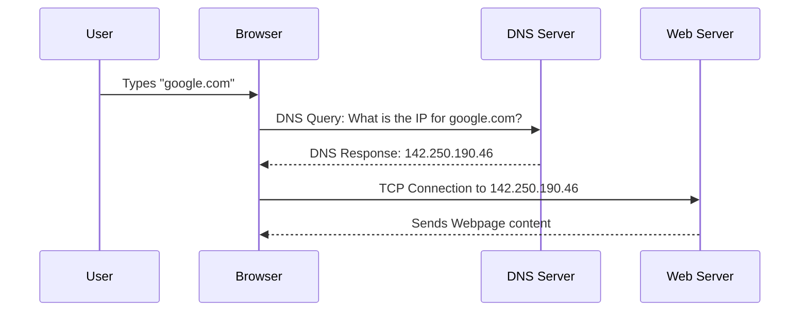
```mermaid

sequenceDiagram
    participant User
    participant Browser
    participant DNSServer as DNS Server
    participant WebServer as Web Server
    
    User->>Browser: Types "google.com"
    Browser->>DNSServer: DNS Query: What is the IP for google.com?
    DNSServer-->>Browser: DNS Response: 142.250.190.46
    Browser->>WebServer: TCP Connection to 142.250.190.46
    WebServer-->>Browser: Sends Webpage content
```

## 3. Implementation / Configuration (Include Python/CLI examples)
You can act as your own computer and ask DNS servers for IP addresses using the `nslookup` or `dig` commands.
**CLI Command (Windows/Linux/macOS):**
```bash
nslookup google.com
```

**Python Script:**
```python
import socket

# Ask the OS to resolve a hostname to an IP
ip_address = socket.gethostbyname("geeksforgeeks.org")
print(f"The IP address is: {ip_address}")
```

## 4. Line-by-Line Explanation
**Python:**
- `import socket`: The network library.
- `socket.gethostbyname(...)`: This function triggers a DNS lookup. It takes a human-readable domain name string and queries your computer's configured DNS server.
- The returned value is the numerical IP address, which is then printed to the screen.

**CLI:**
- `nslookup`: Stands for Name Server Lookup. It asks the DNS server for the IP record associated with the domain name provided.

## 5. Summary
DNS translates human-readable domain names (like website URLs) into computer-readable IP addresses. Without DNS, we would have to memorize a string of numbers for every website we wanted to visit. Tools like `nslookup` or Python's `socket` library allow us to perform these translations manually.


<div style='page-break-after: always;'></div>

# Module 008: HTTP and The Web

## 1. What is it? (Explain from scratch for a complete beginner)
When you browse the web, your browser and the website's server are talking to each other using a language called **HTTP** (HyperText Transfer Protocol). 
Think of HTTP like placing an order at a restaurant. 
1. **The Request:** You (the client) look at the menu and tell the waiter, "I want a burger." (An HTTP GET request).
2. **The Response:** The waiter goes to the kitchen (the server), gets your food, and brings it back to you on a plate (An HTTP Response with the webpage data).
HTTP requests usually contain a "Method" indicating what you want to do: `GET` (give me a webpage) or `POST` (I am sending you data, like a login form).

## 2. System Architecture / Flow (MUST include a Mermaid flowchart/sequence diagram)
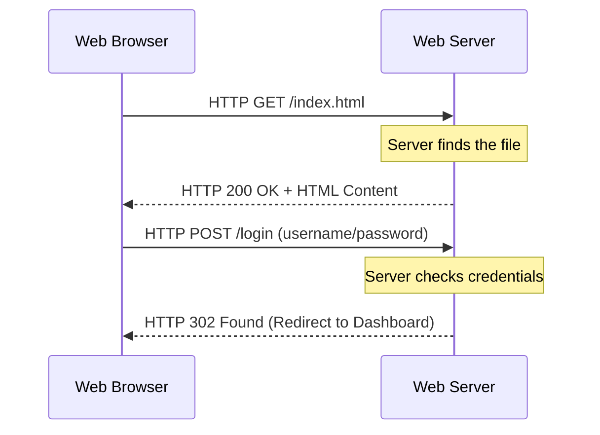
```mermaid

sequenceDiagram
    participant Client as Web Browser
    participant Server as Web Server
    
    Client->>Server: HTTP GET /index.html
    Note over Server: Server finds the file
    Server-->>Client: HTTP 200 OK + HTML Content
    
    Client->>Server: HTTP POST /login (username/password)
    Note over Server: Server checks credentials
    Server-->>Client: HTTP 302 Found (Redirect to Dashboard)
```

## 3. Implementation / Configuration (Include Python/CLI examples)
Python's `requests` library is the easiest way to speak HTTP through code.
**Python Script:**
```python
import requests

# Send an HTTP GET request to a website
response = requests.get("https://httpbin.org/get")

# Check the HTTP Status Code (200 means OK)
print(f"Status Code: {response.status_code}")

# Print the text content returned by the server
print("Response Data:")
print(response.text)
```

## 4. Line-by-Line Explanation
- `import requests`: Imports a highly popular, third-party Python library for making HTTP requests (you may need to install it via `pip install requests`).
- `requests.get(...)`: Creates and sends an HTTP GET request to the URL provided. The server's reply is saved into the `response` variable.
- `response.status_code`: Every HTTP response comes with a number. `200` means success. `404` means not found. `500` means server error.
- `response.text`: This extracts the actual body of the response (the HTML text, or in this case, JSON data) so we can read it.

## 5. Summary
HTTP is the language of the World Wide Web. It operates on a simple Request and Response cycle between a client (your browser) and a server. Using methods like GET and POST, and checking Status Codes like 200 or 404, we can interact with web servers easily using tools like Python's `requests` library.


<div style='page-break-after: always;'></div>

# Module 009: Encryption, TLS, and SSL

## 1. What is it? (Explain from scratch for a complete beginner)
If standard HTTP is like sending a postcard through the mail (anyone handling it can read what it says), **HTTPS** (the S stands for Secure) is like putting that postcard inside a locked steel box.
To lock the box, we use **Encryption**, which scrambles the data so it looks like gibberish to anyone who doesn't have the secret key to unlock it. 
**TLS (Transport Layer Security)**, and its older predecessor **SSL**, are the protocols that provide this encryption for the web. When you see a little padlock icon next to a URL in your browser, it means a TLS handshake occurred, secret keys were exchanged securely, and all your web traffic is now scrambled and safe from eavesdroppers.

## 2. System Architecture / Flow (MUST include a Mermaid flowchart/sequence diagram)
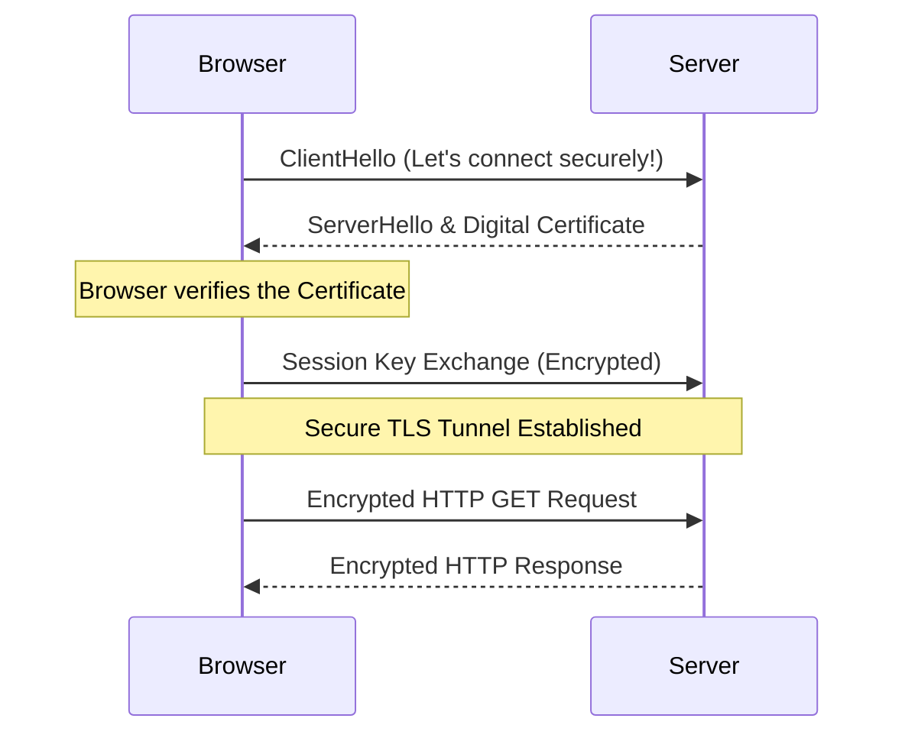
```mermaid

sequenceDiagram
    participant Browser
    participant Server
    
    Browser->>Server: ClientHello (Let's connect securely!)
    Server-->>Browser: ServerHello & Digital Certificate
    Note over Browser: Browser verifies the Certificate
    Browser->>Server: Session Key Exchange (Encrypted)
    Note over Browser,Server: Secure TLS Tunnel Established
    Browser->>Server: Encrypted HTTP GET Request
    Server-->>Browser: Encrypted HTTP Response
```

## 3. Implementation / Configuration (Include Python/CLI examples)
We can use Python to inspect the TLS certificate of a website to see if it is secure.
**Python Script:**
```python
import ssl
import socket

hostname = 'www.google.com'
context = ssl.create_default_context()

with socket.create_connection((hostname, 443)) as sock:
    with context.wrap_socket(sock, server_hostname=hostname) as ssock:
        print(f"TLS Version: {ssock.version()}")
        cert = ssock.getpeercert()
        print(f"Issued To: {cert['subject'][0][0][1]}")
```

## 4. Line-by-Line Explanation
- `import ssl`: Imports Python's built-in module for TLS/SSL encryption.
- `ssl.create_default_context()`: Sets up the default security settings (trusted certificate authorities, secure cipher suites).
- `socket.create_connection(...)`: Opens a standard TCP connection to port 443 (the default port for secure HTTPS traffic).
- `context.wrap_socket(...)`: This is the crucial step. It takes our plain TCP connection and "wraps" it in TLS encryption, performing the secure handshake.
- `ssock.version()`: Prints the version of TLS being used (e.g., TLSv1.3).
- `ssock.getpeercert()`: Downloads the digital certificate from the server so we can see who it was issued to.

## 5. Summary
Encryption protects data from being read by unauthorized people. TLS (and SSL) provides a secure, encrypted tunnel for web traffic, upgrading insecure HTTP to secure HTTPS. This process ensures that passwords and sensitive data are safe as they travel across the internet.


<div style='page-break-after: always;'></div>

# Module 010: Packets vs. Flows (Crucial for NDR)

## 1. What is it? (Explain from scratch for a complete beginner)
In the world of Cybersecurity, specifically **NDR** (Network Detection and Response), security analysts have to monitor network traffic for hackers. They do this in two main ways: looking at **Packets** or looking at **Flows**.
- **Packet Capture (PCAP):** This is like recording the complete audio of a phone call. You capture every single byte of data sent. It is highly detailed but takes up a massive amount of hard drive space and is hard to search quickly.
- **Network Flows (NetFlow/IPFIX):** This is like looking at a phone bill. It doesn't record the audio of the call, but it tells you *who* called *whom*, at what *time*, and for *how long*. It is metadata. Flows are tiny, easy to store for months, and perfect for spotting weird trends (like a computer suddenly uploading gigabytes of data to an unknown country at 3 AM).

## 2. System Architecture / Flow (MUST include a Mermaid flowchart/sequence diagram)
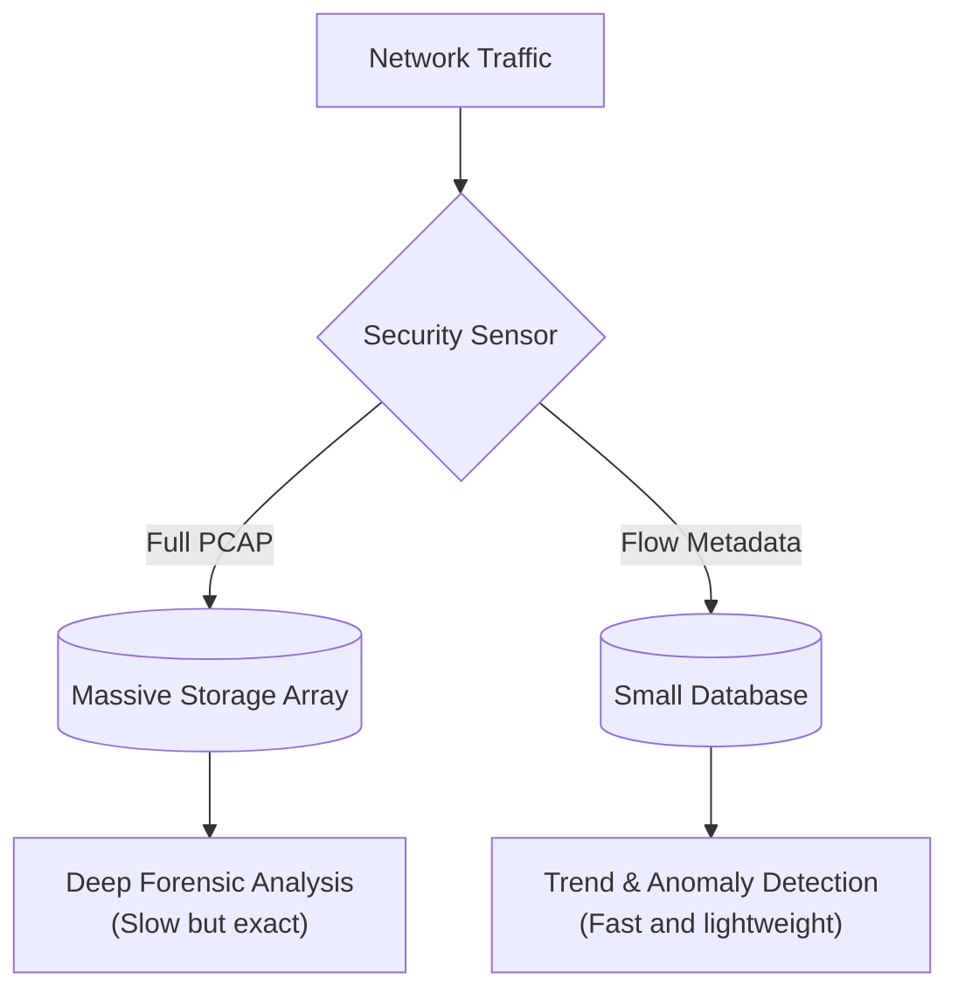
```mermaid

flowchart TD
    A["Network Traffic"] --> B{"Security Sensor"}
    B -- Full PCAP --> C[("Massive Storage Array")]
    B -- Flow Metadata --> D[("Small Database")]
    
    C --> E["Deep Forensic Analysis<br/>(Slow but exact)"]
    D --> F["Trend & Anomaly Detection<br/>(Fast and lightweight)"]
```

## 3. Implementation / Configuration (Include Python/CLI examples)
While Python code for flow generation is complex, here is how you might capture packets vs view flows conceptually on a Linux CLI.
**Capture Packets (Heavy):**
```bash
tcpdump -w traffic.pcap -i eth0
```
*`tcpdump` grabs the entire packet (headers + data body) on interface `eth0` and writes it to a file. This file will grow extremely fast.*

**Analyze Flows (Lightweight, via a tool like Zeek):**
```bash
cat conn.log | awk '{print $3, $5, $9}'
```
*A flow log (like Zeek's `conn.log`) already summarizes the data. This `awk` command easily extracts just the Source IP, Destination IP, and Bytes Transferred without needing to read heavy packet data.*

## 4. Line-by-Line Explanation
- `tcpdump -w traffic.pcap -i eth0`: `tcpdump` is the packet capture tool. `-w` means write to file, and `-i eth0` specifies which network card to listen on.
- `cat conn.log`: Reads out the connection flow log generated by a sensor.
- `awk '{print $3, $5, $9}'`: Awk is a text-processing tool. Here, it is pulling out the 3rd, 5th, and 9th columns of the log (which typically correspond to Source IP, Destination IP, and Bytes).

## 5. Summary
For network security, we must choose between detail and efficiency. Packets (PCAP) contain the full payload of data, useful for deep forensic investigations but expensive to store. Network Flows contain lightweight metadata (source, destination, time, size), which is ideal for long-term storage and detecting anomalous behavior using NDR tools.


<div style='page-break-after: always;'></div>

# Module 11: The History of Network Attacks
## 1. What is it? (Explain from scratch for a complete beginner)
The history of network attacks is the story of how computer networks evolved from trusted academic environments into contested digital battlegrounds. Early networks assumed all users were friendly, meaning there was little to no security built into the original protocols. Over time, as the internet grew, individuals discovered they could abuse these protocols to gain unauthorized access, steal data, or disrupt services. Studying historical attacks like the Morris Worm (1988) or ILOVEYOU (2000) helps us understand why modern security defenses are built the way they are today.

## 2. Attack Architecture / Flow
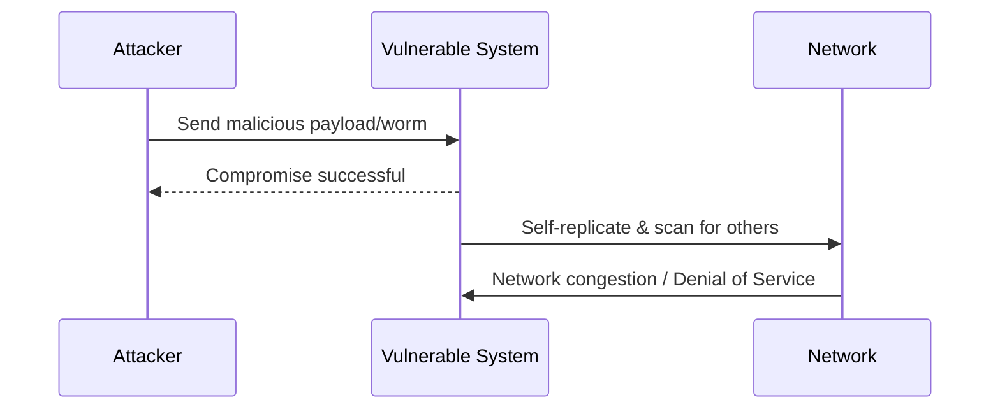
```mermaid

sequenceDiagram
    participant A as Attacker
    participant VS as Vulnerable System
    participant N as Network
    A->>VS: Send malicious payload/worm
    VS-->>A: Compromise successful
    VS->>N: Self-replicate & scan for others
    N->>VS: Network congestion / Denial of Service
```

## 3. Implementation / Code
```python
# Defensive Code: Legacy Attack Pattern Detector (Heuristic)
def detect_legacy_patterns(log_lines):
    suspicious_patterns = ["DEBUG", "WIZ", "expn", "vrfy"]
    alerts = []
    
    for line in log_lines:
        line_lower = line.lower()
        for pattern in suspicious_patterns:
            if pattern in line_lower:
                alerts.append(f"ALERT: Historical attack footprint detected: {pattern} in log -> {line}")
                
    return alerts

# Example Usage
logs = ["Jan 10 08:30:00 server postfix/smtpd: connect from unknown",
        "Jan 10 08:31:00 server sendmail: DEBUG root"]
print(detect_legacy_patterns(logs))
```

## 4. Line-by-Line Explanation
- `def detect_legacy_patterns(log_lines):`: Defines our defensive function that takes a list of server logs.
- `suspicious_patterns = [...]`: A list of commands historically abused in older protocols (like SMTP or Telnet).
- `alerts = []`: Creates an empty list to store our security warnings.
- `for line in log_lines:`: Loops through every line in our server logs.
- `if pattern in line_lower:`: Checks if the suspicious historical command is present in the current log line.
- `alerts.append(...)`: If found, it creates an alert string and adds it to our list.

## 5. Summary
By analyzing the history of network attacks, we learn that security cannot be an afterthought. Defensive programming, such as looking for deprecated or dangerous commands in logs, is a foundational step in securing legacy systems against known historical footprints.

<div style='page-break-after: always;'></div>

# Module 12: Reconnaissance & Port Scanning (Nmap)
## 1. What is it? (Explain from scratch for a complete beginner)
Reconnaissance is the "scouting" phase of a cyber attack. Just like a burglar checking which doors and windows of a house are unlocked, an attacker scans a target network to see which "ports" (communication channels) are open. Tools like Nmap send tiny network messages to thousands of ports on a server. If the server replies, the attacker knows that specific port is open and potentially vulnerable. Port scanning itself isn't an attack, but it is the critical first step an attacker takes to map out their target.

## 2. Attack Architecture / Flow
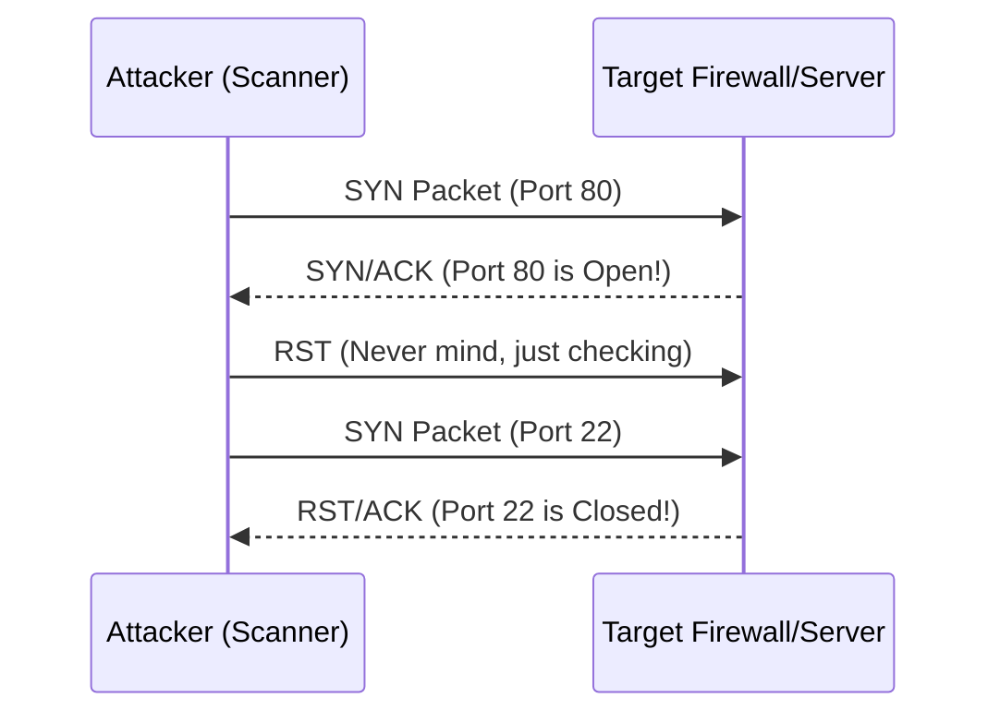
```mermaid

sequenceDiagram
    participant A as Attacker (Scanner)
    participant F as Target Firewall/Server
    A->>F: SYN Packet (Port 80)
    F-->>A: SYN/ACK (Port 80 is Open!)
    A->>F: RST (Never mind, just checking)
    A->>F: SYN Packet (Port 22)
    F-->>A: RST/ACK (Port 22 is Closed!)
```

## 3. Implementation / Code
```python
# Defensive Code: Port Scan Detection via Connection Rate Tracking
from collections import defaultdict
import time

class PortScanDetector:
    def __init__(self, time_window=60, port_threshold=20):
        self.time_window = time_window
        self.port_threshold = port_threshold
        # Stores {source_ip: {port1, port2, ...}}
        self.connections = defaultdict(set)
        
    def log_connection(self, src_ip, dst_port):
        self.connections[src_ip].add(dst_port)
        
        # Check if the unique ports scanned exceed our threshold
        if len(self.connections[src_ip]) > self.port_threshold:
            print(f"[!] PORT SCAN DETECTED from {src_ip}: {len(self.connections[src_ip])} unique ports.")

# Example Usage
detector = PortScanDetector()
for port in range(1, 25):
    detector.log_connection("192.168.1.100", port)
```

## 4. Line-by-Line Explanation
- `from collections import defaultdict`: Imports a specialized dictionary that automatically handles missing keys.
- `class PortScanDetector:`: Creates a blueprint for our defensive tool.
- `self.time_window = time_window`: Sets how long we track connections (e.g., 60 seconds).
- `self.connections = defaultdict(set)`: A dictionary mapping an IP address to a unique mathematical 'set' of ports it has touched.
- `self.connections[src_ip].add(dst_port)`: Records the destination port accessed by the source IP. Sets naturally prevent duplicates.
- `if len(...) > self.port_threshold:`: If one IP touches more than 20 distinct ports quickly, we flag it as a scanner.

## 5. Summary
Reconnaissance helps attackers find ways in, but defenders can use the noise generated by tools like Nmap to their advantage. By tracking how many unique ports a single IP addresses attempts to access in a short timeframe, we can detect and block scanners before they find vulnerabilities.

<div style='page-break-after: always;'></div>

# Module 13: Botnets & The Zombie Army
## 1. What is it? (Explain from scratch for a complete beginner)
A botnet (short for "robot network") is a massive army of infected computers, smart TVs, and IoT cameras controlled by a single attacker (the "botmaster"). The owners of these devices usually have no idea their device is infected. The botmaster can issue a command to all these "zombie" devices at once, ordering them to simultaneously flood a target website with traffic, send billions of spam emails, or mine cryptocurrency.

## 2. Attack Architecture / Flow
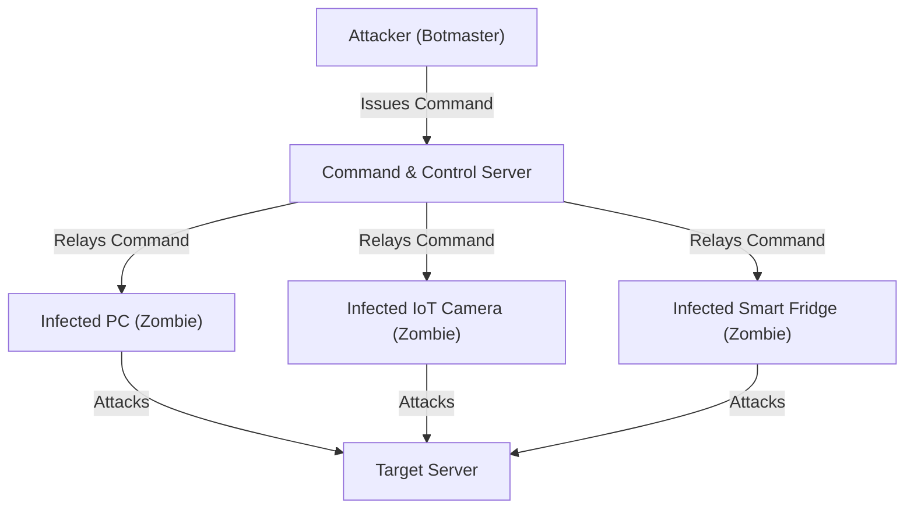
```mermaid

flowchart TD
    A["Attacker (Botmaster)"] -->|Issues Command| C2["Command & Control Server"]
    C2 -->|Relays Command| B1["Infected PC (Zombie)"]
    C2 -->|Relays Command| B2["Infected IoT Camera (Zombie)"]
    C2 -->|Relays Command| B3["Infected Smart Fridge (Zombie)"]
    B1 -->|Attacks| T["Target Server"]
    B2 -->|Attacks| T
    B3 -->|Attacks| T
```

## 3. Implementation / Code
```python
# Defensive Code: Detecting Distributed Anomalies (Botnet DDoS Simulation)
from collections import Counter

def detect_botnet_activity(network_logs, traffic_threshold=1000):
    # network_logs = [{'src_ip': '...', 'dst_ip': '...', 'bytes': ...}]
    target_traffic = Counter()
    
    # Aggregate total connections to each destination
    for log in network_logs:
        target_traffic[log['dst_ip']] += 1
        
    alerts = []
    for target_ip, connection_count in target_traffic.items():
        if connection_count > traffic_threshold:
            alerts.append(f"[!] Botnet/DDoS Alert: {target_ip} is receiving massive distributed traffic ({connection_count} connections).")
            
    return alerts

# Example Usage
logs = [{'src_ip': f"10.0.0.{i}", 'dst_ip': "192.168.1.50", 'bytes': 64} for i in range(1500)]
print(detect_botnet_activity(logs))
```

## 4. Line-by-Line Explanation
- `from collections import Counter`: Imports a built-in Python tool used specifically for counting occurrences.
- `def detect_botnet_activity(...)`: Defines our detection function, taking a list of network logs and a threshold.
- `target_traffic = Counter()`: Initializes a counter to track how many connections each server is receiving.
- `for log in network_logs:`: Loops through all network traffic data.
- `target_traffic[log['dst_ip']] += 1`: Increments the connection count for the destination IP by 1.
- `if connection_count > traffic_threshold:`: Checks if a single destination is receiving an abnormal, massive amount of connections, indicative of a coordinated botnet attack.

## 5. Summary
Botnets leverage the combined power of thousands of infected devices to overwhelm targets. Defenders protect networks from botnets by using aggregation and thresholding algorithms to spot when a single target is suddenly hit by distributed, anomalous traffic volumes.

<div style='page-break-after: always;'></div>

# Module 14: Command & Control (C2) Beacons
## 1. What is it? (Explain from scratch for a complete beginner)
When malware infects a computer, it usually needs instructions on what to do next (e.g., "steal passwords," "encrypt files," or "wait"). To get these instructions, the malware "calls home" to the attacker's Command & Control (C2) server. To avoid detection, it doesn't keep a connection open all the time. Instead, it checks in briefly at regular intervals—say, every 5 minutes. This rhythmic, heartbeat-like check-in is called a "beacon." 

## 2. Attack Architecture / Flow
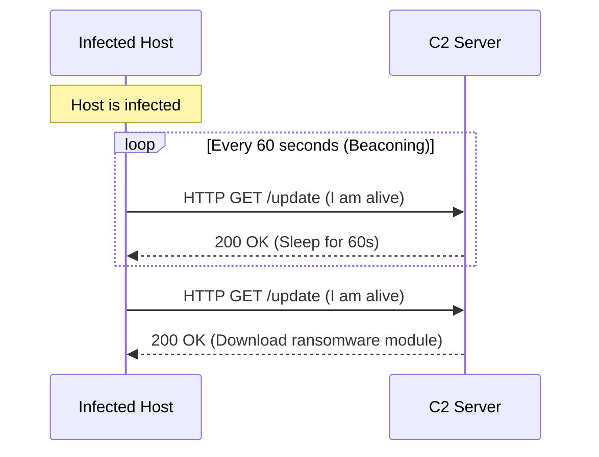
```mermaid

sequenceDiagram
    participant I as Infected Host
    participant C2 as C2 Server
    Note over I: Host is infected
    loop Every 60 seconds (Beaconing)
        I->>C2: HTTP GET /update (I am alive)
        C2-->>I: 200 OK (Sleep for 60s)
    end
    I->>C2: HTTP GET /update (I am alive)
    C2-->>I: 200 OK (Download ransomware module)
```

## 3. Implementation / Code
```python
# Defensive Code: Detecting C2 Beaconing via Time Variance Analysis
import statistics

def detect_c2_beacons(connection_timestamps, variance_threshold=2.0):
    if len(connection_timestamps) < 3:
        return False, "Not enough data"
        
    # Calculate the time difference (delta) between consecutive connections
    deltas = []
    for i in range(1, len(connection_timestamps)):
        deltas.append(connection_timestamps[i] - connection_timestamps[i-1])
        
    # Calculate the variance of these time differences
    time_variance = statistics.variance(deltas)
    
    # If the variance is very low, the connections are suspiciously rhythmic
    if time_variance < variance_threshold:
        return True, f"Suspicious Beaconing Detected! Variance: {time_variance:.2f}"
    
    return False, f"Normal human traffic. Variance: {time_variance:.2f}"

# Example Usage: Connections happening almost exactly every 60 seconds
timestamps = [1000, 1060, 1121, 1180, 1240, 1301]
is_c2, msg = detect_c2_beacons(timestamps)
print(msg)
```

## 4. Line-by-Line Explanation
- `import statistics`: Imports Python's math library for calculating variance.
- `def detect_c2_beacons(...)`: The function takes a list of times a computer connected to a specific external domain.
- `deltas.append(connection_timestamps[i] - connection_timestamps[i-1])`: Computes the exact time gap between each consecutive connection.
- `time_variance = statistics.variance(deltas)`: Calculates how much these gaps differ from one another.
- `if time_variance < variance_threshold:`: Normal human browsing is highly random (high variance). If the variance is extremely low, it means the connection is automated and rhythmic—a classic sign of C2 beaconing.

## 5. Summary
Malware needs to communicate with attackers to be effective. By analyzing the timing of network connections, defenders can spot the robotic, rhythmic "heartbeat" of C2 beacons hiding within the noise of normal human web browsing.

<div style='page-break-after: always;'></div>

# Module 15: Volumetric DDoS & TCP Exhaustion
## 1. What is it? (Explain from scratch for a complete beginner)
Imagine a restaurant that takes reservations over the phone. If a group of pranksters repeatedly call the restaurant, start a reservation, but hang up before finishing, all the phone lines get tied up. Real customers can't get through, and the host is left waiting for the pranksters to finish their sentences. This is a TCP SYN Flood attack. The attacker starts thousands of network "handshakes" (SYN) with a server but never finishes them. The server exhausts its memory waiting for the final handshake (ACK), causing it to crash or ignore legitimate users.

## 2. Attack Architecture / Flow
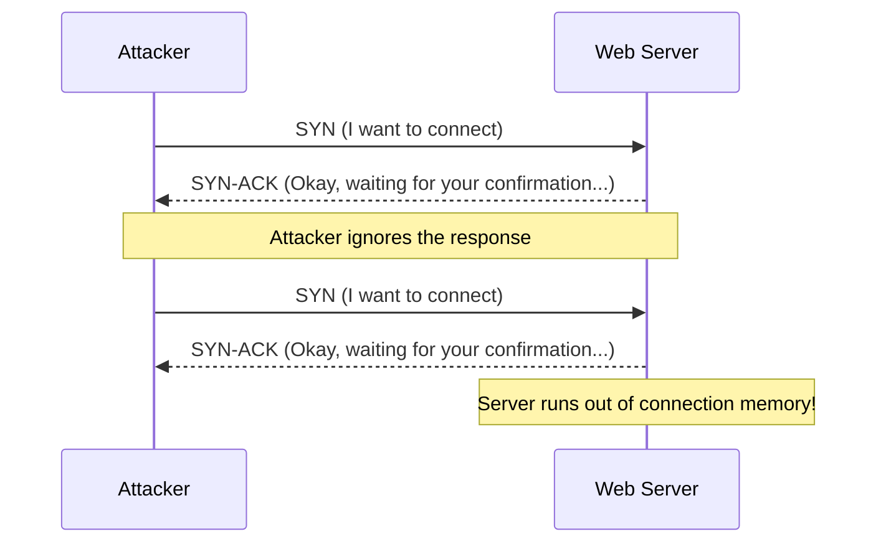
```mermaid

sequenceDiagram
    participant A as Attacker
    participant S as Web Server
    A->>S: SYN (I want to connect)
    S-->>A: SYN-ACK (Okay, waiting for your confirmation...)
    Note over A, S: Attacker ignores the response
    A->>S: SYN (I want to connect)
    S-->>A: SYN-ACK (Okay, waiting for your confirmation...)
    Note over S: Server runs out of connection memory!
```

## 3. Implementation / Code
```python
# Defensive Code: Detecting SYN Flood attacks by tracking TCP flags
def detect_syn_flood(packet_logs, max_unanswered_syns=500):
    # Track the difference between SYNs received and ACKs completed per IP
    pending_connections = {}
    
    for packet in packet_logs:
        src = packet['src_ip']
        flags = packet['tcp_flags']
        
        if src not in pending_connections:
            pending_connections[src] = 0
            
        if flags == 'SYN':
            pending_connections[src] += 1
        elif flags == 'ACK':
            pending_connections[src] -= 1
            
    # Check for IPs with too many uncompleted handshakes
    for ip, uncompleted in pending_connections.items():
        if uncompleted > max_unanswered_syns:
            print(f"[!] SYN FLOOD ALERT: {ip} has {uncompleted} half-open connections!")

# Example Usage
logs = [{'src_ip': '10.9.9.9', 'tcp_flags': 'SYN'} for _ in range(600)]
detect_syn_flood(logs)
```

## 4. Line-by-Line Explanation
- `def detect_syn_flood(...)`: Defines a function that scans network packets to find attackers exhausting server memory.
- `pending_connections = {}`: A dictionary to keep a running tally of open connections for each IP address.
- `if flags == 'SYN':`: If the packet is a "hello" (SYN), we add 1 to the tally of open connections.
- `elif flags == 'ACK':`: If the packet completes the handshake (ACK), we subtract 1 from the tally.
- `if uncompleted > max_unanswered_syns:`: If a single IP address has opened hundreds of connections but never finished them, we raise an alert.

## 5. Summary
TCP exhaustion attacks exploit the fundamental rules of how computers agree to communicate on the internet. By monitoring the ratio of initiated connections (SYN) to completed connections (ACK), defenders can identify and block IP addresses that are attempting to overwhelm the server's memory.

<div style='page-break-after: always;'></div>

# Module 16: UDP Amplification Attacks
## 1. What is it? (Explain from scratch for a complete beginner)
Imagine sending a letter to a mail-order catalog company requesting their heaviest 500-page catalog. But instead of putting *your* return address on the envelope, you put the address of your enemy. The company sends the massive heavy catalog to your enemy. Now imagine doing this thousands of times. This is a UDP Amplification attack. An attacker sends a tiny request to a public server (like a DNS or NTP server) using a forged (spoofed) IP address of their victim. The public server replies with a massive chunk of data, inadvertently flooding and destroying the victim's internet connection.

## 2. Attack Architecture / Flow
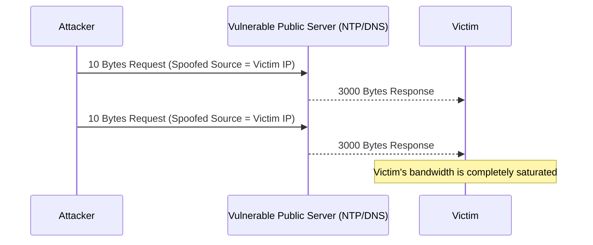
```mermaid

sequenceDiagram
    participant A as Attacker
    participant S as Vulnerable Public Server (NTP/DNS)
    participant V as Victim
    A->>S: 10 Bytes Request (Spoofed Source = Victim IP)
    S-->>V: 3000 Bytes Response
    A->>S: 10 Bytes Request (Spoofed Source = Victim IP)
    S-->>V: 3000 Bytes Response
    Note over V: Victim's bandwidth is completely saturated
```

## 3. Implementation / Code
```python
# Defensive Code: Detecting UDP Amplification based on inbound payload size and ports
def detect_udp_amplification(inbound_traffic):
    # Common ports abused for amplification (DNS, NTP, SSDP, Memcached)
    amplification_ports = {53, 123, 1900, 11211}
    threshold_bytes_per_sec = 5_000_000  # 5 MB/s
    
    victim_traffic_volume = {}
    
    for packet in inbound_traffic:
        if packet['protocol'] == 'UDP' and packet['src_port'] in amplification_ports:
            dst = packet['dst_ip']
            victim_traffic_volume[dst] = victim_traffic_volume.get(dst, 0) + packet['size_bytes']
            
    for victim_ip, volume in victim_traffic_volume.items():
        if volume > threshold_bytes_per_sec:
            print(f"[!] UDP Amplification Detected! {victim_ip} received {volume} bytes from amplification ports.")

# Example Usage
traffic = [{'protocol': 'UDP', 'src_port': 123, 'dst_ip': '192.168.1.10', 'size_bytes': 4000} for _ in range(2000)]
detect_udp_amplification(traffic)
```

## 4. Line-by-Line Explanation
- `amplification_ports = {53, 123, 1900, 11211}`: Sets containing the specific server ports commonly tricked into sending massive responses.
- `threshold_bytes_per_sec = 5_000_000`: Sets a baseline. If an internal IP receives more than 5MB per second of this specific UDP traffic, it's abnormal.
- `if packet['protocol'] == 'UDP' and packet['src_port'] in amplification_ports:`: Filters the traffic. We only care about UDP traffic originating from the risky ports.
- `victim_traffic_volume.get(dst, 0) + packet['size_bytes']`: Adds the size of the incoming packet to the running total for that victim's IP.
- `if volume > threshold_bytes_per_sec:`: Triggers the alarm if the volume exceeds safe limits.

## 5. Summary
UDP Amplification allows attackers to multiply their destructive power without needing a massive botnet. Defenders must monitor inbound UDP traffic from known vulnerable services (like DNS and NTP) to quickly detect and mitigate these massive volumetric floods.

<div style='page-break-after: always;'></div>

# Module 17: Application Layer Attacks (Slowloris)
## 1. What is it? (Explain from scratch for a complete beginner)
Unlike volumetric DDoS attacks that try to overwhelm a server with sheer force and millions of packets, Slowloris is a "low and slow" attack. Imagine someone walking up to a bank teller and speaking incredibly slowly, taking five minutes between every single word. The teller cannot help anyone else while they wait for the person to finish their sentence. Slowloris does this to web servers. It opens a web connection and sends pieces of a request at a painfully slow pace, keeping the server's connection slots occupied until legitimate users are entirely blocked out.

## 2. Attack Architecture / Flow
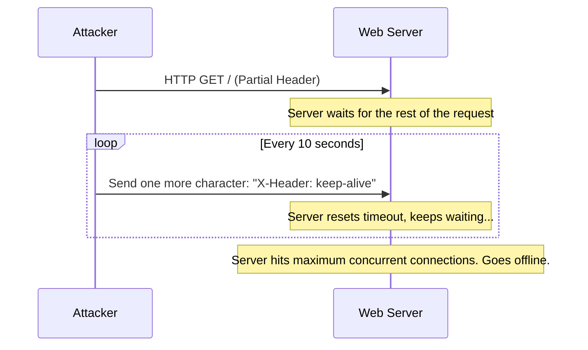
```mermaid

sequenceDiagram
    participant A as Attacker
    participant S as Web Server
    A->>S: HTTP GET / (Partial Header)
    Note over S: Server waits for the rest of the request
    loop Every 10 seconds
        A->>S: Send one more character: "X-Header: keep-alive"
        Note over S: Server resets timeout, keeps waiting...
    end
    Note over S: Server hits maximum concurrent connections. Goes offline.
```

## 3. Implementation / Code
```python
# Defensive Code: Detecting Slowloris via Connection Timeout & Byte Rate
def detect_slowloris(active_connections, current_time):
    # Minimum bytes per second a legitimate client should send
    min_bytes_per_sec = 10
    
    for conn_id, conn_data in active_connections.items():
        duration = current_time - conn_data['start_time']
        
        # Only evaluate connections open longer than 30 seconds
        if duration > 30:
            bytes_per_sec = conn_data['bytes_received'] / duration
            
            if bytes_per_sec < min_bytes_per_sec:
                print(f"[!] Slowloris Alert! Connection {conn_id} is suspiciously slow: {bytes_per_sec:.2f} B/s. Terminating.")

# Example Usage
# Connection 1: Open for 45 seconds, but only sent 50 bytes total.
conns = {
    "conn_001": {'start_time': 100, 'bytes_received': 50}
}
detect_slowloris(conns, current_time=145)
```

## 4. Line-by-Line Explanation
- `min_bytes_per_sec = 10`: Defines our standard. Legitimate web requests transfer data much faster than 10 bytes a second.
- `duration = current_time - conn_data['start_time']`: Calculates exactly how many seconds the connection has been held open.
- `if duration > 30:`: Gives clients a grace period. We only analyze connections that have been open for an unusually long time.
- `bytes_per_sec = conn_data['bytes_received'] / duration`: Calculates the average speed of data transfer for this connection.
- `if bytes_per_sec < min_bytes_per_sec:`: If a connection is open a long time but transferring almost no data, it matches the Slowloris profile.

## 5. Summary
Application layer attacks like Slowloris prove that you don't need a massive amount of bandwidth to take down a server. Defenders must enforce strict timeouts and minimum data-transfer rates to prevent attackers from hoarding server resources with "low and slow" techniques.

<div style='page-break-after: always;'></div>

# Module 18: Data Exfiltration
## 1. What is it? (Explain from scratch for a complete beginner)
Data Exfiltration is the cyber equivalent of smuggling. Once an attacker has broken into a network and found sensitive data (like credit card numbers or secret blueprints), they have to get it out of the network without sounding the alarm. Because firewalls block incoming attacks, attackers often encrypt the stolen data and send it outbound, hiding it in normal-looking web traffic or file transfers so the security team thinks it's just an employee uploading a document.

## 2. Attack Architecture / Flow
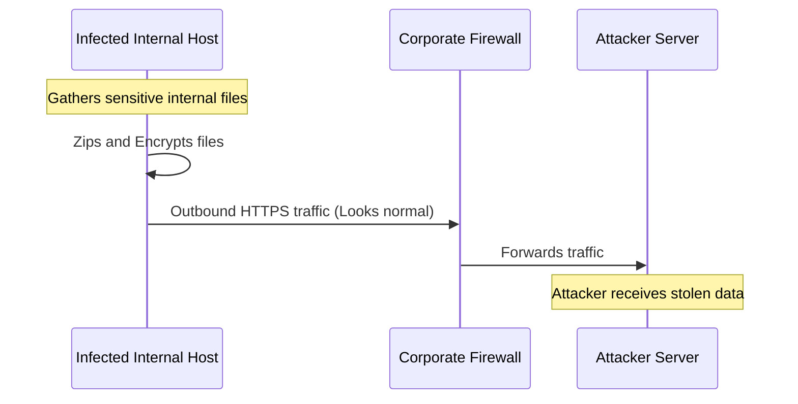
```mermaid

sequenceDiagram
    participant I as Infected Internal Host
    participant F as Corporate Firewall
    participant A as Attacker Server
    Note over I: Gathers sensitive internal files
    I->>I: Zips and Encrypts files
    I->>F: Outbound HTTPS traffic (Looks normal)
    F->>A: Forwards traffic
    Note over A: Attacker receives stolen data
```

## 3. Implementation / Code
```python
# Defensive Code: Baseline Outbound Traffic Anomaly Detection
def detect_exfiltration(daily_outbound_logs, baseline_mb=500, spike_multiplier=3):
    alerts = []
    
    for host_ip, bytes_sent in daily_outbound_logs.items():
        mb_sent = bytes_sent / (1024 * 1024)
        
        # If the host exceeds normal daily limits drastically
        if mb_sent > (baseline_mb * spike_multiplier):
            alerts.append(f"[CRITICAL] Exfiltration Alert: {host_ip} transferred {mb_sent:.2f} MB outbound! Normal is ~{baseline_mb} MB.")
            
    return alerts

# Example Usage
logs = {
    "10.0.0.15": 104857600,   # 100 MB (Normal)
    "10.0.0.99": 5368709120   # 5120 MB (Suspicious!)
}
for alert in detect_exfiltration(logs):
    print(alert)
```

## 4. Line-by-Line Explanation
- `baseline_mb=500`: Establishes that an average employee uploads about 500 MB of data to the internet per day.
- `spike_multiplier=3`: Sets a threshold. If someone uploads 3 times the baseline, it's highly suspicious.
- `mb_sent = bytes_sent / (1024 * 1024)`: Converts raw network bytes into readable Megabytes.
- `if mb_sent > (baseline_mb * spike_multiplier):`: Compares the host's daily outbound traffic against the established maximum threshold.
- `alerts.append(...)`: Generates a critical alert pointing directly to the IP address hoarding and smuggling data out of the network.

## 5. Summary
Preventing intruders from breaking in is only half the battle. Monitoring outbound traffic to detect anomalies and massive data transfers is critical for stopping Data Exfiltration. If you catch the smuggling attempt, the attacker leaves empty-handed.

<div style='page-break-after: always;'></div>

# Module 19: DNS Tunneling
## 1. What is it? (Explain from scratch for a complete beginner)
DNS (Domain Name System) is the phonebook of the internet; it turns names like "google.com" into IP addresses. Because almost every network allows DNS traffic to flow freely, attackers use it as a secret tunnel. Instead of asking for a real website, malware asks for a fake website containing hidden, stolen data (e.g., "password123.attacker.com"). The firewall sees a "normal" DNS request and lets it through. The attacker's server receives the request, strips off the data ("password123"), and replies with commands disguised as a DNS response.

## 2. Attack Architecture / Flow
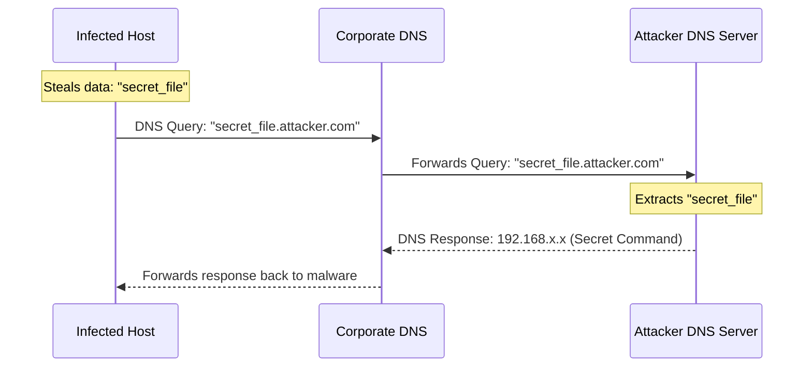
```mermaid

sequenceDiagram
    participant I as Infected Host
    participant D as Corporate DNS
    participant A as Attacker DNS Server
    Note over I: Steals data: "secret_file"
    I->>D: DNS Query: "secret_file.attacker.com"
    D->>A: Forwards Query: "secret_file.attacker.com"
    Note over A: Extracts "secret_file"
    A-->>D: DNS Response: 192.168.x.x (Secret Command)
    D-->>I: Forwards response back to malware
```

## 3. Implementation / Code
```python
# Defensive Code: Detecting DNS Tunneling via Subdomain Length and Entropy
import math

def calculate_entropy(string):
    # Calculates the randomness (entropy) of a string.
    prob = [float(string.count(c)) / len(string) for c in set(string)]
    return -sum(p * math.log(p, 2) for p in prob)

def detect_dns_tunneling(dns_queries, length_threshold=45, entropy_threshold=4.0):
    for query in dns_queries:
        # Extract just the subdomain part (e.g., 'a8b7c6d5e4' from 'a8b7c6d5e4.evil.com')
        subdomain = query.split('.')[0]
        
        # Tunneling usually uses very long, random-looking subdomains to fit data
        if len(subdomain) > length_threshold or calculate_entropy(subdomain) > entropy_threshold:
            print(f"[!] DNS Tunneling Alert: Highly suspicious query -> {query}")

# Example Usage
queries = ["www.google.com", "mail.yahoo.com", "z3x9v2b4n7m1q8w5e2r0.attacker.com"]
detect_dns_tunneling(queries)
```

## 4. Line-by-Line Explanation
- `def calculate_entropy(string):`: A mathematical function that measures how "random" a string looks. Normal words have low entropy; encrypted data has high entropy.
- `subdomain = query.split('.')[0]`: Takes a full web address and isolates the very first part (the subdomain).
- `if len(subdomain) > length_threshold...`: Attackers need to stuff a lot of data into the subdomain, making it unnaturally long. This checks if it's too long.
- `or calculate_entropy(subdomain) > entropy_threshold:`: Checks if the subdomain looks like random garbage (encrypted data) rather than a real word like "mail" or "www".
- `print(...)`: Alerts the security team to the covert tunnel.

## 5. Summary
Attackers love DNS tunneling because DNS is rarely blocked or deeply inspected by firewalls. By applying mathematical concepts like entropy and length thresholds, defenders can spot encrypted data masquerading as normal internet phonebook lookups.

<div style='page-break-after: always;'></div>

# Module 20: IP Spoofing
## 1. What is it? (Explain from scratch for a complete beginner)
When you send a physical letter, you write your return address in the top left corner. But nothing stops you from writing someone else's address there. IP Spoofing is the digital version of this. An attacker alters the network packet to forge the "Source IP address." They do this to hide their true identity, bypass firewalls that only trust specific IPs, or to trick servers into sending massive amounts of data to a victim (as seen in UDP Amplification). 

## 2. Attack Architecture / Flow
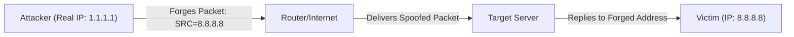
```mermaid

flowchart LR
    A["Attacker (Real IP: 1.1.1.1)"] -- "Forges Packet: SRC=8.8.8.8" --> R["Router/Internet"]
    R -- "Delivers Spoofed Packet" --> T["Target Server"]
    T -- "Replies to Forged Address" --> V["Victim (IP: 8.8.8.8)"]
```

## 3. Implementation / Code
```python
# Defensive Code: Ingress Filtering (Anti-Spoofing Pseudo-code)
def verify_ingress_traffic(packet, interface_expected_subnet):
    '''
    Simulates a router interface checking if the source IP of a packet 
    actually belongs to the network connected to that interface.
    '''
    src_ip = packet['src_ip']
    
    # In a real scenario, this uses IP math (CIDR). We use a basic string check for simplicity.
    if src_ip.startswith(interface_expected_subnet):
        return "Packet Accepted: Source IP matches interface routing rules."
    else:
        # BCP38: Network Ingress Filtering principle
        return f"[!] SPOOFING DETECTED: Packet dropped. {src_ip} shouldn't come from this interface!"

# Example Usage
# Router Interface 1 is connected to the 10.0.0.x network.
valid_packet = {'src_ip': '10.0.0.5', 'dst_ip': '8.8.8.8'}
spoofed_packet = {'src_ip': '192.168.1.1', 'dst_ip': '8.8.8.8'}

print(verify_ingress_traffic(valid_packet, "10.0.0."))
print(verify_ingress_traffic(spoofed_packet, "10.0.0."))
```

## 4. Line-by-Line Explanation
- `def verify_ingress_traffic(...)`: Defines a function representing a security check on a router interface.
- `interface_expected_subnet`: Represents the valid IP addresses that exist on the network physically plugged into this router port.
- `if src_ip.startswith(interface_expected_subnet):`: Checks if the packet's return address matches the physical location it just came from.
- `return f"[!] SPOOFING DETECTED..."`: If a packet claims to be from an external IP but comes from an internal network cable (or vice versa), the router drops it immediately.

## 5. Summary
IP spoofing undermines trust on the internet. The primary defense against IP spoofing is Network Ingress Filtering (BCP38), where routers strictly verify that traffic entering their interfaces actually belongs to the IP subnets assigned to those interfaces.

<div style='page-break-after: always;'></div>

# Module 21: Firewalls (The Perimeter)
## 1. What is it? (Explain from scratch for a complete beginner)
A firewall is like a security guard at the entrance of a building. It sits between your computer network (or a single computer) and the internet, checking all the digital traffic trying to come in or go out. If the traffic follows the rules (like having the right ID badge), the firewall lets it through. If it doesn't, the firewall blocks it. This prevents hackers, viruses, and malicious data from entering your system.

## 2. System Architecture
```mermaid

flowchart LR
    Internet((Internet)) -->|Incoming Traffic| FW[Firewall]
    FW -->|Allowed Traffic| InternalNetwork["Internal Network"]
    FW -->|Blocked Traffic| Drop[Discarded]
    InternalNetwork -->|Outgoing Traffic| FW
```

## 3. Implementation
Here is a simple example of how you might use Python (using `iptc` library) to add a firewall rule in Linux to block an IP address, or conceptually how rules are defined:

```python
# Conceptual Python representation of adding a firewall rule
class SimpleFirewall:
    def __init__(self):
        self.block_list = []

    def add_rule(self, ip_address):
        self.block_list.append(ip_address)
        print(f"Rule added: Block all traffic from {ip_address}")

    def inspect_traffic(self, source_ip):
        if source_ip in self.block_list:
            return "Blocked"
        return "Allowed"

fw = SimpleFirewall()
fw.add_rule("192.168.1.100")
print(fw.inspect_traffic("192.168.1.100")) # Blocked
print(fw.inspect_traffic("10.0.0.5"))      # Allowed
```

## 4. Line-by-Line Explanation
1. `class SimpleFirewall:`: Creates a blueprint for our simulated firewall.
2. `def __init__(self): self.block_list = []`: Initializes the firewall with an empty list of blocked IPs.
3. `def add_rule(self, ip_address):`: Defines a method to add a new rule.
4. `self.block_list.append(ip_address)`: Adds the specified IP to the block list.
5. `print(...)`: Confirms the rule was added.
6. `def inspect_traffic(self, source_ip):`: Method to check incoming traffic.
7. `if source_ip in self.block_list:`: Checks if the incoming IP is in our banned list.
8. `return "Blocked"`: If it is, reject the traffic.
9. `return "Allowed"`: If not, let the traffic through.

## 5. Summary
Firewalls are the first line of defense in network security. They act as a barrier between your internal network and the wild internet, filtering traffic based on predefined rules to keep unauthorized or malicious traffic out while letting legitimate communication happen.


<div style='page-break-after: always;'></div>

# Module 22: IDS and IPS (Intrusion Detection/Prevention)
## 1. What is it? (Explain from scratch for a complete beginner)
If a firewall is the security guard at the door, an **Intrusion Detection System (IDS)** is the security camera inside the building. It watches network traffic and alerts you if it sees anything suspicious (like a break-in attempt). An **Intrusion Prevention System (IPS)** takes it a step further: it's a security camera equipped with automated traps. When the IPS sees an attack, it doesn't just alert you; it actively blocks the attack from happening.

## 2. System Architecture
```mermaid

flowchart TD
    Traffic["Network Traffic"] --> IDS["Intrusion Detection System"]
    Traffic --> IPS["Intrusion Prevention System"]
    IDS -->|Analyzes & Alerts| Admin["Security Admin"]
    IPS -->|Analyzes & Blocks| Drop["Drop Malicious Packets"]
    IPS -->|Allows| Network["Internal Network"]
```

## 3. Implementation
Here is a conceptual Python example showing the difference between IDS and IPS logic:

```python
class SecuritySystem:
    def __init__(self, mode):
        self.mode = mode # 'IDS' or 'IPS'
        self.signatures = ["sql_injection", "malware_signature_xyz"]

    def analyze_packet(self, packet_content):
        for sig in self.signatures:
            if sig in packet_content:
                if self.mode == 'IDS':
                    return "ALERT: Malicious traffic detected!"
                elif self.mode == 'IPS':
                    return "BLOCKED: Malicious traffic stopped!"
        return "Allowed"

ids = SecuritySystem('IDS')
print("IDS:", ids.analyze_packet("normal_web_request"))
print("IDS:", ids.analyze_packet("some_text_with_sql_injection"))

ips = SecuritySystem('IPS')
print("IPS:", ips.analyze_packet("some_text_with_sql_injection"))
```

## 4. Line-by-Line Explanation
1. `class SecuritySystem:`: Blueprint for our IDS/IPS.
2. `def __init__(self, mode):`: Sets up the system to act as either an IDS or IPS.
3. `self.signatures = [...]`: A list of known bad patterns (signatures) to look for.
4. `def analyze_packet(self, packet_content):`: Takes a chunk of network data (packet) to inspect.
5. `for sig in self.signatures:`: Loops through known threats.
6. `if sig in packet_content:`: Checks if the threat pattern is in the packet.
7. `if self.mode == 'IDS': return "ALERT..."`: If it's an IDS, it just warns us.
8. `elif self.mode == 'IPS': return "BLOCKED..."`: If it's an IPS, it actively blocks the data.
9. `return "Allowed"`: If no threats match, traffic passes safely.

## 5. Summary
An IDS monitors and alerts on potential attacks but doesn't stop them, whereas an IPS monitors, alerts, and actively takes action to block the threats. Together with firewalls, they provide deep layered security for networks.


<div style='page-break-after: always;'></div>

# Module 23: SIEM (Security Information and Event Management)
## 1. What is it? (Explain from scratch for a complete beginner)
Imagine a massive factory with thousands of sensors, alarms, and cameras. It would be impossible for one person to watch them all individually. A **SIEM (Security Information and Event Management)** system is like the central control room. It collects logs (records of events) from firewalls, computers, IDS/IPS, and servers, puts them all in one place, and analyzes them to find hidden patterns. If someone logs in from New York and China at the exact same time, the SIEM connects the dots and sounds a unified alarm.

## 2. System Architecture
```mermaid

flowchart TD
    FW["Firewall Logs"] --> SIEM[("SIEM Engine")]
    Server["Server Logs"] --> SIEM
    AV["Antivirus Logs"] --> SIEM
    SIEM -->|Correlation| Dashboard["Security Dashboard"]
    SIEM -->|Alerts| Analyst["SOC Analyst"]
```

## 3. Implementation
Here is a Python script demonstrating how a SIEM correlates events to detect a "Brute Force" attack (multiple failed logins followed by a success):

```python
from collections import defaultdict
import time

class MiniSIEM:
    def __init__(self):
        self.failed_logins = defaultdict(int)

    def process_log(self, user, action):
        if action == "LOGIN_FAILED":
            self.failed_logins[user] += 1
            if self.failed_logins[user] > 3:
                print(f"SIEM ALERT: Possible Brute Force Attack on {user}!")
        elif action == "LOGIN_SUCCESS":
            if self.failed_logins[user] > 3:
                print(f"CRITICAL SIEM ALERT: Compromised account {user} (Brute Force Succeeded)!")
            self.failed_logins[user] = 0 # Reset on success

siem = MiniSIEM()
siem.process_log("admin", "LOGIN_FAILED")
siem.process_log("admin", "LOGIN_FAILED")
siem.process_log("admin", "LOGIN_FAILED")
siem.process_log("admin", "LOGIN_FAILED") # Triggers alert
siem.process_log("admin", "LOGIN_SUCCESS") # Triggers critical alert
```

## 4. Line-by-Line Explanation
1. `from collections import defaultdict`: Imports a helpful dictionary to count things.
2. `class MiniSIEM:`: Creates our SIEM class.
3. `self.failed_logins = defaultdict(int)`: Keeps track of how many times each user fails to log in.
4. `def process_log(self, user, action):`: Simulates receiving a log entry.
5. `if action == "LOGIN_FAILED":`: If the log says the login failed...
6. `self.failed_logins[user] += 1`: Increase the fail count for that user by 1.
7. `if self.failed_logins[user] > 3:`: If they failed more than 3 times...
8. `print(...)`: Generate a warning alert.
9. `elif action == "LOGIN_SUCCESS":`: If they finally log in...
10. `if self.failed_logins[user] > 3:`: And they previously failed many times, this means the hacker guessed the password!
11. `print(...)`: Generate a CRITICAL alert.
12. `self.failed_logins[user] = 0`: Reset the counter.

## 5. Summary
A SIEM aggregates data from across the entire IT environment and correlates it to detect complex attacks that a single security device (like a firewall) would miss. It is the central nervous system of a cybersecurity operation.


<div style='page-break-after: always;'></div>

# Module 24: Passive vs Active Defense
## 1. What is it? (Explain from scratch for a complete beginner)
In cybersecurity, **Passive Defense** is like building a strong castle: thick walls (firewalls), strong locks (passwords), and security cameras (IDS). You wait for the enemy to attack and hope your defenses hold. **Active Defense** is sending out scouts, setting booby traps, and actively hunting for threats. Instead of just waiting, you try to confuse the attackers, waste their time (using honeypots), or actively trace where they are coming from.

## 2. System Architecture
```mermaid

flowchart LR
    Attacker((Hacker)) -->|Attacks| Network
    
    subgraph Passive Defense
        Network --> Firewall[Firewall]
        Network --> Patching[Patching/Updates]
    end
    
    subgraph Active Defense
        Network --> Honeypot["Honeypot / Decoy"]
        Network --> ThreatHunt["Threat Hunting"]
    end
```

## 3. Implementation
Here is a Python example of a simple Active Defense technique called a "Honeypot" (a fake service meant to trap hackers):

```python
import socket

def simple_honeypot():
    # Bind to port 22 (SSH - a common target for hackers)
    s = socket.socket(socket.AF_INET, socket.SOCK_STREAM)
    s.bind(('0.0.0.0', 2222)) # Using 2222 for testing so we don't need root
    s.listen(5)
    print("Honeypot active. Listening for attackers...")
    
    try:
        while True:
            client_socket, address = s.accept()
            print(f"ACTIVE DEFENSE ALERT: Connection from attacker at {address}")
            # Send fake SSH banner to fool the attacker
            client_socket.send(b"SSH-2.0-OpenSSH_8.2p1 Ubuntu-4ubuntu0.1\r\n")
            client_socket.close()
    except KeyboardInterrupt:
        print("Honeypot shut down.")

# simple_honeypot() # Uncomment to run (will block execution)
print("Honeypot script ready to deploy.")
```

## 4. Line-by-Line Explanation
1. `import socket`: Imports the library needed for network communication.
2. `def simple_honeypot():`: Defines our active defense trap.
3. `s = socket.socket(...)`: Creates a network socket.
4. `s.bind(('0.0.0.0', 2222))`: Opens port 2222 on the machine to listen for connections.
5. `s.listen(5)`: Starts listening.
6. `client_socket, address = s.accept()`: When an attacker connects, it grabs their IP address.
7. `print(...)`: Logs the attacker's IP.
8. `client_socket.send(...)`: Sends a fake server banner to make the hacker think they found a real server, wasting their time.
9. `client_socket.close()`: Disconnects them abruptly.

## 5. Summary
Passive defense focuses on hardening the environment and preventing breaches, while active defense involves proactively engaging with, deceiving, or hunting the attackers to disrupt their operations and gather intelligence.


<div style='page-break-after: always;'></div>

# Module 25: The SOC (Security Operations Center)
## 1. What is it? (Explain from scratch for a complete beginner)
A **Security Operations Center (SOC)** is a physical or virtual room filled with cybersecurity professionals working 24/7. Think of it like a military command center or a 911 dispatch center, but for computer networks. The SOC team constantly monitors the network, uses tools like SIEMs, investigates alerts, and responds to cyber incidents in real-time to stop hackers before they steal data.

## 2. System Architecture
```mermaid

flowchart TD
    Data["Network Data / Logs"] --> SIEM["SIEM System"]
    SIEM --> Alerts["Security Alerts"]
    Alerts --> Tier1["Tier 1 Analyst: Triage"]
    Tier1 -->|Escalates| Tier2["Tier 2 Analyst: Deep Investigation"]
    Tier2 -->|Escalates| Tier3["Tier 3 Analyst: Threat Hunting / Malware Eval"]
    Tier1 -->|False Alarm| Close["Close Ticket"]
```

## 3. Implementation
A SOC uses ticket management. Here is a Python script simulating how a SOC Analyst might triage an alert:

```python
class SOCTicket:
    def __init__(self, alert_id, severity, description):
        self.alert_id = alert_id
        self.severity = severity
        self.description = description
        self.status = "Open"

def triage_alert(ticket):
    print(f"Investigating Ticket {ticket.alert_id}: {ticket.description}")
    
    if ticket.severity == "Low":
        print("Action: False positive confirmed. Closing ticket.")
        ticket.status = "Closed"
    elif ticket.severity == "High":
        print("Action: True positive confirmed! Escalating to Incident Response (Tier 2).")
        ticket.status = "Escalated"
    
    print(f"Ticket Status: {ticket.status}\n")

# Simulate SOC alerts arriving
alert1 = SOCTicket(101, "Low", "Failed login from known employee IP.")
alert2 = SOCTicket(102, "High", "Ransomware encryption detected on Server DB-01!")

triage_alert(alert1)
triage_alert(alert2)
```

## 4. Line-by-Line Explanation
1. `class SOCTicket:`: Defines a tracking ticket for a security alert.
2. `def __init__(...)`: Assigns an ID, severity, description, and sets status to "Open".
3. `def triage_alert(ticket):`: A function representing the Tier 1 analyst's job.
4. `if ticket.severity == "Low":`: If the alert is minor...
5. `ticket.status = "Closed"`: Mark it as a false alarm or resolved.
6. `elif ticket.severity == "High":`: If the alert is critical...
7. `ticket.status = "Escalated"`: Pass the ticket up to the senior analysts for immediate action.
8. The final lines create two simulated alerts and pass them through the triage process.

## 5. Summary
The SOC is the human element of cybersecurity. While firewalls and antiviruses automate defense, the SOC is the team of experts that monitor the tools, investigate complex threats, and orchestrate the response when a breach actually happens.


<div style='page-break-after: always;'></div>

# Module 26: Zeek Network Security Monitor (Architecture)
## 1. What is it? (Explain from scratch for a complete beginner)
**Zeek** (formerly known as Bro) is a powerful, open-source network analysis framework. Unlike a firewall that blocks traffic, or an IDS that only looks for signatures of attacks, Zeek is like a network "flight data recorder." It quietly watches all network traffic and generates highly detailed, structured logs (like spreadsheets) of exactly who talked to whom, what files were downloaded, and what protocols were used. It allows security analysts to look back in time to see exactly what happened during a hack.

## 2. System Architecture
```mermaid

flowchart TD
    Network["Raw Network Traffic"] --> ZeekSensor["Zeek Sensor Engine"]
    ZeekSensor -->|Event Engine| ZeekScripts["Zeek Scripting Language"]
    ZeekScripts --> ConnLog["conn.log (Connections)"]
    ZeekScripts --> DnsLog["dns.log (DNS Queries)"]
    ZeekScripts --> HttpLog["http.log (Web Traffic)"]
```

## 3. Implementation
Zeek uses its own scripting language. Here is an example of a Zeek script that prints a message to the console every time someone connects to an SSH server (Port 22):

```zeek
# Zeek Script (save as ssh_monitor.zeek)
event connection_established(c: connection)
    {
    # Check if the destination port is 22 (SSH)
    if ( c$id$resp_p == 22/tcp )
        {
        print fmt("SSH Connection Detected! Source: %s -> Destination: %s", c$id$orig_h, c$id$resp_h);
        }
    }
```
*Note: This is Zeek script syntax, not Python.*

## 4. Line-by-Line Explanation
1. `# Zeek Script`: A comment.
2. `event connection_established(c: connection)`: This is an event handler. Zeek triggers this block of code every time a network connection is successfully established. The `c` variable holds all the data about the connection.
3. `if ( c$id$resp_p == 22/tcp )`: `c$id` contains the connection IDs. `resp_p` stands for Responder Port (the destination port). We check if it is port 22 (SSH) over TCP.
4. `print fmt(...)`: The format print command.
5. `c$id$orig_h`: The Originator Host (Source IP address).
6. `c$id$resp_h`: The Responder Host (Destination IP address).
7. If someone connects via SSH, Zeek instantly prints their IP and the server's IP.

## 5. Summary
Zeek is a passive network monitor that translates complex network packets into easily readable, highly detailed logs. Its powerful scripting language allows analysts to customize exactly what data they want to extract, making it an essential tool for threat hunting and incident response.


<div style='page-break-after: always;'></div>

# Module 27: Taps and SPAN Ports (Hardware)
## 1. What is it? (Explain from scratch for a complete beginner)
To monitor a network (using an IDS or Zeek), you need to actually *see* the traffic. Because modern networks use switches (which only send traffic to the specific computer it's meant for), you can't just plug in and see everything. 
You have two ways to get a copy of the traffic:
1. **SPAN Port (Port Mirroring):** You tell the network switch to copy all traffic from port 1 and send the copy out of port 2 (where your monitor is plugged in).
2. **Network TAP:** A physical piece of hardware you plug the cables into. It physically splits the light or electrical signal and sends a perfect, unalterable copy to your monitor.

## 2. System Architecture
```mermaid

flowchart LR
    subgraph SPAN Port
        Switch["Network Switch"] -->|Normal Traffic| PC["User PC"]
        Switch -.->|Copied Traffic| Monitor1["Security Monitor"]
    end
    
    subgraph Network TAP
        Router[Router] --> TAP["Physical TAP"]
        TAP -->|Normal Traffic| Switch2[Switch]
        TAP -.->|Perfect Physical Copy| Monitor2["Security Monitor"]
    end
```

## 3. Implementation
There is no code for this, as it is a physical/networking configuration. However, we can simulate the concept in Python to understand how traffic copying works conceptually:

```python
class NetworkSwitch:
    def __init__(self):
        self.span_port = None

    def configure_span(self, monitor_device):
        self.span_port = monitor_device
        print("SPAN Port configured. Copying traffic to monitor.")

    def route_traffic(self, packet, destination):
        # 1. Normal routing
        print(f"Routing '{packet}' to {destination}")
        
        # 2. SPAN / Mirroring logic
        if self.span_port:
            print(f"--> SPAN PORT COPY: Sending copy of '{packet}' to {self.span_port}")

switch = NetworkSwitch()
switch.configure_span("Zeek_IDS_Sensor")
switch.route_traffic("GET /bank_details HTTP/1.1", "Web_Server")
```

## 4. Line-by-Line Explanation
1. `class NetworkSwitch:`: Simulates a network switch.
2. `self.span_port = None`: By default, mirroring is off.
3. `def configure_span(self, monitor_device):`: Tells the switch which device should receive the copied traffic.
4. `def route_traffic(...)`: Simulates a packet passing through the switch.
5. `print(...)`: Represents the packet successfully going to its normal destination.
6. `if self.span_port:`: Checks if mirroring is turned on.
7. `print(...)`: If on, it sends an exact copy of the data to the security monitor.

## 5. Summary
Taps and SPAN ports are the physical and logical mechanisms used to feed network traffic into security tools. Taps are physical, fail-safe devices that guarantee 100% visibility, while SPAN ports use software on a switch to mirror traffic, which is cheaper but can drop packets if the switch gets too busy.


<div style='page-break-after: always;'></div>

# Module 28: PCAP Analysis (Wireshark)
## 1. What is it? (Explain from scratch for a complete beginner)
**PCAP (Packet Capture)** is a file format that stores recorded network traffic. Think of it like an audio recording of a phone call, but for computers. **Wireshark** is the most famous tool used to open, read, and analyze these PCAP files. If a hacker breaches your system, you can open the PCAP file in Wireshark to read exactly what commands they typed, what files they stole, and how they got in.

## 2. System Architecture
```mermaid

flowchart TD
    Network["Live Network"] --> TCPDump["TCPDump / Capture Tool"]
    TCPDump -->|Saves to| PCAP[("capture.pcap File")]
    PCAP --> Wireshark["Wireshark GUI"]
    Wireshark -->|Filters applied| Analyst["Analyst reads plain text traffic"]
```

## 3. Implementation
While Wireshark is a GUI tool, we can use the Python library `scapy` to programmatically analyze a PCAP file or live packets. Here is how you extract basic info from a packet using Python:

```python
from scapy.all import IP, TCP, rdpcap

def analyze_packet_concept():
    # Simulating a captured packet (IP layer + TCP layer + Raw Data)
    simulated_packet = IP(src="192.168.1.10", dst="10.0.0.5") / TCP(dport=80) / b"GET /admin_login HTTP/1.1"
    
    # Analyze it like Wireshark would
    if IP in simulated_packet:
        source = simulated_packet[IP].src
        destination = simulated_packet[IP].dst
        print(f"Source IP: {source}")
        print(f"Dest IP:   {destination}")
        
    if TCP in simulated_packet:
        print(f"Dest Port: {simulated_packet[TCP].dport}")
        
    if simulated_packet.haslayer('Raw'):
        print(f"Payload:   {simulated_packet.getlayer('Raw').load.decode('utf-8')}")

analyze_packet_concept()
```

## 4. Line-by-Line Explanation
1. `from scapy.all import IP, TCP`: Imports Scapy, a powerful Python tool for packet manipulation.
2. `simulated_packet = ...`: We manually craft a network packet to simulate reading one from a PCAP file. It has an IP address, a TCP port (80 for HTTP), and raw text payload.
3. `if IP in simulated_packet:`: Checks if the packet contains Internet Protocol data.
4. `simulated_packet[IP].src`: Extracts the sender's IP address.
5. `if TCP in simulated_packet:`: Checks if it uses the TCP protocol.
6. `simulated_packet.haslayer('Raw')`: Checks if there is actual application data (like a web request) inside the packet.
7. `...load.decode('utf-8')`: Extracts the raw text, decoding it so it is human-readable.

## 5. Summary
PCAP files are the ultimate source of truth in network security, containing the raw bytes of communication. Tools like Wireshark (and Python's Scapy) allow security analysts to dissect these files packet-by-packet to uncover the exact anatomy of a cyberattack.


<div style='page-break-after: always;'></div>

# Module 29: Behavioral Heuristics vs Signatures
## 1. What is it? (Explain from scratch for a complete beginner)
Antiviruses and security tools catch bad guys in two main ways. 
**Signatures** are like police "Wanted" posters. If a file's fingerprint perfectly matches a known virus on the poster, it's blocked. But what if the hacker creates a brand new virus? The signature won't match.
That's where **Behavioral Heuristics** come in. This is like a security guard watching how someone *acts*. If a brand new program suddenly tries to quietly delete all your backup files and encrypt your hard drive, the behavioral engine stops it, not because it recognizes the program's face, but because its *behavior* is malicious.

## 2. System Architecture
```mermaid

flowchart TD
    File["New File Executed"]
    File --> SigCheck{"Signature Check"}
    SigCheck -->|Match found| Block1["Block (Known Malware)"]
    SigCheck -->|No match| BehaviorCheck{"Behavioral Analysis Engine"}
    BehaviorCheck -->|Acts suspiciously| Block2["Block (Zero-Day Malware)"]
    BehaviorCheck -->|Acts normal| Allow["Allow Execution"]
```

## 3. Implementation
Here is a Python script demonstrating the difference between checking a signature (hash) and checking behavior (actions):

```python
class SecurityAgent:
    def __init__(self):
        self.known_signatures = ["bad_hash_123", "virus_hash_456"]
    
    def scan_file(self, file_hash, file_actions):
        # 1. Signature Analysis
        if file_hash in self.known_signatures:
            return "BLOCKED: Known signature matched!"
            
        # 2. Behavioral Heuristics Analysis
        suspicious_score = 0
        for action in file_actions:
            if action == "disable_antivirus":
                suspicious_score += 50
            if action == "encrypt_files":
                suspicious_score += 50
                
        if suspicious_score >= 100:
            return "BLOCKED: Suspicious behavior detected (Ransomware-like)!"
            
        return "ALLOWED: File appears safe."

agent = SecurityAgent()

# Scenario 1: Known virus
print("Test 1:", agent.scan_file("virus_hash_456", ["print_hello"]))

# Scenario 2: Brand new virus (Zero-day) doing bad things
print("Test 2:", agent.scan_file("brand_new_hash_999", ["disable_antivirus", "encrypt_files"]))

# Scenario 3: Normal program
print("Test 3:", agent.scan_file("good_hash_001", ["read_config_file", "show_ui"]))
```

## 4. Line-by-Line Explanation
1. `class SecurityAgent:`: Represents our antivirus software.
2. `self.known_signatures = [...]`: A database of known "Wanted" posters (file hashes).
3. `def scan_file(self, file_hash, file_actions):`: Examines both the file's ID (hash) and what it tries to do.
4. `if file_hash in self.known_signatures:`: **Signature Check.** If the hash matches, block it instantly.
5. `suspicious_score = 0`: **Behavior Check.** We start keeping a score of how shady the program acts.
6. `if action == "disable_antivirus": suspicious_score += 50`: Legitimate programs rarely do this.
7. `if suspicious_score >= 100:`: If it crosses a threshold, block it, even if we've never seen the file hash before.

## 5. Summary
While signature-based detection is fast and perfectly accurate for known threats, it is useless against new, unseen malware. Behavioral heuristics analyze what a program attempts to do, allowing security systems to catch brand new "zero-day" attacks based purely on malicious actions.


<div style='page-break-after: always;'></div>

# Module 30: Threat Intelligence Fusion
## 1. What is it? (Explain from scratch for a complete beginner)
**Threat Intelligence** is information about hackers, their tools, and their IP addresses. **Fusion** is the process of taking threat intelligence from many different sources (the FBI, cybersecurity companies, open-source lists) and combining it into one central system. Your security tools (like your SIEM or Firewall) then consume this "fused" list. If the FBI reports a new Russian hacking server IP, your Threat Intelligence Fusion center instantly updates your firewall to block it, before the hacker ever targets you.

## 2. System Architecture
```mermaid

flowchart LR
    Gov["Gov Intel (FBI/CISA)"] --> Fusion["Threat Intel Platform (TIP)"]
    Private["Private Vendors (CrowdStrike)"] --> Fusion
    OSINT["Open Source Feeds"] --> Fusion
    Fusion -->|Consolidated Blocklist| FW[Firewall]
    Fusion -->|Indicators of Compromise| SIEM[SIEM]
```

## 3. Implementation
Here is a Python script showing how a Fusion system might pull IP addresses from multiple feeds, remove duplicates, and generate a master blocklist:

```python
def fetch_gov_intel():
    return ["198.51.100.1", "203.0.113.5"] # Simulated data

def fetch_osint_intel():
    return ["203.0.113.5", "104.28.1.1"] # Notice the duplicate

def threat_intelligence_fusion():
    print("Initiating Threat Intel Fusion...")
    
    # 1. Gather data from all sources
    gov_ips = fetch_gov_intel()
    osint_ips = fetch_osint_intel()
    
    # 2. Fuse and deduplicate (using a Python Set)
    master_blocklist = set()
    master_blocklist.update(gov_ips)
    master_blocklist.update(osint_ips)
    
    print(f"Fusion Complete. Generated Master Blocklist with {len(master_blocklist)} unique IPs.")
    
    # 3. Deploy to security tools
    print("Deploying to Firewall...")
    for ip in master_blocklist:
        print(f" -> Adding FW Block Rule: {ip}")

threat_intelligence_fusion()
```

## 4. Line-by-Line Explanation
1. `def fetch_gov_intel():`: Simulates downloading a threat list from a government agency.
2. `def fetch_osint_intel():`: Simulates downloading a list from an open-source community.
3. `master_blocklist = set()`: Creates a Python `set`. Sets are data structures that automatically remove duplicate entries.
4. `master_blocklist.update(gov_ips)`: Adds the government IPs to the set.
5. `master_blocklist.update(osint_ips)`: Adds the OSINT IPs. The duplicate "203.0.113.5" is ignored automatically.
6. `for ip in master_blocklist:`: Loops through the final, clean list of bad IP addresses.
7. `print(f" -> Adding FW Block Rule: {ip}")`: Simulates sending an API command to the firewall to block the bad guys.

## 5. Summary
Threat Intelligence Fusion takes raw data about cyber threats from multiple global sources, cleans it, and transforms it into actionable, automated defense. It allows organizations to proactively protect themselves based on the experiences and intelligence gathered by the rest of the world.


<div style='page-break-after: always;'></div>

# Module 31: The Unidirectional Network Problem

## 1. What is it? (Explain from scratch for a complete beginner)
Imagine a high-security military base that needs to receive weather updates from the outside world but cannot risk letting any secret data leak out. A unidirectional network, often implemented with a "data diode," solves this by allowing data to travel in only one direction. In cybersecurity, the Unidirectional Network Problem refers to the challenge of getting data out of a highly secure system (like the PS26145 architecture) for monitoring or processing without ever allowing inbound connections that hackers could exploit.

## 2. Architecture / Flow (MUST include a Mermaid flowchart/diagram)
```mermaid

graph LR
    A["Secure Internal Network"] -->|Data Diode / One-Way Link| B["External Monitoring Network"]
    B -.->|Blocked| A
    C[Sensors/Logs] --> A
    B --> D["Security Dashboard"]
```

## 3. Implementation (Include Python/React code snippets)
```python
import socket

# UDP is often used for unidirectional communication since it does not require a handshake
def send_secure_data(data):
    udp_ip = "192.168.1.100" # External monitoring server
    udp_port = 5005
    
    sock = socket.socket(socket.AF_INET, socket.SOCK_DGRAM) # UDP
    sock.sendto(data.encode(), (udp_ip, udp_port))
    print("Data sent unidirectionally. No response expected.")

send_secure_data("ALERT: Unauthorized Access Attempt Detected")
```

## 4. Line-by-Line Explanation
1. `import socket`: Brings in the Python library for networking.
2. `def send_secure_data(data)`: Defines a function that takes the data we want to send.
3. `udp_ip = "192.168.1.100"`: Sets the IP address of the external, less-secure network receiving the data.
4. `udp_port = 5005`: Sets the communication port.
5. `sock = socket.socket(...)`: Creates a network socket specifically for UDP (User Datagram Protocol). UDP is connectionless, meaning it just fires data and forgets it, perfect for one-way links.
6. `sock.sendto(...)`: Encodes the data and sends it out.
7. `print(...)`: A simple print statement confirming the action.

## 5. Summary
Unidirectional networks are essential for protecting critical infrastructure. By using hardware data diodes or connectionless protocols like UDP, systems can safely export logs and alerts without opening up a channel for attackers to get in.


<div style='page-break-after: always;'></div>

# Module 32: Asynchronous Streaming Architecture

## 1. What is it? (Explain from scratch for a complete beginner)
When you order food at a busy fast-food restaurant, you don't stand at the counter waiting while they cook it. You take a receipt, sit down, and they call your number when it's ready. Meanwhile, the cashier keeps taking orders. This is "asynchronous" processing. In cybersecurity architectures like PS26145, an Asynchronous Streaming Architecture means that systems generate alerts and logs continuously without pausing to wait for the analysis engine to finish reading the previous one. Data flows in a constant, independent stream.

## 2. Architecture / Flow (MUST include a Mermaid flowchart/diagram)
```mermaid

sequenceDiagram
    participant Sensor
    participant MessageBroker
    participant Analyzer
    Sensor->>MessageBroker: Send Event 1 (Non-blocking)
    Sensor->>MessageBroker: Send Event 2 (Non-blocking)
    MessageBroker->>Analyzer: Process Event 1
    Sensor->>MessageBroker: Send Event 3
    MessageBroker->>Analyzer: Process Event 2
```

## 3. Implementation (Include Python/React code snippets)
```python
import asyncio

async def generate_alerts():
    for i in range(3):
        print(f"Generating Alert {i}")
        await asyncio.sleep(1) # Simulates delay without blocking the whole program

async def analyze_alerts():
    for i in range(3):
        print(f"Analyzing Alert {i}")
        await asyncio.sleep(2) # Slower analysis process

async def main():
    # Run both tasks concurrently
    await asyncio.gather(
        generate_alerts(),
        analyze_alerts()
    )

if __name__ == "__main__":
    asyncio.run(main())
```

## 4. Line-by-Line Explanation
1. `import asyncio`: Imports Python's library for asynchronous programming.
2. `async def generate_alerts()`: Defines an asynchronous function to create alerts.
3. `for i in range(3)`: Loops 3 times.
4. `print(...)`: Prints which alert is being generated.
5. `await asyncio.sleep(1)`: Pauses this specific function for 1 second, but allows other functions to run in the meantime!
6. `async def analyze_alerts()`: Defines a second async function for analysis.
7. `await asyncio.sleep(2)`: Simulates a slower analysis time.
8. `async def main()`: The main entry point of the program.
9. `asyncio.gather(...)`: This is the magic! It runs both functions at the exact same time independently.
10. `asyncio.run(main())`: Starts the asynchronous loop.

## 5. Summary
Asynchronous streaming ensures that high-speed data generation (like security sensors) isn't bottlenecked by slower processes (like deep malware analysis). By decoupling these components, the system remains fast and highly responsive.


<div style='page-break-after: always;'></div>

# Module 33: Kafka and Redpanda (Message Brokers)

## 1. What is it? (Explain from scratch for a complete beginner)
Imagine a massive post office. Millions of letters (data messages) arrive every second. Without a system, it would be chaos. A Message Broker is like the ultimate post office sorting facility. Apache Kafka and Redpanda are popular software tools that act as message brokers. In the PS26145 architecture, when hundreds of sensors detect suspicious activity, they don't send data directly to the database. They send it to Kafka or Redpanda, which organizes the messages into "topics" and holds them safely until the analysis servers are ready to read them.

## 2. Architecture / Flow (MUST include a Mermaid flowchart/diagram)
```mermaid

graph TD
    S1["Firewall Sensor"] -->|Publish| B((Kafka / Redpanda Broker))
    S2["Endpoint Sensor"] -->|Publish| B
    B -->|Subscribe| A1["Threat Analyzer"]
    B -->|Subscribe| A2["Log Storage"]
    B -->|Subscribe| A3["Alert Dashboard"]
```

## 3. Implementation (Include Python/React code snippets)
```python
from kafka import KafkaProducer
import json

# Initialize the producer (sender) connecting to the broker
producer = KafkaProducer(
    bootstrap_servers=['localhost:9092'],
    value_serializer=lambda v: json.dumps(v).encode('utf-8')
)

# The data we want to send
security_event = {
    "event_type": "login_failure",
    "ip_address": "192.168.1.45",
    "severity": "high"
}

# Send the data to a specific 'topic' or category
producer.send('security_alerts_topic', security_event)
producer.flush() # Ensure all messages are sent

print("Message successfully sent to the broker!")
```

## 4. Line-by-Line Explanation
1. `from kafka import KafkaProducer`: Imports the tool to send (produce) messages to Kafka.
2. `import json`: Imports the JSON library to format our data nicely.
3. `producer = KafkaProducer(...)`: Connects to our broker running on `localhost` port `9092`.
4. `value_serializer=...`: Tells Kafka to convert our Python dictionary into a JSON string and encode it as bytes before sending.
5. `security_event = {...}`: We define a dictionary containing the details of a hacking attempt.
6. `producer.send(...)`: Sends the event to a specific mailbox named `security_alerts_topic`.
7. `producer.flush()`: Waits for the broker to acknowledge receipt.
8. `print(...)`: Confirmation message.

## 5. Summary
Message brokers like Kafka and Redpanda act as heavy-duty shock absorbers in a cybersecurity system. They ensure that even if thousands of alerts happen in one second, no data is lost, and systems can read the data at their own pace.


<div style='page-break-after: always;'></div>

# Module 34: Redis State Management

## 1. What is it? (Explain from scratch for a complete beginner)
Think of your computer's hard drive versus its RAM. The hard drive is slow but permanent. RAM is incredibly fast but temporary. Redis is a database that lives entirely in RAM (memory). Because it is so fast, we use it for "State Management"—keeping track of what is happening *right now*. In the PS26145 architecture, if an IP address fails to log in 5 times in a minute, we need a blazing-fast way to count those failures. Redis stores this temporary count (the "state") so the security system can block the IP instantly.

## 2. Architecture / Flow (MUST include a Mermaid flowchart/diagram)
```mermaid

graph LR
    A["Authentication Server"] -->|Check IP Failures| B[("Redis In-Memory DB")]
    A -->|Increment Failure Count| B
    B -.->|If Count > 5| C[Firewall]
    C -->|Block IP| D[Attacker]
```

## 3. Implementation (Include Python/React code snippets)
```python
import redis

# Connect to the local Redis server
r = redis.Redis(host='localhost', port=6379, db=0)

attacker_ip = "203.0.113.50"
redis_key = f"failed_logins:{attacker_ip}"

# Increment the failure count for this IP
failures = r.incr(redis_key)

# Set the counter to expire (reset) after 60 seconds
if failures == 1:
    r.expire(redis_key, 60)

print(f"IP {attacker_ip} has failed {failures} times.")

if failures >= 5:
    print("ALERT: Blocking IP! Too many failed attempts.")
```

## 4. Line-by-Line Explanation
1. `import redis`: Imports the Python library to interact with Redis.
2. `r = redis.Redis(...)`: Connects to the Redis server running locally.
3. `attacker_ip = "203.0.113.50"`: The IP address we are monitoring.
4. `redis_key = ...`: Creates a unique label (key) to store the data under, like `failed_logins:203.0.113.50`.
5. `failures = r.incr(redis_key)`: This is the magic! It increases the count by 1. If the key doesn't exist, it creates it and sets it to 1.
6. `if failures == 1:`: Checks if this is the first failed attempt.
7. `r.expire(redis_key, 60)`: If it's the first attempt, we tell Redis to delete this memory after 60 seconds (a 60-second window).
8. `if failures >= 5:`: Checks if they have failed 5 or more times.
9. `print("ALERT...")`: Triggers the block if the threshold is reached.

## 5. Summary
Redis provides ultra-fast, temporary storage perfect for keeping track of live, changing data. In cybersecurity, it is the go-to tool for rate-limiting, tracking live sessions, and counting rapid events to detect anomalies instantly.


<div style='page-break-after: always;'></div>

# Module 35: Tumbling Windows in Stream Processing

## 1. What is it? (Explain from scratch for a complete beginner)
Imagine you are counting cars on a highway. Instead of counting forever, you decide to count how many cars pass every 5 minutes. At 1:00, you start counting. At 1:05, you write down the total, reset the counter to zero, and start counting again for the 1:05-1:10 period. These distinct, non-overlapping time chunks are called "Tumbling Windows." In stream processing (PS26145), we analyze millions of security logs by grouping them into tumbling windows (e.g., exactly 1-minute blocks) to detect spikes in traffic or continuous password guessing.

## 2. Architecture / Flow (MUST include a Mermaid flowchart/diagram)
```mermaid

gantt
    title Tumbling Windows (Non-Overlapping)
    dateFormat  s
    axisFormat %S
    section Continuous Data Stream
    Window 1 (0s - 5s) :a1, 0, 5s
    Window 2 (5s - 10s) :a2, 5, 10s
    Window 3 (10s - 15s) :a3, 10, 15s
```

## 3. Implementation (Include Python/React code snippets)
```python
import time

def process_tumbling_window(window_size_seconds):
    print(f"Starting Tumbling Window of {window_size_seconds} seconds.")
    event_count = 0
    start_time = time.time()
    
    while True:
        # Simulate an event arriving
        event_count += 1
        current_time = time.time()
        
        # Check if the window time has expired
        if current_time - start_time >= window_size_seconds:
            print(f"--- Window closed! Total events in this window: {event_count} ---")
            
            # Reset for the next tumbling window
            event_count = 0
            start_time = time.time()
            
        time.sleep(0.5) # Simulate events coming in every 0.5 seconds

# process_tumbling_window(5) # Run this to see it in action!
```

## 4. Line-by-Line Explanation
1. `import time`: Allows us to track the current time.
2. `def process_tumbling_window(...)`: Defines a function that takes the window size in seconds.
3. `event_count = 0` and `start_time = time.time()`: Initializes our counter and marks the exact starting time of the window.
4. `while True:`: Creates an infinite loop to process continuous data.
5. `event_count += 1`: Simulates a new security event arriving.
6. `current_time = time.time()`: Checks the exact time right now.
7. `if current_time - start_time >= window_size_seconds:`: Math to check if our 5-second (or whatever size) window is up.
8. `print(...)`: Outputs the summary of that specific window.
9. `event_count = 0` and `start_time = time.time()`: Resets everything to completely fresh for the next non-overlapping window.

## 5. Summary
Tumbling windows chop an endless stream of data into neat, discrete time blocks. This makes it possible for cybersecurity systems to analyze data mathematically (like calculating averages or identifying sudden spikes) without running out of memory trying to analyze infinity.


<div style='page-break-after: always;'></div>

# Module 36: The Canonical Observation Layer (L2 vs L3 fix)

## 1. What is it? (Explain from scratch for a complete beginner)
In networking, data travels in layers. Layer 2 (L2) deals with MAC addresses (physical hardware limits, usually confined to one building). Layer 3 (L3) deals with IP addresses (the internet, routed globally). A common problem in security architectures is losing the original hardware (MAC) address when traffic jumps over a router to an L3 network. The "Canonical Observation Layer" in PS26145 is a dedicated design pattern where we extract and attach the L2 physical hardware data to the logs *before* it gets routed to L3, ensuring we always know exactly which physical machine generated the threat.

## 2. Architecture / Flow (MUST include a Mermaid flowchart/diagram)
```mermaid

graph TD
    A["Hacked Laptop MAC: A1-B2..."] -->|L2 Traffic| B["Observation Layer Switch"]
    B -->|Extract L2 Data & Tag it| C["Router (L3 Boundary)"]
    C -->|L3 IP Traffic| D["Security Cloud"]
    D -.->|Reads Canonical Log| E["We know the exact MAC address!"]
```

## 3. Implementation (Include Python/React code snippets)
```python
# Simulating the Canonical Observation Layer tagging process

def observation_layer_tagger(raw_packet):
    # Imagine we extract this directly from the raw Ethernet frame at L2
    mac_address = raw_packet.get("hardware_mac")
    ip_address = raw_packet.get("source_ip")
    payload = raw_packet.get("data")
    
    # We create a 'Canonical' (standardized) log entry containing BOTH L2 and L3 data
    canonical_log = {
        "l2_identity": mac_address,
        "l3_identity": ip_address,
        "threat_data": payload,
        "is_canonical": True
    }
    
    return canonical_log

incoming_traffic = {"hardware_mac": "00:1A:2B:3C:4D:5E", "source_ip": "192.168.1.15", "data": "malware.exe"}

standardized_log = observation_layer_tagger(incoming_traffic)
print(f"Forwarding to Cloud: {standardized_log}")
```

## 4. Line-by-Line Explanation
1. `def observation_layer_tagger(raw_packet)`: A function representing our specialized network switch.
2. `mac_address = raw_packet.get("hardware_mac")`: Extracts the physical Layer 2 MAC address.
3. `ip_address = raw_packet.get("source_ip")`: Extracts the routing Layer 3 IP address.
4. `canonical_log = {...}`: We construct a new, standardized JSON object. Even though the router will strip the MAC address from the actual network packet, it will remain safely inside this log data payload.
5. `incoming_traffic = {...}`: Simulates a packet arriving at the switch.
6. `standardized_log = ...`: Processes the packet.
7. `print(...)`: Shows the final log that gets sent to the central SIEM (Security Information and Event Management) system.

## 5. Summary
By observing and tagging data at Layer 2 before it passes through Layer 3 routers, the Canonical Observation Layer ensures critical physical identifying information is never lost. This "fix" guarantees security teams can always trace an attack back to the specific physical device.


<div style='page-break-after: always;'></div>

# Module 37: Microservices and Fault Tolerance

## 1. What is it? (Explain from scratch for a complete beginner)
Imagine a giant cruise ship. If it has only one hull and gets a hole, the whole ship sinks (this is a "monolithic" app). Now imagine a ship made of 100 separate, sealed compartments. If one gets a hole, only that compartment floods, and the ship keeps sailing. This is "Microservices and Fault Tolerance." In the PS26145 architecture, the security system is broken into small, independent programs (microservices). If the 'Log Reader' service crashes, the 'Alert Dashboard' keeps running perfectly fine. Fault tolerance is the ability to survive those crashes.

## 2. Architecture / Flow (MUST include a Mermaid flowchart/diagram)
```mermaid

graph TD
    A["API Gateway"] --> B["Auth Microservice"]
    A --> C["Log Processing Microservice"]
    A --> D["Alerting Microservice"]
    C -.->|CRASHES!| X((Goes Offline))
    D -->|Still works perfectly!| E["Sends SMS to Admin"]
```

## 3. Implementation (Include Python/React code snippets)
```python
import requests
from requests.exceptions import RequestException
import time

def call_alert_microservice():
    url = "http://localhost:8001/send_alert"
    max_retries = 3
    
    # Fault Tolerance: Implement a Retry Mechanism
    for attempt in range(max_retries):
        try:
            print(f"Attempt {attempt + 1} to reach Alert Service...")
            response = requests.post(url, json={"msg": "Intrusion!"}, timeout=2)
            if response.status_code == 200:
                print("Alert successfully sent!")
                return True
        except RequestException as e:
            print(f"Service failed to respond. Error: {e}")
            time.sleep(1) # Wait 1 second before retrying
            
    print("CRITICAL: Alert Microservice is completely down. Logging to local backup.")
    return False

# call_alert_microservice()
```

## 4. Line-by-Line Explanation
1. `import requests`: Imports a library to make web requests to other microservices.
2. `def call_alert_microservice()`: Defines a function simulating one service talking to another.
3. `max_retries = 3`: A key fault tolerance concept—if at first you don't succeed, try again (but not forever).
4. `for attempt in range(...)`: Loops up to 3 times.
5. `try...except RequestException`: We "try" to make the connection. If the other microservice is crashed, it throws an exception (error), which we catch gracefully instead of letting our own program crash.
6. `time.sleep(1)`: We wait a second to see if the crashed microservice restarts.
7. `print("CRITICAL...")`: If all retries fail, we have a backup plan (graceful degradation).

## 5. Summary
Microservices split a massive application into small, manageable pieces. Fault tolerance adds safety nets (like retries, timeouts, and backups) between those pieces. Together, they ensure that a single bug doesn't take down the entire cybersecurity infrastructure.


<div style='page-break-after: always;'></div>

# Module 38: The React WebSockets Dashboard

## 1. What is it? (Explain from scratch for a complete beginner)
When you browse a normal website, you have to click "Refresh" to see new information. This is called polling. In a cybersecurity command center, clicking refresh is too slow—you need to see a hacker's IP pop up the exact millisecond they attack. "WebSockets" is a technology that keeps a permanent, open pipeline between the server and the browser. A React WebSockets Dashboard (used in PS26145) updates live, on its own, streaming alerts to the security analyst's screen in real-time without ever reloading the page.

## 2. Architecture / Flow (MUST include a Mermaid flowchart/diagram)
```mermaid

sequenceDiagram
    participant Browser (React)
    participant Server (WebSocket)
    Browser->>Server: 1. Establish WebSocket Connection (Handshake)
    Server-->>Browser: 2. Connection Open!
    Note over Server,Browser: Pipeline remains open permanently
    Server->>Browser: 3. PUSH: New Alert (Malware Found)
    Server->>Browser: 4. PUSH: New Alert (Login Failed)
```

## 3. Implementation (Include Python/React code snippets)
```jsx
import React, { useState, useEffect } from 'react';

function SecurityDashboard() {
  const [alerts, setAlerts] = useState([]);

  useEffect(() => {
    // Open a WebSocket connection to our security server
    const socket = new WebSocket('ws://localhost:8080/live-alerts');

    // Listen for messages pushed from the server
    socket.onmessage = (event) => {
      const newAlert = JSON.parse(event.data);
      // Add the new alert to the top of the list
      setAlerts((prevAlerts) => [newAlert, ...prevAlerts]);
    };

    // Cleanup connection when we close the dashboard
    return () => socket.close();
  }, []); // Empty array means this runs once on load

  return (
    <div>
      <h1>Live Threat Dashboard</h1>
      <ul>
        {alerts.map((alert, index) => (
          <li key={index} style={{ color: 'red' }}>
            {alert.time}: {alert.message} (IP: {alert.ip})
          </li>
        ))}
      </ul>
    </div>
  );
}

export default SecurityDashboard;
```

## 4. Line-by-Line Explanation
1. `import React, { useState, useEffect }`: Imports React tools. `useState` holds our data, `useEffect` runs background tasks.
2. `const [alerts, setAlerts] = useState([])`: Creates an empty array to hold our live alerts.
3. `useEffect(() => { ... })`: Tells React to run this code as soon as the dashboard loads.
4. `const socket = new WebSocket(...)`: Opens the permanent two-way pipeline to the server.
5. `socket.onmessage = (event) =>`: This function fires instantly every time the server pushes data to us.
6. `JSON.parse(event.data)`: Converts the server's text data into a JavaScript object.
7. `setAlerts(...)`: Updates the React state, instantly displaying the new alert on the screen.
8. `return () => socket.close()`: Good housekeeping to close the pipeline if the user closes the tab.
9. `return ( <div>... )`: The HTML/JSX that actually draws the list of alerts in red text.

## 5. Summary
WebSockets replace the clunky "refresh to update" model with a continuous, real-time data stream. By pairing WebSockets with React, the PS26145 dashboard instantly reflects the live state of the network, giving analysts a zero-latency view of active threats.


<div style='page-break-after: always;'></div>

# Module 39: End-to-End Playwright Testing

## 1. What is it? (Explain from scratch for a complete beginner)
Imagine building a car and only testing the engine and the brakes separately, but never actually driving the car on a road to see if they work together. That's a bad idea. In software, "End-to-End (E2E) Testing" is like driving the car. It uses a robot to open a real web browser, click real buttons, and verify the whole system works from the database to the screen. Playwright is a modern tool created by Microsoft that writes these robotic browser tests. For PS26145, we use Playwright to ensure the security dashboard correctly displays alerts when a simulated attack happens.

## 2. Architecture / Flow (MUST include a Mermaid flowchart/diagram)
```mermaid

graph TD
    A["Playwright Test Script"] -->|1. Opens Browser| B[Chromium/Firefox]
    B -->|2. Navigates to Dashboard| C["React Frontend"]
    A -->|3. Injects Fake Attack| D["Backend API"]
    D -->|4. WebSockets Push Alert| C
    A -->|5. Verifies UI shows Alert| B
    B -->|6. Test Passes!| A
```

## 3. Implementation (Include Python/React code snippets)
```javascript
// A Playwright test file (e.g., dashboard.spec.js)
const { test, expect } = require('@playwright/test');

test('Dashboard should display new alerts in real-time', async ({ page, request }) => {
  // 1. Robot opens the browser and goes to the dashboard
  await page.goto('http://localhost:3000/dashboard');

  // 2. Ensure the dashboard is empty at first
  await expect(page.locator('.alert-list')).toBeEmpty();

  // 3. Simulate an attack by hitting our backend API directly
  await request.post('http://localhost:8080/api/simulate_attack', {
    data: { type: 'SQL Injection', ip: '10.0.0.99' }
  });

  // 4. Verify the frontend instantly updates via WebSockets
  // The robot waits for the text to appear on the screen
  const newAlert = page.locator('text="SQL Injection detected from 10.0.0.99"');
  await expect(newAlert).toBeVisible({ timeout: 5000 });
});
```

## 4. Line-by-Line Explanation
1. `const { test, expect } = require('@playwright/test')`: Imports Playwright's testing tools.
2. `test(..., async ({ page, request }) => {`: Starts a new test case. `page` controls the browser, `request` can make API calls.
3. `await page.goto(...)`: Instructs the invisible robotic browser to open our dashboard URL.
4. `await expect(...).toBeEmpty()`: Checks that no alerts exist yet. If there are alerts, the test fails immediately.
5. `await request.post(...)`: We act like a hacker and trigger our backend API to simulate a threat.
6. `const newAlert = page.locator(...)`: We tell the robot to look for specific text on the screen.
7. `await expect(newAlert).toBeVisible({ timeout: 5000 })`: The ultimate test! Playwright waits up to 5 seconds for the WebSockets to push the data and React to draw it. If it sees it, the test passes.

## 5. Summary
Playwright End-to-End testing gives us ultimate confidence in our application. By simulating real user interactions in a real browser, we can guarantee that our complex chain of APIs, Message Brokers, and WebSockets actually results in a visual alert for the security team.


<div style='page-break-after: always;'></div>

# Module 40: Zero-Trust Hardware Deployment

## 1. What is it? (Explain from scratch for a complete beginner)
In the old days of cybersecurity, the network was like a castle with a moat. If you made it inside the walls (by plugging into an Ethernet port in the building), you were trusted. "Zero-Trust" means exactly what it sounds like: Trust no one, not even devices already inside the building. In the PS26145 architecture, Zero-Trust Hardware Deployment means that before a new server, switch, or sensor is allowed to talk to the network, it must cryptographically prove its identity using secure hardware chips. Just being plugged in is no longer enough.

## 2. Architecture / Flow (MUST include a Mermaid flowchart/diagram)
```mermaid

graph TD
    A["New Server Plugged In"] --> B{"Verify Identity"}
    B -->|Checks Hardware TPM Chip| C["Certificate Authority"]
    C -->|Invalid / Unknown| D["Quarantine Network (Blocked)"]
    C -->|Cryptographically Verified| E["Granted Access to Secure Net"]
    E --> F["Continuous Re-verification"]
```

## 3. Implementation (Include Python/React code snippets)
```python
import hashlib
import hmac

# Simulating a TPM (Trusted Platform Module) verification process
def verify_hardware_identity(device_id, provided_hmac, secret_key):
    # We recalculate what the HMAC should be based on the secret key
    # Only the true hardware device and the server know the secret key
    expected_hmac = hmac.new(
        key=secret_key.encode(), 
        msg=device_id.encode(), 
        digestmod=hashlib.sha256
    ).hexdigest()
    
    # Compare what the device sent vs what we calculated
    # Using hmac.compare_digest prevents timing attacks
    if hmac.compare_digest(expected_hmac, provided_hmac):
        print(f"Device {device_id} is AUTHENTICATED. Granting network access.")
        return True
    else:
        print(f"Device {device_id} is IMPOSTER. Quarantining immediately.")
        return False

# Simulated data from a device trying to connect
secret_auth_key = "super_secret_hardware_key_provisioned_at_factory"
incoming_device = "sensor_mac_00:11:22"
incoming_hmac = hmac.new(secret_auth_key.encode(), incoming_device.encode(), hashlib.sha256).hexdigest()

verify_hardware_identity(incoming_device, incoming_hmac, secret_auth_key)
```

## 4. Line-by-Line Explanation
1. `import hashlib` and `import hmac`: Imports Python libraries for creating secure, irreversible mathematical hashes.
2. `def verify_hardware_identity(...)`: A function that acts as the network gatekeeper.
3. `expected_hmac = hmac.new(...)`: The server uses the shared secret key to calculate a mathematical signature for the device ID.
4. `if hmac.compare_digest(...)`: The server safely compares the signature it calculated against the signature the hardware device presented.
5. `secret_auth_key = ...`: In real life, this key is baked into a physical TPM chip on the motherboard at the factory.
6. `incoming_hmac = ...`: Simulates the device generating its signature to prove its identity.
7. `verify_hardware_identity(...)`: Calls the function, which successfully authenticates because the keys match.

## 5. Summary
Zero-Trust Hardware Deployment assumes the network is always hostile. By forcing every single piece of hardware to cryptographically prove its identity using secure, baked-in keys (like TPMs), organizations can prevent attackers from simply plugging a rogue laptop into a wall jack and accessing sensitive data.


<div style='page-break-after: always;'></div>

# Module 041: Deterministic vs Probabilistic Defense
## 1. What is it? (Explain from scratch for a complete beginner)
In cybersecurity, we have two main ways to catch bad guys: **Deterministic** and **Probabilistic** defense. 
- **Deterministic Defense** is like a bouncer at a club with a strict VIP list. If your name is on the "bad guys" list (like a known malware signature or a bad IP address), you are blocked. It uses strict *rules*.
- **Probabilistic Defense** is like a seasoned detective. It doesn't just look for known bad names; it looks at *behavior*. If someone is sweating, wearing a ski mask, and carrying a crowbar, the detective calculates a *probability* that this person is up to no good, even if they've never been seen before. This relies on Machine Learning (ML).

## 2. Architecture / Logic
```mermaid

flowchart TD
    A["Incoming Network Traffic"] --> B{"Defense Type"}
    B -->|Deterministic| C["Check Signature Database"]
    C -->|Match Found| D[Block]
    C -->|No Match| E[Allow]
    B -->|Probabilistic| F["Machine Learning Model"]
    F -->|Probability > 90%| D
    F -->|Probability < 90%| E
```

## 3. Implementation
```python
def deterministic_defense(ip_address):
    bad_ips = ["192.168.1.50", "10.0.0.99"]
    if ip_address in bad_ips:
        return "Blocked by Rule"
    return "Allowed"

def probabilistic_defense(ml_model, traffic_features):
    # Predict the probability of being malicious
    malicious_probability = ml_model.predict_proba(traffic_features)[0][1]
    if malicious_probability > 0.85:
        return f"Blocked by ML (Confidence: {malicious_probability*100}%)"
    return "Allowed"
```

## 4. Line-by-Line Explanation
- `bad_ips = [...]`: We define a hardcoded list of known threats for deterministic defense.
- `if ip_address in bad_ips`: This is the strict rule. It either matches exactly, or it doesn't.
- `malicious_probability = ml_model.predict_proba(traffic_features)[0][1]`: Here, an ML model looks at the traffic's features and outputs a percentage (probability) of it being an attack.
- `if malicious_probability > 0.85`: Instead of an exact match, we use a threshold (85%). If the model is confident enough, we block it.

## 5. Summary
Deterministic defense is highly accurate for *known* threats but fails against new, unseen attacks (zero-days). Probabilistic defense uses AI to guess if something is bad based on its behavior, allowing us to catch brand-new attacks, though it occasionally makes mistakes (false positives).


<div style='page-break-after: always;'></div>

# Module 042: Machine Learning Basics (Features & Labels)
## 1. What is it? (Explain from scratch for a complete beginner)
When we teach a computer to find malware using Machine Learning, we have to speak its language. We do this using **Features** and **Labels**.
- **Features** are the characteristics or clues. Imagine you are trying to guess if an animal is a dog or a cat. The features would be: *Weight, Ear Shape, Barking (Yes/No)*. In cybersecurity, features are things like: *File Size, Network Port, Number of failed logins*.
- **Labels** are the answers. It's what we are trying to predict. In our animal example, the label is "Dog" or "Cat". In cybersecurity, the label is usually "Malicious" or "Benign" (safe).

## 2. Architecture / Logic
```mermaid

flowchart LR
    A["Raw Data: Network Packet"] --> B["Feature Extraction"]
    B --> C["Feature 1: Packet Size"]
    B --> D["Feature 2: Destination Port"]
    B --> E["Feature 3: Protocol"]
    C --> F["Machine Learning Algorithm"]
    D --> F
    E --> F
    F --> G["Label: Malicious or Benign"]
```

## 3. Implementation
```python
import pandas as pd

# Creating a dataset of network traffic
data = {
    'Packet_Size': [500, 1500, 64, 9000],          # Feature 1
    'Dest_Port': [80, 443, 22, 4444],              # Feature 2
    'Failed_Logins': [0, 0, 5, 0],                 # Feature 3
    'Label': ['Benign', 'Benign', 'Malicious', 'Malicious'] # The Answer
}

df = pd.DataFrame(data)

# Separating Features (X) and Labels (y)
X_features = df[['Packet_Size', 'Dest_Port', 'Failed_Logins']]
y_labels = df['Label']

print("Features (Clues):\n", X_features)
print("\nLabels (Answers):\n", y_labels)
```

## 4. Line-by-Line Explanation
- `data = {...}`: We create a dictionary containing our columns. Three columns are our features, and one is our label.
- `pd.DataFrame(data)`: We convert this dictionary into a Pandas DataFrame, which is basically a virtual Excel spreadsheet.
- `X_features = df[['Packet_Size', 'Dest_Port', 'Failed_Logins']]`: We create a new variable `X` that holds *only* the clues.
- `y_labels = df['Label']`: We create a variable `y` that holds *only* the answers.

## 5. Summary
To do machine learning, we need historical data. We extract measurable properties called **Features** (the X variables) and pair them with the correct answers called **Labels** (the y variable). The ML algorithm studies the relationship between the features and the labels so it can predict labels for new data.


<div style='page-break-after: always;'></div>

# Module 043: Tabular Data Supremacy in InfoSec
## 1. What is it? (Explain from scratch for a complete beginner)
When you hear about Artificial Intelligence, you often hear about Deep Learning (Neural Networks) doing amazing things like recognizing faces or writing essays. But in Cybersecurity (InfoSec), standard **Tabular Data** models (like Random Forests and XGBoost) usually beat Deep Learning!
Tabular data is just data that fits nicely into rows and columns, like a CSV file or an Excel spreadsheet. Network logs, firewall events, and user logins are naturally tabular. Standard ML models are faster, use less memory, and are often much more accurate for this specific type of data than massive deep neural networks.

## 2. Architecture / Logic
```mermaid

flowchart TD
    A["Security Logs / NetFlow"] --> B["Structured CSV/Database"]
    B --> C{"Which ML Model?"}
    C -->|Deep Learning| D["Requires massive compute, slow, often overfits"]
    C -->|Tree-based Models XGBoost| E["Fast, highly accurate, explainable"]
    E --> F["Winner for InfoSec!"]
```

## 3. Implementation
```python
import pandas as pd
from sklearn.ensemble import RandomForestClassifier

# Loading tabular InfoSec data (rows and columns)
tabular_data = pd.DataFrame({
    'bytes_sent': [450, 89000, 120, 5000000],
    'duration_sec': [1, 5, 0.1, 3600],
    'is_malware': [0, 1, 0, 1]
})

X = tabular_data[['bytes_sent', 'duration_sec']]
y = tabular_data['is_malware']

# Using a standard Tree-based model (supreme for tabular data)
model = RandomForestClassifier(n_estimators=10)
model.fit(X, y)

print("Model trained successfully on tabular data!")
```

## 4. Line-by-Line Explanation
- `tabular_data = pd.DataFrame(...)`: We create structured, row-and-column data representing network sessions.
- `X = ...` and `y = ...`: We split the tabular data into our features (bytes sent, duration) and our label (is_malware).
- `RandomForestClassifier(n_estimators=10)`: We initialize a Random Forest, which is a classic tabular data model made of multiple decision trees.
- `model.fit(X, y)`: The model learns the patterns in the spreadsheet instantly, without the need for complex, heavy Deep Learning mathematics.

## 5. Summary
While Neural Networks are great for images and text, InfoSec data is mostly tabular (logs, flows, events). For tabular data, tree-based algorithms like XGBoost and Random Forest are supreme because they are faster, require less tuning, and provide excellent accuracy.


<div style='page-break-after: always;'></div>

# Module 044: Feature Engineering for Network Flows
## 1. What is it? (Explain from scratch for a complete beginner)
A network flow is just a record of a conversation between two computers (e.g., Computer A talked to Computer B for 5 minutes and sent 100 packets). But raw flows aren't always useful for AI. 
**Feature Engineering** is the art of taking raw data and doing math on it to create *better, smarter clues* (features) for our Machine Learning model. For example, instead of just giving the model "Total Bytes" and "Total Time", we can engineer a new feature: "Bytes per Second". This new feature might immediately expose a data exfiltration attack!

## 2. Architecture / Logic
```mermaid

flowchart LR
    A["Raw Flow Data"] --> B(Bytes: 5000, Time: 5s)
    B --> C{"Feature Engineering"}
    C --> D["Feature: Bytes/Sec = 1000"]
    C --> E["Feature: Packets/Sec = 20"]
    D --> F["ML Model"]
    E --> F
```

## 3. Implementation
```python
import pandas as pd

# Raw Network Flow Data
flows = pd.DataFrame({
    'source_ip': ['10.0.0.1', '10.0.0.2'],
    'total_bytes': [15000, 8000000],
    'total_packets': [15, 8000],
    'duration_seconds': [5, 2]
})

# --- Feature Engineering ---
# 1. Calculate Bytes per Second
flows['bytes_per_sec'] = flows['total_bytes'] / flows['duration_seconds']

# 2. Calculate Average Packet Size
flows['avg_packet_size'] = flows['total_bytes'] / flows['total_packets']

print("Engineered Features:\n", flows[['bytes_per_sec', 'avg_packet_size']])
```

## 4. Line-by-Line Explanation
- `flows = pd.DataFrame(...)`: We start with raw, un-optimized data directly from our network router or firewall.
- `flows['bytes_per_sec'] = ...`: We create a brand new column. We divide `total_bytes` by `duration_seconds`. If this number is extremely high, it might indicate a file download or data theft.
- `flows['avg_packet_size'] = ...`: We create another feature. If average packet size is very small, it might be a ping sweep or port scan.

## 5. Summary
Feature Engineering is the most important step in Machine Learning. By mathematically combining and transforming raw network data into meaningful metrics (like rates, averages, and ratios), we make it much easier for the AI to spot malicious behavior.


<div style='page-break-after: always;'></div>

# Module 045: Entropy and Mathematics in Detection
## 1. What is it? (Explain from scratch for a complete beginner)
How can you tell if a file contains plain text or if it's an encrypted ransomware payload? You can use **Entropy**!
In cybersecurity, entropy is a mathematical measurement of *randomness* or *chaos* in a piece of data. 
- Normal English text has low entropy (predictable letters, lots of spaces).
- Encrypted data or compressed malware has very **high entropy** (looks completely random).
By measuring the entropy of network packets or files, we can mathematically detect if someone is trying to hide malicious code.

## 2. Architecture / Logic
The formula for Shannon Entropy (H) is:
$$ H(X) = - \sum_{i=1}^{n} P(x_i) \log_2 P(x_i) $$
Where $P(x_i)$ is the probability (frequency) of a specific byte appearing in the data.

```mermaid

flowchart TD
    A["Incoming File / Payload"] --> B["Calculate Byte Frequencies"]
    B --> C["Apply Shannon Entropy Formula"]
    C --> D{"Entropy Score (0 to 8)"}
    D -->|> 7.5| E["High Chaos: Likely Encrypted / Malware!"]
    D -->|< 6.0| F["Low Chaos: Plaintext / Normal Data"]
```

## 3. Implementation
```python
import math
from collections import Counter

def calculate_entropy(data_string):
    # Count how many times each character appears
    frequencies = Counter(data_string)
    length = len(data_string)
    
    entropy = 0.0
    for count in frequencies.values():
        probability = count / length
        # Shannon Entropy math
        entropy -= probability * math.log2(probability)
        
    return entropy

# Test cases
normal_text = "Hello world, this is a normal sentence."
encrypted_malware = "x8f\x9a\x02\x1b\x7f\xa3\xcc\x4d\xe1\x55\x89"

print(f"Normal text entropy: {calculate_entropy(normal_text):.2f}")
print(f"Encrypted malware entropy: {calculate_entropy(encrypted_malware):.2f}")
```

## 4. Line-by-Line Explanation
- `Counter(data_string)`: This counts the occurrences of every single byte/character in the data.
- `probability = count / length`: We find the percentage chance of any given byte appearing.
- `entropy -= probability * math.log2(probability)`: This is the Shannon Entropy formula. It sums up the unpredictability of every byte.
- When applied to `normal_text`, the score is low (around 3.0 - 4.0) because letters like 'e' and ' ' (space) are predictable. The `encrypted_malware` scores much higher because every byte is totally random.

## 5. Summary
Entropy is a powerful mathematical tool in cybersecurity. By calculating how "random" a file or network payload is, defenders can easily spot encrypted communication, packed malware, or ransomware without needing to know the actual contents of the file.


<div style='page-break-after: always;'></div>

# Module 046: eXtreme Gradient Boosting (XGBoost)
## 1. What is it? (Explain from scratch for a complete beginner)
**XGBoost** stands for eXtreme Gradient Boosting. It is one of the most powerful Machine Learning algorithms in the world for tabular data.
Imagine you have a team of detectives. The first detective looks at the evidence and makes a guess, but makes some mistakes. The second detective looks *only* at the mistakes the first one made and tries to fix them. The third looks at the second's mistakes, and so on. 
XGBoost builds hundreds of small Decision Trees in a sequence, where each new tree specifically tries to correct the errors of the previous trees.

## 2. Architecture / Logic
```mermaid

flowchart LR
    A["Input Data"] --> B["Tree 1: Makes a guess"]
    B --> C["Calculate Errors/Residuals"]
    C --> D["Tree 2: Learns to fix Tree 1's errors"]
    D --> E["Calculate Errors"]
    E --> F["Tree 3: Learns to fix Tree 2's errors"]
    F --> G["Final XGBoost Prediction"]
```

## 3. Implementation
```python
import xgboost as xgb
import numpy as np

# Feature 1: Payload size, Feature 2: Entropy
X_train = np.array([[500, 3.2], [1500, 7.9], [64, 2.1], [8000, 7.8]])
# 0 = Benign, 1 = Malware
y_train = np.array([0, 1, 0, 1]) 

# Initialize the XGBoost Classifier
model = xgb.XGBClassifier(n_estimators=10, learning_rate=0.1)

# Train the model (Building the sequential trees)
model.fit(X_train, y_train)

# Test with a new network flow (Size=7500, Entropy=7.95)
new_flow = np.array([[7500, 7.95]])
prediction = model.predict(new_flow)

print("Prediction (0=Safe, 1=Malware):", prediction[0])
```

## 4. Line-by-Line Explanation
- `import xgboost as xgb`: We import the XGBoost library.
- `X_train` and `y_train`: We set up some dummy training data. Notice how malware (1) has high entropy.
- `xgb.XGBClassifier(n_estimators=10, learning_rate=0.1)`: We create the model. `n_estimators=10` means it will build 10 trees in a sequence. `learning_rate` controls how aggressively each tree corrects the last one.
- `model.fit(X_train, y_train)`: The algorithm trains, building trees step-by-step to minimize prediction error.
- `model.predict(new_flow)`: We ask the fully trained team of trees to classify a new, unseen network packet.

## 5. Summary
XGBoost is an ensemble learning method that uses sequential decision trees. Because it explicitly focuses on correcting its own past mistakes, it achieves incredibly high accuracy and is a favorite algorithm for cybersecurity data scientists detecting anomalies in network traffic.


<div style='page-break-after: always;'></div>

# Module 047: Evidence Fusion Engine
## 1. What is it? (Explain from scratch for a complete beginner)
In a real Security Operations Center (SOC), you don't rely on just one tool. You might have an Antivirus, a Firewall, an Intrusion Detection System (IDS), and a Machine Learning model. 
An **Evidence Fusion Engine** is a central brain that takes the alerts (evidence) from all these different tools and mathematically fuses them together to make one final, highly accurate decision. It weighs the evidence based on how much it trusts each tool.

## 2. Architecture / Logic
```mermaid

flowchart TD
    A["ML Model Score: 70% bad"] --> D["Evidence Fusion Engine"]
    B["Firewall Rule: Port 4444 open"] --> D
    C["Threat Intel: IP is suspicious"] --> D
    D --> E{"Weighted Calculation"}
    E -->|> Threshold| F["Trigger Critical Alert"]
    E -->|< Threshold| G["Log as Low Priority"]
```

## 3. Implementation
```python
def fusion_engine(ml_score, rule_matched, intel_flagged):
    # Weights define how much we trust each source
    weight_ml = 0.4
    weight_rule = 0.3
    weight_intel = 0.3
    
    # Normalize inputs to 0.0 or 1.0 (except ML which is already a probability)
    rule_score = 1.0 if rule_matched else 0.0
    intel_score = 1.0 if intel_flagged else 0.0
    
    # Calculate fused confidence score
    fused_score = (ml_score * weight_ml) + (rule_score * weight_rule) + (intel_score * weight_intel)
    
    print(f"Fused Threat Score: {fused_score:.2f}")
    
    if fused_score > 0.75:
        return "CRITICAL ALERT: Isolate Machine"
    return "MONITOR: Not enough evidence"

# Scenario: ML is suspicious, Rule didn't trigger, Threat Intel knows the IP is bad
action = fusion_engine(ml_score=0.85, rule_matched=False, intel_flagged=True)
print("Action Taken:", action)
```

## 4. Line-by-Line Explanation
- `weight_... = ...`: We assign weights. If they add up to 1.0 (100%), it forms a weighted average.
- `rule_score = 1.0 if rule_matched else 0.0`: We convert Boolean (True/False) alerts into numbers so we can do math on them.
- `fused_score = (ml_score * weight_ml) + ...`: The Fusion Engine multiplies each piece of evidence by its weight and adds them up.
- `if fused_score > 0.75:`: We only isolate the machine if the combined evidence crosses a high threshold, preventing false alarms.

## 5. Summary
An Evidence Fusion Engine solves the problem of "alert fatigue." By combining multiple weak signals (a slightly suspicious ML score, a generic threat intel flag) using weighted math, it creates a single, high-confidence alert that security analysts can actually trust.


<div style='page-break-after: always;'></div>

# Module 048: The T1-T15 Requirements Matrix
## 1. What is it? (Explain from scratch for a complete beginner)
When building a security architecture, you can't just guess if you are secure. The **T1-T15 Requirements Matrix** (a conceptual framework similar to MITRE ATT&CK or strict compliance frameworks) is a checklist of 15 critical technical requirements your defense system must meet. 
These requirements range from T1 (Must inspect all inbound traffic) to T15 (Must have zero physical connection to the outside world - hardware diodes). Using a matrix ensures there are no blind spots in your defense grid.

## 2. Architecture / Logic
```mermaid

flowchart LR
    A["Security Architecture"] --> B["T1: Packet Inspection"]
    A --> C["T5: Machine Learning Validation"]
    A --> D["T11: Evasion Prevention"]
    A --> E["T15: Hardware Diode Isolation"]
    B --> F["Matrix Compliant"]
    C --> F
    D --> F
    E --> F
```

## 3. Implementation
```python
# A dictionary representing the T1-T15 validation matrix
compliance_matrix = {
    "T1_Packet_Inspection": True,
    "T5_ML_Detection": True,
    "T11_Evasion_Protection": False, # Uh oh, we are failing this requirement!
    "T15_Physical_Isolation": True
}

def validate_architecture(matrix):
    failed_controls = []
    for requirement, status in matrix.items():
        if status == False:
            failed_controls.append(requirement)
            
    if failed_controls:
        print(f"SYSTEM NON-COMPLIANT. Fix the following: {failed_controls}")
    else:
        print("System fully meets the T1-T15 Requirements Matrix.")

validate_architecture(compliance_matrix)
```

## 4. Line-by-Line Explanation
- `compliance_matrix = {...}`: We define a JSON-like structure that tracks whether our network meets the specific technical requirements (T1 through T15).
- `for requirement, status in matrix.items():`: We loop through every requirement in the matrix.
- `if status == False:`: We check if any requirement is currently failing.
- `failed_controls.append(requirement)`: If it's failing, we add it to a list of violations that the security engineering team needs to fix immediately.

## 5. Summary
The T1-T15 Requirements Matrix is an engineering blueprint. It turns abstract security concepts into a strict, auditable checklist, ensuring that systems possess layered defenses, ML capabilities, and physical safeguards without leaving dangerous gaps.


<div style='page-break-after: always;'></div>

# Module 049: True Positives and Model Precision
## 1. What is it? (Explain from scratch for a complete beginner)
When evaluating an ML model, we can't just ask "Is it accurate?" We need to be specific. 
- **True Positive (TP):** The model caught actual malware. (YAY!)
- **False Positive (FP):** The model flagged a normal file as malware. (Annoying for users!)
- **Precision** is a specific math formula: Out of everything the model *claimed* was malware, what percentage was *actually* malware? If precision is low, your security team will waste all day investigating False Positives.

## 2. Architecture / Logic
$$ Precision = \frac{True Positives}{True Positives + False Positives} $$

```mermaid

pie title Model Alerts (Precision = 80%)
    "True Positives (Actual Malware)" : 80
    "False Positives (Wrong Alarms)" : 20
```

## 3. Implementation
```python
from sklearn.metrics import precision_score, confusion_matrix

# True answers (1 = Malware, 0 = Safe)
actual_reality = [1, 0, 0, 1, 1, 0]

# What our ML model guessed
model_guesses  = [1, 1, 0, 1, 0, 0]

# Calculate Precision
# The model guessed Malware for indices 0, 1, 3. 
# Actual reality for those indices is 1, 0, 1.
# So it got 2 True Positives, and 1 False Positive (index 1).
precision = precision_score(actual_reality, model_guesses)

# Extract TP and FP
tn, fp, fn, tp = confusion_matrix(actual_reality, model_guesses).ravel()

print(f"True Positives: {tp}")
print(f"False Positives: {fp}")
print(f"Model Precision: {precision * 100:.1f}%")
```

## 4. Line-by-Line Explanation
- `actual_reality`: This is the ground truth. We have 3 malware files and 3 safe files.
- `model_guesses`: The model guessed that the first, second, and fourth files were malware. 
- Notice the second file: Reality was `0`, but the model guessed `1`. That is a **False Positive**.
- `precision_score(...)`: This calculates the math for us. The model yelled "Malware!" 3 times. 2 times it was right (TP), 1 time it was wrong (FP). Precision = 2 / (2 + 1) = 66.7%.

## 5. Summary
In cybersecurity, Precision is critical. A model with low precision generates too many False Positives (alert fatigue). By tracking True Positives vs False Positives, engineers can tune their XGBoost models to only flag traffic when they are absolutely certain.


<div style='page-break-after: always;'></div>

# Module 050: The T11 False Negative (Evasion)
## 1. What is it? (Explain from scratch for a complete beginner)
A **False Negative (FN)** is the worst-case scenario in cybersecurity: Malware enters the network, and the security model says "Looks safe to me!" (Negative).
In the T11 requirement, we specifically worry about **Evasion Attacks** (Adversarial ML). This is when a hacker purposefully slightly alters their malware (like adding a few blank bytes) so that it still does damage, but the Machine Learning model's math gets confused and misclassifies it as benign.

## 2. Architecture / Logic
```mermaid

flowchart LR
    A["Malware Payload"] --> B["Adversarial Evasion Tool"]
    B --> C["Altered Payload with Junk Data"]
    C --> D["ML Classifier"]
    D --> E["Prediction: Benign!"]
    E --> F["False Negative: Network Breached"]
```

## 3. Implementation
```python
# Simulating an Evasion Attack on a basic ML check
def simple_ml_model(payload_size_bytes):
    # Model learned that payloads over 1000 bytes are usually safe (like images)
    if payload_size_bytes > 1000:
        return "Benign (Safe)"
    else:
        return "Malware!"

# Hacker's original malware is small (500 bytes)
original_malware_size = 500
print("Original Attack:", simple_ml_model(original_malware_size)) # Caught!

# Hacker evades detection by padding malware with 600 bytes of zeros
evasion_padding = 600
altered_malware_size = original_malware_size + evasion_padding

print("Evasion Attack:", simple_ml_model(altered_malware_size)) # False Negative!
```

## 4. Line-by-Line Explanation
- `simple_ml_model(payload_size_bytes)`: Imagine a highly simplified ML model that thinks small files are exploits and large files are safe documents.
- The `original_malware_size` is 500 bytes. The model successfully flags it as "Malware!"
- `evasion_padding = 600`: The attacker figures out the model's blind spot. They add 600 bytes of useless data (zeros) to their malware.
- The `altered_malware_size` is now 1100 bytes. The model outputs "Benign". This is a **False Negative** caused by evasion.

## 5. Summary
Machine Learning is not bulletproof. Hackers use evasion techniques (Adversarial AI) to manipulate features—like changing file sizes, adjusting entropy, or spoofing ports—to trick models into generating False Negatives. Defenders must constantly retrain models on adversarial examples to satisfy requirement T11.


<div style='page-break-after: always;'></div>

# Module 051: Hardware Diodes
## 1. What is it? (Explain from scratch for a complete beginner)
No software is 100% hack-proof. For the most highly classified networks (like nuclear power plants), we use a **Hardware Diode** (or Data Diode).
A diode is a physical piece of networking hardware that allows data to flow in **only one direction**. It physically has a transmitter (laser) on one side and a receiver (sensor) on the other, but no cable going back. Because of physics, it is physically impossible for a hacker on the outside to send data *into* the protected network.

## 2. Architecture / Logic
```mermaid

flowchart LR
    A["Highly Secure Network"] -->|Fiber Optic TX| B((Data Diode))
    B -->|Fiber Optic RX| C["Outside World / Monitoring"]
    C -.->|PHYSICALLY IMPOSSIBLE| B
```

## 3. Implementation
While a real diode is hardware, here is how you simulate one-way UDP communication in Python.

```python
import socket

def simulate_diode_tx(data):
    # Transmitter (TX) - Sends data, but NEVER listens for a response
    sock = socket.socket(socket.AF_INET, socket.SOCK_DGRAM)
    # Send data to the outside network
    sock.sendto(data.encode(), ("192.168.1.100", 5005))
    print("TX: Data sent out. No acknowledgment required.")
    # No sock.recv() exists here.

def simulate_diode_rx():
    # Receiver (RX) - Listens for data, but NEVER sends data back
    sock = socket.socket(socket.AF_INET, socket.SOCK_DGRAM)
    sock.bind(("0.0.0.0", 5005))
    print("RX: Listening for inbound data...")
    # data, addr = sock.recvfrom(1024)
    # print("RX: Received data:", data)
    # No sock.send() exists here.

simulate_diode_tx("System Health: OK")
```

## 4. Line-by-Line Explanation
- `socket.SOCK_DGRAM`: We use UDP. Unlike TCP, UDP does not require a "handshake" or two-way communication. It just blasts data into the void.
- `simulate_diode_tx`: The secure network sends data out. Notice there is absolutely no code to receive data. In a real diode, the receiving wire is physically cut.
- `simulate_diode_rx`: The outside monitoring system listens. It cannot talk back because it physically lacks a transmitting laser.

## 5. Summary
Hardware Diodes enforce absolute, physics-based network segmentation. They allow a secure system to push logs, alerts, or backups to the outside world for monitoring, while making it physically impossible for an external attacker to send malicious commands back in.


<div style='page-break-after: always;'></div>

# Module 052: Model Governance & Shadow Mode
## 1. What is it? (Explain from scratch for a complete beginner)
If you train a new ML model to block hackers, you can't just plug it into your network and turn it on immediately. What if it accidentally blocks the CEO's laptop? 
**Model Governance** is the process of safely deploying AI. We use **Shadow Mode** (also called Dark Launching). The new model runs live on real network traffic and makes predictions, but it is *muted*. It only writes its predictions to a log file. Security engineers analyze the logs to ensure it's safe before giving it the power to actually block traffic.

## 2. Architecture / Logic
```mermaid

flowchart TD
    A["Live Network Traffic"] --> B["Current System - Rules"]
    B --> C["Action: Block or Allow"]
    A --> D["New ML Model in Shadow Mode"]
    D --> E["Log Prediction to Database ONLY"]
    E -.->|Engineers Review Logs| F["Promote to Active?"]
```

## 3. Implementation
```python
def active_defense(traffic):
    # Standard rule-based firewall
    return "Allowed by Firewall"

def shadow_mode_model(traffic, is_active=False):
    # The new Machine Learning model
    prediction = "Block (Malware detected!)"
    
    if is_active:
        # If fully deployed, actually take action
        return prediction
    else:
        # SHADOW MODE: Just log it, don't interfere
        print(f"[SHADOW LOG] Model would have done: {prediction}")
        return None

# Processing a network packet
packet = "Normal Web Browsing"

# The active system processes traffic normally
firewall_action = active_defense(packet)
print("Actual Action Taken:", firewall_action)

# The new model evaluates the same traffic silently
shadow_mode_model(packet, is_active=False)
```

## 4. Line-by-Line Explanation
- `active_defense()`: The current legacy system is the only thing allowed to actually interact with the traffic.
- `is_active=False`: By default, our new ML model is placed in Shadow Mode.
- `if is_active:`: This is the governance switch. It prevents the ML model from returning a block command.
- `print("[SHADOW LOG]...")`: Instead of blocking, it simply logs what it *would* have done. Engineers can review this later to check for False Positives.

## 5. Summary
Model Governance and Shadow Mode prevent catastrophic AI failures in production. By allowing a new ML model to evaluate live traffic without the authority to take action, defenders can safely validate its precision and recall in the real world before flipping the switch to "Active."


<div style='page-break-after: always;'></div>

# Module 053: The Final Verdict
## 1. What is it? (Explain from scratch for a complete beginner)
**The Final Verdict** is the ultimate output of the entire cybersecurity pipeline. 
Traffic entered the network, features were engineered, XGBoost analyzed it, the Evidence Fusion Engine weighed the scores, and it passed Shadow Mode. Now, the system must make an automated, irreversible decision: *Allow*, *Alert*, or *Isolate*. The Final Verdict is where data science turns into kinetic network action.

## 2. Architecture / Logic
```mermaid

flowchart TD
    A["Evidence Fusion Score"] --> B{"Threshold Check"}
    B -->|< 50%| C["VERDICT: Allow Traffic"]
    B -->|50% - 85%| D["VERDICT: Send Alert to SOC"]
    B -->|> 85%| E["VERDICT: API Call to Isolate Host"]
    E --> F["Network Port Disabled"]
```

## 3. Implementation
```python
import requests

def execute_final_verdict(fusion_score, host_ip):
    print(f"--- Evaluating Final Verdict for {host_ip} ---")
    
    if fusion_score < 0.50:
        print("Verdict: ALLOW. Traffic is benign.")
        
    elif 0.50 <= fusion_score < 0.85:
        print("Verdict: ALERT. Creating ticket for SOC Analyst.")
        # Trigger an email or Slack alert here
        
    else:
        print("Verdict: ISOLATE. Critical threat detected!")
        # Simulate an API call to a Cisco/Palo Alto switch to kill the port
        api_payload = {"ip": host_ip, "action": "quarantine"}
        print(f"[API CALL] Sent to Network Controller: {api_payload}")
        return "Host Isolated"

# Simulating the end of the pipeline
execute_final_verdict(fusion_score=0.92, host_ip="10.0.5.50")
```

## 4. Line-by-Line Explanation
- `execute_final_verdict(...)`: The function that takes the final mathematical score from the fusion engine.
- `if fusion_score < 0.50:`: Low scores are allowed through immediately. Minimal latency.
- `elif ... < 0.85:`: Medium scores generate alerts. The system isn't confident enough to break the user's connection, so it asks a human to look.
- `else:`: High scores (>85%) trigger automated response.
- `api_payload = ...`: The python script actually reaches out to network hardware (like a firewall or switch) via an API to physically disconnect the infected machine.

## 5. Summary
The Final Verdict is the culmination of Deterministic and Probabilistic defense. It takes the mathematical certainty of the ML models and translates it into automated, decisive action to protect the network. It proves that ML in InfoSec is not just about logging alerts—it is about active, automated defense.


<div style='page-break-after: always;'></div>

