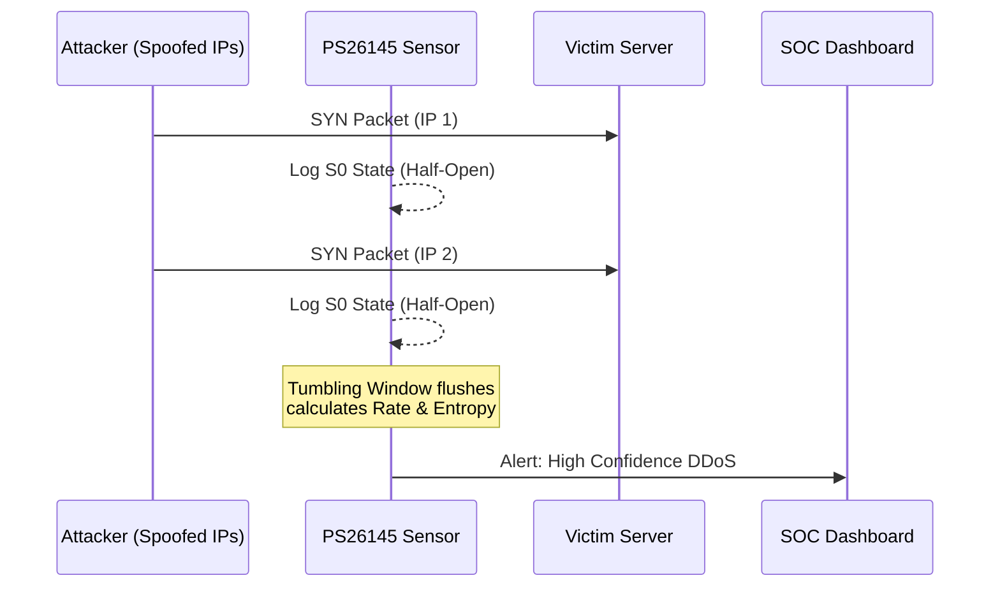

# Module 15: Volumetric DDoS & TCP Exhaustion

## 1. What is Volumetric DDoS?
A **Distributed Denial of Service (DDoS)** attack is a malicious attempt to disrupt the normal traffic of a targeted server by overwhelming it with a flood of Internet traffic. 
In PS26145, we focus specifically on **TCP State Exhaustion** (SYN Floods). The attacker sends millions of connection requests (SYN packets) with spoofed (fake) source IPs, forcing the server to allocate memory for connections that will never complete.

## 2. System Architecture
The PS26145 detection engine (`ddos_stat_v1`) operates unidirectionally. It cannot send a TCP RST packet to kill the connection. Instead, it must passively observe the flood and alert the SOC.



## 3. Implementation (Python Backend)
Below is the exact deterministic logic used by our `ddos_stat_v1` detector to mathematically prove an attack is occurring.

```python
import math

def calculate_shannon_entropy(ip_list):
    # Calculate the frequency of each source IP
    probabilities = [ip_list.count(ip) / len(ip_list) for ip in set(ip_list)]
    
    # Calculate Shannon Entropy: H(X) = -sum( P(x) * log2(P(x)) )
    entropy = -sum(p * math.log2(p) for p in probabilities)
    return entropy

def detect_syn_flood(window_flows):
    total_flows = len(window_flows)
    
    # Filter for Zeek 'S0' state (SYN seen, no reply)
    s0_flows = [f for f in window_flows if f.state == 'S0']
    
    syn_ratio = len(s0_flows) / total_flows if total_flows > 0 else 0
    source_ips = [f.source_ip for f in window_flows]
    
    entropy = calculate_shannon_entropy(source_ips)
    
    # The Deterministic Threshold
    if total_flows > 10000 and syn_ratio > 0.8 and entropy > 2.5:
        return True, "Volumetric SYN Flood with Spoofed IPs Detected"
    
    return False, "Normal Traffic"
```

## 4. Code Explanation (Line-by-Line)
1. **`calculate_shannon_entropy(ip_list)`**: This function measures the "chaos" of the source IPs. In normal traffic, a server talks to a predictable set of IPs (low entropy). In a spoofed DDoS, the IPs are totally random (high entropy > 2.5).
2. **`s0_flows`**: We parse the Zeek connection state. `S0` specifically means a connection was attempted but never completed.
3. **`syn_ratio > 0.8`**: If 80% of the traffic in a 10-second window is incomplete connections, a flood is almost certainly occurring.
4. **`total_flows > 10000`**: The volumetric baseline.

## 5. Playwright E2E Evidence
Below is the live Playwright E2E screenshot capturing the SOC Dashboard successfully receiving the triggered DDoS alert via WebSockets.


*(Note: If the dashboard image does not load, ensure `npm start` is running and the E2E script has executed.)*