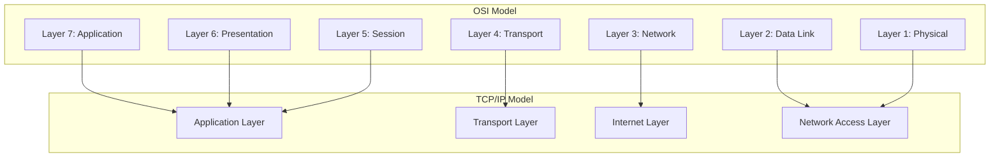

# Module 001: What is a Network? (OSI vs TCP/IP)

## 1. What is it? (Explain from scratch for a complete beginner)
Imagine a network as a postal system, but for computers. When you write a letter to a friend, you put it in an envelope, write the address on it, and hand it over to the post office. The post office then figures out the best way to get that letter to your friend's house, whether it's via a truck, plane, or local mail carrier. 
In the digital world, a **Network** is simply two or more computers connected together so they can share information, just like the postal system shares letters. The internet itself is just one massive, global network of networks!
To make sure every computer understands each other (like speaking the same language), they use special rules called **Protocols**. The two most famous frameworks for understanding these rules are the **OSI Model** (a theoretical 7-layer concept) and the **TCP/IP Model** (a practical 4-layer model used on the internet today).

## 2. System Architecture / Flow (MUST include a Mermaid flowchart/sequence diagram)


## 3. Implementation / Configuration (Include Python/CLI examples)
To see your computer's connection in a network, you can use built-in command-line tools.
**Windows Command Prompt:**
```cmd
ipconfig
```
**Linux/macOS Terminal:**
```bash
ifconfig
# or modern alternative
ip a
```

## 4. Line-by-Line Explanation
- `ipconfig`: This Windows command stands for "Internet Protocol Configuration". When you run it, your computer asks the operating system to print out the current network settings.
- `ifconfig`: This is the older Linux/macOS equivalent (Interface Configuration).
- `ip a`: The modern Linux command to show IP addresses. It lists all network interfaces (like Wi-Fi or Ethernet) and the addresses assigned to them, showing how you are connected to the network.

## 5. Summary
A network connects computers to share data using standard protocols. The OSI model describes how networks work theoretically using 7 layers, while TCP/IP is the practical 4-layer model used by the internet today. You can check your own network connection using commands like `ipconfig` or `ip a`.
