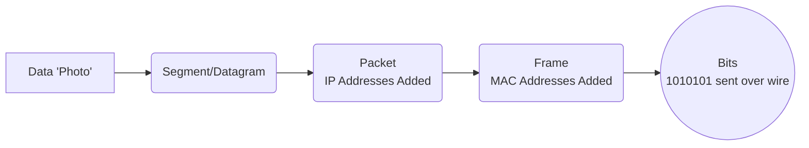

# Module 002: Packets, Frames, and Bits

## 1. What is it? (Explain from scratch for a complete beginner)
When you send a large file like a photo over the internet, it doesn't travel as one giant block. That would easily clog up the network! Instead, the photo is chopped up into tiny, manageable pieces. 
These pieces have different names depending on where they are in the network process:
- **Bits:** The smallest unit of data, represented as 1s and 0s. This is how data physically travels over cables (as electrical pulses) or Wi-Fi (as radio waves).
- **Frames:** When bits are grouped together on a local network (like your home Wi-Fi), they are called a Frame. Frames contain physical addresses (MAC addresses) so computers on the same network can find each other.
- **Packets:** When a frame needs to leave your home network and travel across the internet, it is wrapped in an IP (Internet Protocol) address. This wrapped data is called a Packet. Think of a packet as an envelope with a global address on it!

## 2. System Architecture / Flow (MUST include a Mermaid flowchart/sequence diagram)


## 3. Implementation / Configuration (Include Python/CLI examples)
You can see packets flowing through your network by sending small test packets to another computer using the `ping` command.
**CLI Command (Windows/Linux/macOS):**
```bash
ping google.com -c 4
```

## 4. Line-by-Line Explanation
- `ping`: The command used to test if another computer is reachable across a network. It sends a special type of packet called an ICMP Echo Request.
- `google.com`: The destination we are sending our packets to.
- `-c 4`: This flag tells the command to send exactly 4 packets (Count = 4). (Note: On Windows, use `-n 4`).
- Output: The terminal will show each packet as it returns from Google, displaying how long it took in milliseconds. If the packet gets lost, it will say "Request timed out".

## 5. Summary
Data travels across networks by being broken down. The smallest unit is a Bit (1s and 0s), which forms Frames for local networks, and Packets for global internet travel. The `ping` command is a simple way to test if your packets are successfully reaching their destination.
