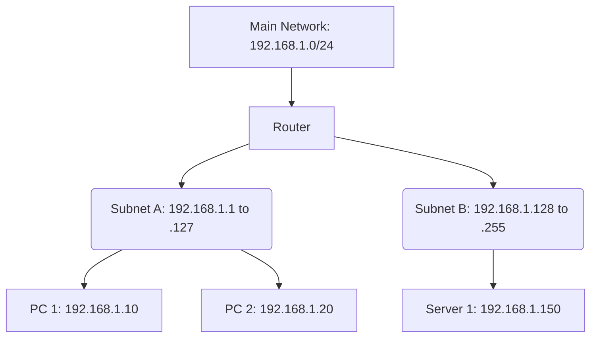

# Module 003: IP Addresses and Subnetting

## 1. What is it? (Explain from scratch for a complete beginner)
Just as every house needs a mailing address for the postman to deliver letters, every computer connected to a network needs an address so other computers can send it data. This is called an **IP Address** (Internet Protocol Address).
An IPv4 address looks like four numbers separated by dots, like `192.168.1.10`.
**Subnetting** is a way of dividing a large network into smaller, more efficient networks (called subnets). Imagine a large city divided into zip codes. If a post office only had to deliver mail to a specific zip code rather than the entire city, it would be much faster. Subnetting does exactly this for computer networks, keeping traffic localized and secure.

## 2. System Architecture / Flow (MUST include a Mermaid flowchart/sequence diagram)


## 3. Implementation / Configuration (Include Python/CLI examples)
Python has a great built-in library for calculating IP addresses and subnets.
**Python Script:**
```python
import ipaddress

network = ipaddress.ip_network('192.168.1.0/24')
print(f"Total IPs in network: {network.num_addresses}")
print(f"First usable IP: {network[1]}")
print(f"Subnet Mask: {network.netmask}")
```

## 4. Line-by-Line Explanation
- `import ipaddress`: Imports Python's built-in module specifically designed for inspecting and manipulating IP addresses.
- `ip_network('192.168.1.0/24')`: We define a network. The `/24` tells us the size of the subnet mask, which dictates how many addresses belong to this network.
- `network.num_addresses`: Calculates the total number of IP addresses available in this specific subnet (in a /24, it's 256).
- `network[1]`: Grabs the first usable IP address in the network (often assigned to the router).
- `network.netmask`: Displays the subnet mask (which would be 255.255.255.0), the mechanism used to separate the network portion from the host portion of the address.

## 5. Summary
IP addresses are the unique identifiers for devices on a network. Subnetting allows us to break large networks down into smaller, manageable, and more secure segments. We can use tools like Python's `ipaddress` module to easily calculate network sizes and available IPs.
