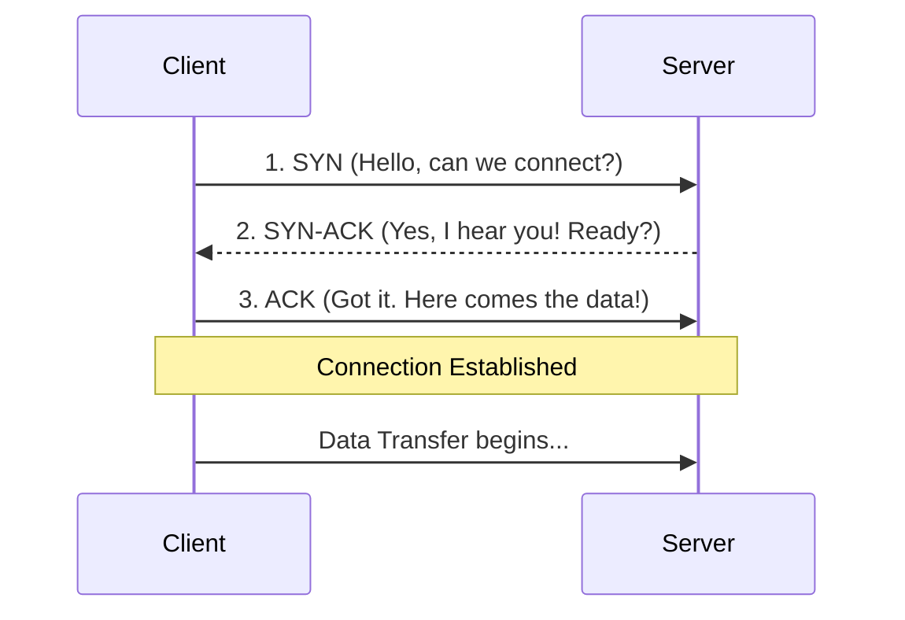

# Module 004: The TCP 3-Way Handshake

## 1. What is it? (Explain from scratch for a complete beginner)
Imagine you want to make a phone call. Before you can start talking, you dial the number, wait for the other person to say "Hello?", and then you say "Hi, it's me!". Only after this polite introduction do you begin your conversation.
Computers use a very similar polite introduction when they want to send data reliably. This process is called the **TCP 3-Way Handshake**. 
TCP (Transmission Control Protocol) is a set of rules that ensures data arrives perfectly, without missing any pieces. To guarantee this, the two computers must first agree to a connection using three steps:
1. **SYN (Synchronize):** Computer A says, "Hello, can we talk?"
2. **SYN-ACK (Synchronize-Acknowledge):** Computer B replies, "Yes, I hear you, we can talk!"
3. **ACK (Acknowledge):** Computer A says, "Great, I'm starting to send data now."

## 2. System Architecture / Flow (MUST include a Mermaid flowchart/sequence diagram)


## 3. Implementation / Configuration (Include Python/CLI examples)
We can create a simple TCP connection in Python using sockets to trigger this handshake.
**Python Script:**
```python
import socket

# Create a TCP socket
client_socket = socket.socket(socket.AF_INET, socket.SOCK_STREAM)

# This single line triggers the 3-Way Handshake!
client_socket.connect(("google.com", 80))

print("Handshake successful, connected to Google on port 80!")
client_socket.close()
```

## 4. Line-by-Line Explanation
- `import socket`: Brings in the Python module used for network connections.
- `socket.socket(...)`: Creates a new "socket", which is basically a software plug. `AF_INET` means we are using IPv4 addresses, and `SOCK_STREAM` means we specifically want to use TCP (which requires the handshake).
- `client_socket.connect(...)`: This is where the magic happens. By calling `connect`, your computer automatically sends the SYN packet to `google.com` on port 80 (web traffic). Google responds with SYN-ACK, and your computer automatically replies with ACK.
- `print(...)`: Confirms that the 3-way handshake completed without any errors.
- `client_socket.close()`: Politely closes the connection when we are done.

## 5. Summary
The TCP 3-Way Handshake is a reliable introduction protocol (SYN, SYN-ACK, ACK) that two computers perform before sending data to ensure both sides are ready and listening. This reliability makes TCP the backbone of the internet for things like loading web pages and downloading files.
