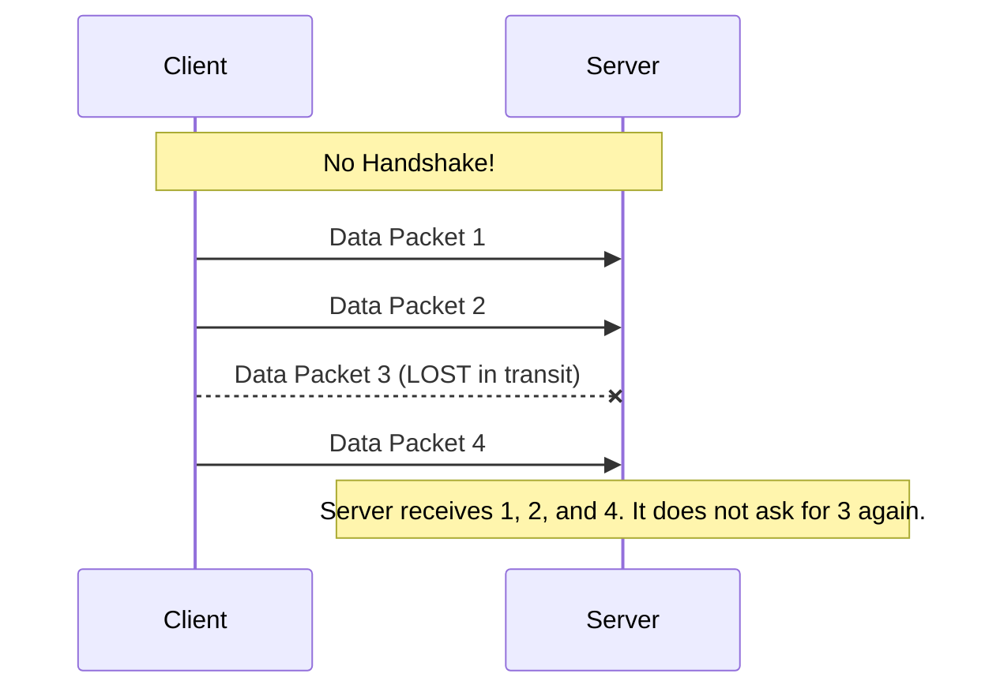

# Module 005: UDP: The Best Effort Protocol

## 1. What is it? (Explain from scratch for a complete beginner)
If TCP is like a registered mail service where you get a signature confirming delivery, **UDP** (User Datagram Protocol) is like throwing a postcard out of a moving car window towards someone's mailbox. You hope it gets there, but you don't stick around to check!
UDP is a "connectionless" protocol. It doesn't use the polite TCP 3-way handshake. It just starts blasting data at the destination immediately. 
Why would we want a protocol that might lose data? **Speed!** Because UDP skips the handshakes and the delivery confirmations, it is incredibly fast. It's used for things where a missing packet doesn't ruin the whole experience, like live video streaming (a dropped frame just causes a brief glitch), online gaming (you want the newest location data instantly), or Voice over IP phone calls.

## 2. System Architecture / Flow (MUST include a Mermaid flowchart/sequence diagram)


## 3. Implementation / Configuration (Include Python/CLI examples)
Creating a UDP connection in Python is very simple since there is no connection setup phase.
**Python Script:**
```python
import socket

# Create a UDP socket
udp_socket = socket.socket(socket.AF_INET, socket.SOCK_DGRAM)

# Message to send
message = b"Hello Server, catching this?"

# Blast the data immediately without connect()
udp_socket.sendto(message, ("127.0.0.1", 9999))
print("Message sent via UDP!")
```

## 4. Line-by-Line Explanation
- `socket.socket(...)`: Creates the network plug. This time we use `SOCK_DGRAM`, which tells Python we want to use UDP instead of TCP.
- `message = b"..."`: The `b` converts the text into bytes, which is the raw format data needs to be in to travel over a network.
- `udp_socket.sendto(...)`: Notice we didn't use `connect()`! We use `sendto()` to simply aim the data at an IP (`127.0.0.1`, which is local loopback) and a port (`9999`), and fire it off immediately. There is no check to see if anyone is listening on port 9999.
- `print(...)`: Confirms our code executed.

## 5. Summary
UDP is a fast, connectionless protocol that sacrifices reliability for speed. It is perfect for real-time applications like video games and live streaming where getting data instantly is more important than getting every single piece perfectly.
