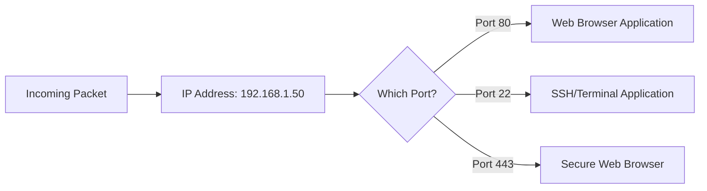

# Module 006: Ports and Sockets

## 1. What is it? (Explain from scratch for a complete beginner)
Imagine an IP address is an apartment building. A package (packet) arrives at the building because it has the correct street address (IP address). But how does the postman know *which* apartment door to deliver it to? That's where **Ports** come in!
A Port is simply an apartment number for a computer. When data arrives at your computer's IP address, the Port number tells the computer which specific application should receive that data. 
- Port 80 goes to the Web Server application.
- Port 25 goes to the Email application.
A **Socket** is the combination of an IP Address and a Port number (e.g., `192.168.1.10:80`). It represents a single, complete destination for data.

## 2. System Architecture / Flow (MUST include a Mermaid flowchart/sequence diagram)


## 3. Implementation / Configuration (Include Python/CLI examples)
You can see which ports are currently open and listening on your computer using the command line.
**CLI Command (Windows/Linux/macOS):**
```bash
netstat -an
```

## 4. Line-by-Line Explanation
- `netstat`: Network Statistics. This is a classic command-line tool used to display active network connections and listening ports.
- `-a`: Displays **A**ll active connections and listening ports on your machine.
- `-n`: Displays addresses and port numbers in **N**umerical form, rather than trying to look up the names (which makes the command run much faster).
- The output will show columns for Protocol (TCP/UDP), Local Address (your IP and Port, e.g., 127.0.0.1:443), and the State of the connection (e.g., LISTENING, ESTABLISHED).

## 5. Summary
While an IP Address gets data to the right computer, a Port gets data to the right application on that computer. A Socket is the combination of an IP and a Port, forming a complete digital address. You can view your computer's open ports using tools like `netstat`.
