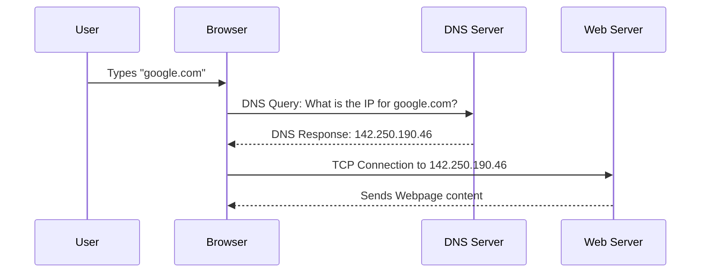

# Module 007: DNS: The Phonebook of the Internet

## 1. What is it? (Explain from scratch for a complete beginner)
Computers communicate using IP Addresses (like `142.250.190.46`). However, humans are terrible at remembering random strings of numbers! We prefer names like `google.com` or `amazon.com`. 
To solve this problem, we created the **Domain Name System (DNS)**. DNS is literally the phonebook of the internet. When you type `google.com` into your browser, your computer secretly asks a DNS server, "Hey, what is the IP address for google.com?" The DNS server looks up the name, finds the number `142.250.190.46`, and hands it back to your computer so it can make the connection.

## 2. System Architecture / Flow (MUST include a Mermaid flowchart/sequence diagram)


## 3. Implementation / Configuration (Include Python/CLI examples)
You can act as your own computer and ask DNS servers for IP addresses using the `nslookup` or `dig` commands.
**CLI Command (Windows/Linux/macOS):**
```bash
nslookup google.com
```

**Python Script:**
```python
import socket

# Ask the OS to resolve a hostname to an IP
ip_address = socket.gethostbyname("geeksforgeeks.org")
print(f"The IP address is: {ip_address}")
```

## 4. Line-by-Line Explanation
**Python:**
- `import socket`: The network library.
- `socket.gethostbyname(...)`: This function triggers a DNS lookup. It takes a human-readable domain name string and queries your computer's configured DNS server.
- The returned value is the numerical IP address, which is then printed to the screen.

**CLI:**
- `nslookup`: Stands for Name Server Lookup. It asks the DNS server for the IP record associated with the domain name provided.

## 5. Summary
DNS translates human-readable domain names (like website URLs) into computer-readable IP addresses. Without DNS, we would have to memorize a string of numbers for every website we wanted to visit. Tools like `nslookup` or Python's `socket` library allow us to perform these translations manually.
