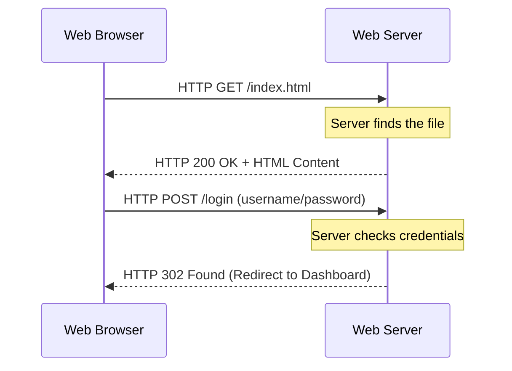

# Module 008: HTTP and The Web

## 1. What is it? (Explain from scratch for a complete beginner)
When you browse the web, your browser and the website's server are talking to each other using a language called **HTTP** (HyperText Transfer Protocol). 
Think of HTTP like placing an order at a restaurant. 
1. **The Request:** You (the client) look at the menu and tell the waiter, "I want a burger." (An HTTP GET request).
2. **The Response:** The waiter goes to the kitchen (the server), gets your food, and brings it back to you on a plate (An HTTP Response with the webpage data).
HTTP requests usually contain a "Method" indicating what you want to do: `GET` (give me a webpage) or `POST` (I am sending you data, like a login form).

## 2. System Architecture / Flow (MUST include a Mermaid flowchart/sequence diagram)


## 3. Implementation / Configuration (Include Python/CLI examples)
Python's `requests` library is the easiest way to speak HTTP through code.
**Python Script:**
```python
import requests

# Send an HTTP GET request to a website
response = requests.get("https://httpbin.org/get")

# Check the HTTP Status Code (200 means OK)
print(f"Status Code: {response.status_code}")

# Print the text content returned by the server
print("Response Data:")
print(response.text)
```

## 4. Line-by-Line Explanation
- `import requests`: Imports a highly popular, third-party Python library for making HTTP requests (you may need to install it via `pip install requests`).
- `requests.get(...)`: Creates and sends an HTTP GET request to the URL provided. The server's reply is saved into the `response` variable.
- `response.status_code`: Every HTTP response comes with a number. `200` means success. `404` means not found. `500` means server error.
- `response.text`: This extracts the actual body of the response (the HTML text, or in this case, JSON data) so we can read it.

## 5. Summary
HTTP is the language of the World Wide Web. It operates on a simple Request and Response cycle between a client (your browser) and a server. Using methods like GET and POST, and checking Status Codes like 200 or 404, we can interact with web servers easily using tools like Python's `requests` library.
