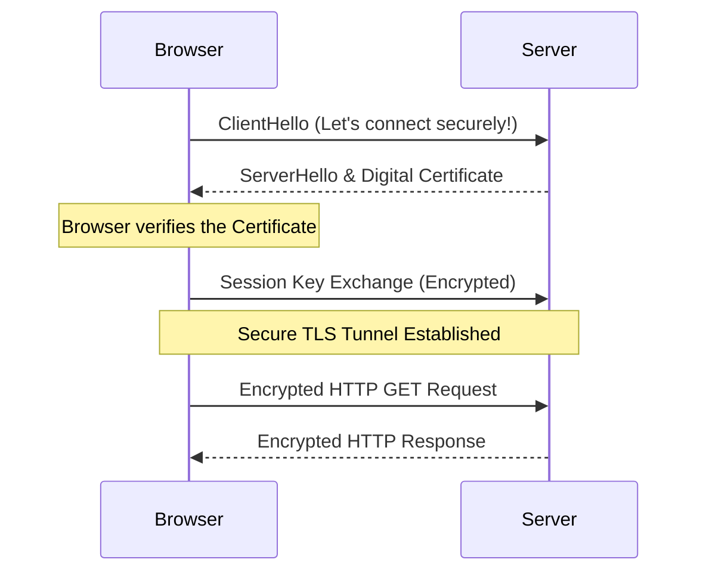

# Module 009: Encryption, TLS, and SSL

## 1. What is it? (Explain from scratch for a complete beginner)
If standard HTTP is like sending a postcard through the mail (anyone handling it can read what it says), **HTTPS** (the S stands for Secure) is like putting that postcard inside a locked steel box.
To lock the box, we use **Encryption**, which scrambles the data so it looks like gibberish to anyone who doesn't have the secret key to unlock it. 
**TLS (Transport Layer Security)**, and its older predecessor **SSL**, are the protocols that provide this encryption for the web. When you see a little padlock icon next to a URL in your browser, it means a TLS handshake occurred, secret keys were exchanged securely, and all your web traffic is now scrambled and safe from eavesdroppers.

## 2. System Architecture / Flow (MUST include a Mermaid flowchart/sequence diagram)


## 3. Implementation / Configuration (Include Python/CLI examples)
We can use Python to inspect the TLS certificate of a website to see if it is secure.
**Python Script:**
```python
import ssl
import socket

hostname = 'www.google.com'
context = ssl.create_default_context()

with socket.create_connection((hostname, 443)) as sock:
    with context.wrap_socket(sock, server_hostname=hostname) as ssock:
        print(f"TLS Version: {ssock.version()}")
        cert = ssock.getpeercert()
        print(f"Issued To: {cert['subject'][0][0][1]}")
```

## 4. Line-by-Line Explanation
- `import ssl`: Imports Python's built-in module for TLS/SSL encryption.
- `ssl.create_default_context()`: Sets up the default security settings (trusted certificate authorities, secure cipher suites).
- `socket.create_connection(...)`: Opens a standard TCP connection to port 443 (the default port for secure HTTPS traffic).
- `context.wrap_socket(...)`: This is the crucial step. It takes our plain TCP connection and "wraps" it in TLS encryption, performing the secure handshake.
- `ssock.version()`: Prints the version of TLS being used (e.g., TLSv1.3).
- `ssock.getpeercert()`: Downloads the digital certificate from the server so we can see who it was issued to.

## 5. Summary
Encryption protects data from being read by unauthorized people. TLS (and SSL) provides a secure, encrypted tunnel for web traffic, upgrading insecure HTTP to secure HTTPS. This process ensures that passwords and sensitive data are safe as they travel across the internet.
