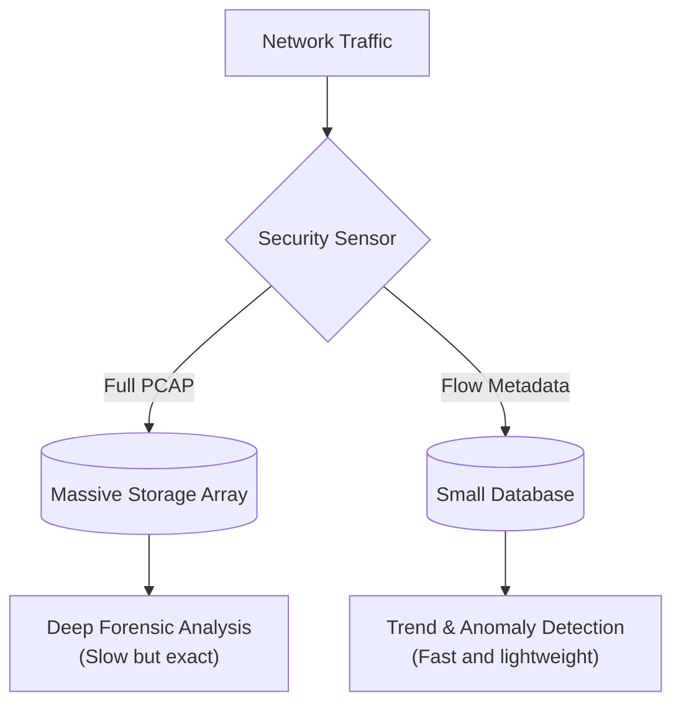

# Module 010: Packets vs. Flows (Crucial for NDR)

## 1. What is it? (Explain from scratch for a complete beginner)
In the world of Cybersecurity, specifically **NDR** (Network Detection and Response), security analysts have to monitor network traffic for hackers. They do this in two main ways: looking at **Packets** or looking at **Flows**.
- **Packet Capture (PCAP):** This is like recording the complete audio of a phone call. You capture every single byte of data sent. It is highly detailed but takes up a massive amount of hard drive space and is hard to search quickly.
- **Network Flows (NetFlow/IPFIX):** This is like looking at a phone bill. It doesn't record the audio of the call, but it tells you *who* called *whom*, at what *time*, and for *how long*. It is metadata. Flows are tiny, easy to store for months, and perfect for spotting weird trends (like a computer suddenly uploading gigabytes of data to an unknown country at 3 AM).

## 2. System Architecture / Flow (MUST include a Mermaid flowchart/sequence diagram)


## 3. Implementation / Configuration (Include Python/CLI examples)
While Python code for flow generation is complex, here is how you might capture packets vs view flows conceptually on a Linux CLI.
**Capture Packets (Heavy):**
```bash
tcpdump -w traffic.pcap -i eth0
```
*`tcpdump` grabs the entire packet (headers + data body) on interface `eth0` and writes it to a file. This file will grow extremely fast.*

**Analyze Flows (Lightweight, via a tool like Zeek):**
```bash
cat conn.log | awk '{print $3, $5, $9}'
```
*A flow log (like Zeek's `conn.log`) already summarizes the data. This `awk` command easily extracts just the Source IP, Destination IP, and Bytes Transferred without needing to read heavy packet data.*

## 4. Line-by-Line Explanation
- `tcpdump -w traffic.pcap -i eth0`: `tcpdump` is the packet capture tool. `-w` means write to file, and `-i eth0` specifies which network card to listen on.
- `cat conn.log`: Reads out the connection flow log generated by a sensor.
- `awk '{print $3, $5, $9}'`: Awk is a text-processing tool. Here, it is pulling out the 3rd, 5th, and 9th columns of the log (which typically correspond to Source IP, Destination IP, and Bytes).

## 5. Summary
For network security, we must choose between detail and efficiency. Packets (PCAP) contain the full payload of data, useful for deep forensic investigations but expensive to store. Network Flows contain lightweight metadata (source, destination, time, size), which is ideal for long-term storage and detecting anomalous behavior using NDR tools.
