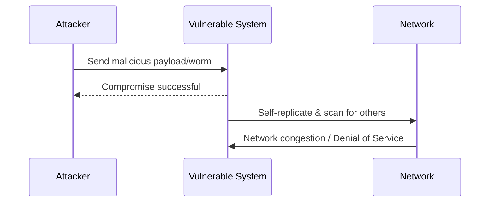

# Module 11: The History of Network Attacks
## 1. What is it? (Explain from scratch for a complete beginner)
The history of network attacks is the story of how computer networks evolved from trusted academic environments into contested digital battlegrounds. Early networks assumed all users were friendly, meaning there was little to no security built into the original protocols. Over time, as the internet grew, individuals discovered they could abuse these protocols to gain unauthorized access, steal data, or disrupt services. Studying historical attacks like the Morris Worm (1988) or ILOVEYOU (2000) helps us understand why modern security defenses are built the way they are today.

## 2. Attack Architecture / Flow


## 3. Implementation / Code
```python
# Defensive Code: Legacy Attack Pattern Detector (Heuristic)
def detect_legacy_patterns(log_lines):
    suspicious_patterns = ["DEBUG", "WIZ", "expn", "vrfy"]
    alerts = []
    
    for line in log_lines:
        line_lower = line.lower()
        for pattern in suspicious_patterns:
            if pattern in line_lower:
                alerts.append(f"ALERT: Historical attack footprint detected: {pattern} in log -> {line}")
                
    return alerts

# Example Usage
logs = ["Jan 10 08:30:00 server postfix/smtpd: connect from unknown",
        "Jan 10 08:31:00 server sendmail: DEBUG root"]
print(detect_legacy_patterns(logs))
```

## 4. Line-by-Line Explanation
- `def detect_legacy_patterns(log_lines):`: Defines our defensive function that takes a list of server logs.
- `suspicious_patterns = [...]`: A list of commands historically abused in older protocols (like SMTP or Telnet).
- `alerts = []`: Creates an empty list to store our security warnings.
- `for line in log_lines:`: Loops through every line in our server logs.
- `if pattern in line_lower:`: Checks if the suspicious historical command is present in the current log line.
- `alerts.append(...)`: If found, it creates an alert string and adds it to our list.

## 5. Summary
By analyzing the history of network attacks, we learn that security cannot be an afterthought. Defensive programming, such as looking for deprecated or dangerous commands in logs, is a foundational step in securing legacy systems against known historical footprints.