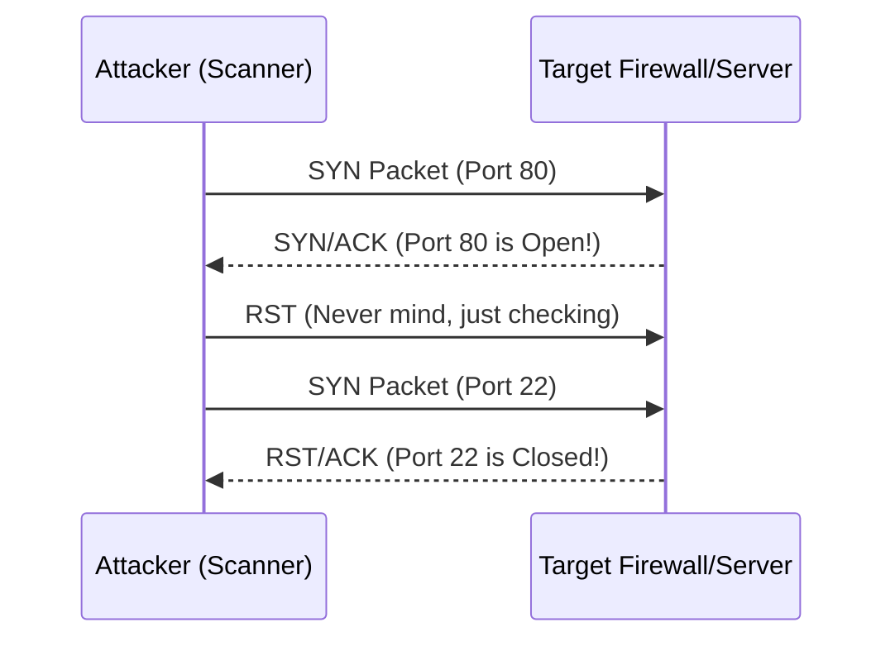

# Module 12: Reconnaissance & Port Scanning (Nmap)
## 1. What is it? (Explain from scratch for a complete beginner)
Reconnaissance is the "scouting" phase of a cyber attack. Just like a burglar checking which doors and windows of a house are unlocked, an attacker scans a target network to see which "ports" (communication channels) are open. Tools like Nmap send tiny network messages to thousands of ports on a server. If the server replies, the attacker knows that specific port is open and potentially vulnerable. Port scanning itself isn't an attack, but it is the critical first step an attacker takes to map out their target.

## 2. Attack Architecture / Flow


## 3. Implementation / Code
```python
# Defensive Code: Port Scan Detection via Connection Rate Tracking
from collections import defaultdict
import time

class PortScanDetector:
    def __init__(self, time_window=60, port_threshold=20):
        self.time_window = time_window
        self.port_threshold = port_threshold
        # Stores {source_ip: {port1, port2, ...}}
        self.connections = defaultdict(set)
        
    def log_connection(self, src_ip, dst_port):
        self.connections[src_ip].add(dst_port)
        
        # Check if the unique ports scanned exceed our threshold
        if len(self.connections[src_ip]) > self.port_threshold:
            print(f"[!] PORT SCAN DETECTED from {src_ip}: {len(self.connections[src_ip])} unique ports.")

# Example Usage
detector = PortScanDetector()
for port in range(1, 25):
    detector.log_connection("192.168.1.100", port)
```

## 4. Line-by-Line Explanation
- `from collections import defaultdict`: Imports a specialized dictionary that automatically handles missing keys.
- `class PortScanDetector:`: Creates a blueprint for our defensive tool.
- `self.time_window = time_window`: Sets how long we track connections (e.g., 60 seconds).
- `self.connections = defaultdict(set)`: A dictionary mapping an IP address to a unique mathematical 'set' of ports it has touched.
- `self.connections[src_ip].add(dst_port)`: Records the destination port accessed by the source IP. Sets naturally prevent duplicates.
- `if len(...) > self.port_threshold:`: If one IP touches more than 20 distinct ports quickly, we flag it as a scanner.

## 5. Summary
Reconnaissance helps attackers find ways in, but defenders can use the noise generated by tools like Nmap to their advantage. By tracking how many unique ports a single IP addresses attempts to access in a short timeframe, we can detect and block scanners before they find vulnerabilities.