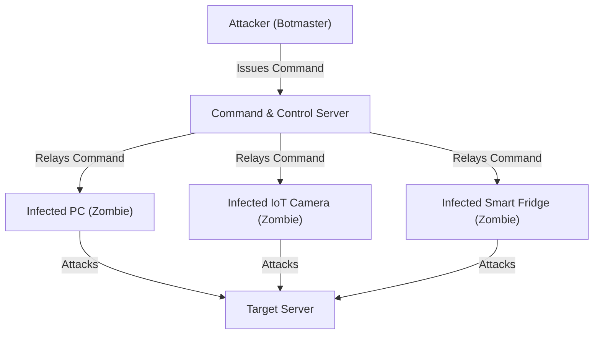

# Module 13: Botnets & The Zombie Army
## 1. What is it? (Explain from scratch for a complete beginner)
A botnet (short for "robot network") is a massive army of infected computers, smart TVs, and IoT cameras controlled by a single attacker (the "botmaster"). The owners of these devices usually have no idea their device is infected. The botmaster can issue a command to all these "zombie" devices at once, ordering them to simultaneously flood a target website with traffic, send billions of spam emails, or mine cryptocurrency.

## 2. Attack Architecture / Flow


## 3. Implementation / Code
```python
# Defensive Code: Detecting Distributed Anomalies (Botnet DDoS Simulation)
from collections import Counter

def detect_botnet_activity(network_logs, traffic_threshold=1000):
    # network_logs = [{'src_ip': '...', 'dst_ip': '...', 'bytes': ...}]
    target_traffic = Counter()
    
    # Aggregate total connections to each destination
    for log in network_logs:
        target_traffic[log['dst_ip']] += 1
        
    alerts = []
    for target_ip, connection_count in target_traffic.items():
        if connection_count > traffic_threshold:
            alerts.append(f"[!] Botnet/DDoS Alert: {target_ip} is receiving massive distributed traffic ({connection_count} connections).")
            
    return alerts

# Example Usage
logs = [{'src_ip': f"10.0.0.{i}", 'dst_ip': "192.168.1.50", 'bytes': 64} for i in range(1500)]
print(detect_botnet_activity(logs))
```

## 4. Line-by-Line Explanation
- `from collections import Counter`: Imports a built-in Python tool used specifically for counting occurrences.
- `def detect_botnet_activity(...)`: Defines our detection function, taking a list of network logs and a threshold.
- `target_traffic = Counter()`: Initializes a counter to track how many connections each server is receiving.
- `for log in network_logs:`: Loops through all network traffic data.
- `target_traffic[log['dst_ip']] += 1`: Increments the connection count for the destination IP by 1.
- `if connection_count > traffic_threshold:`: Checks if a single destination is receiving an abnormal, massive amount of connections, indicative of a coordinated botnet attack.

## 5. Summary
Botnets leverage the combined power of thousands of infected devices to overwhelm targets. Defenders protect networks from botnets by using aggregation and thresholding algorithms to spot when a single target is suddenly hit by distributed, anomalous traffic volumes.