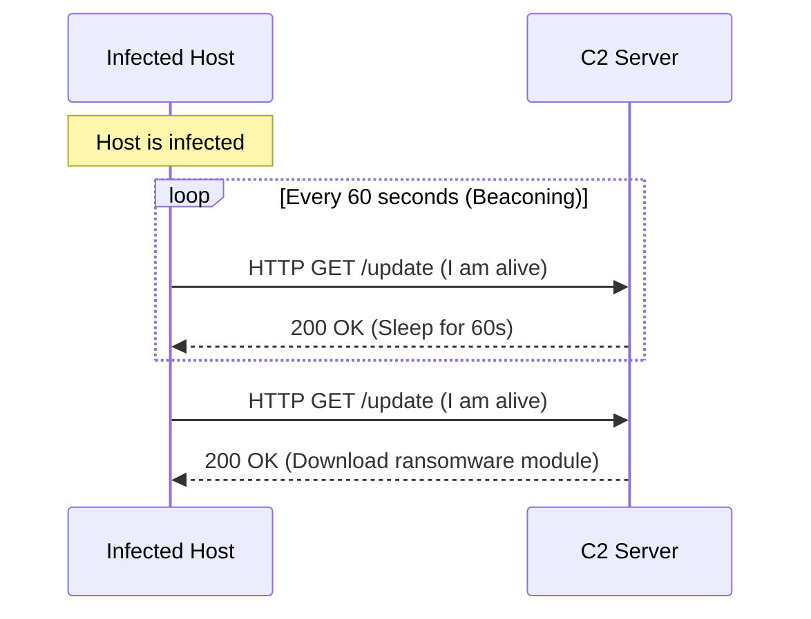

# Module 14: Command & Control (C2) Beacons
## 1. What is it? (Explain from scratch for a complete beginner)
When malware infects a computer, it usually needs instructions on what to do next (e.g., "steal passwords," "encrypt files," or "wait"). To get these instructions, the malware "calls home" to the attacker's Command & Control (C2) server. To avoid detection, it doesn't keep a connection open all the time. Instead, it checks in briefly at regular intervals—say, every 5 minutes. This rhythmic, heartbeat-like check-in is called a "beacon." 

## 2. Attack Architecture / Flow


## 3. Implementation / Code
```python
# Defensive Code: Detecting C2 Beaconing via Time Variance Analysis
import statistics

def detect_c2_beacons(connection_timestamps, variance_threshold=2.0):
    if len(connection_timestamps) < 3:
        return False, "Not enough data"
        
    # Calculate the time difference (delta) between consecutive connections
    deltas = []
    for i in range(1, len(connection_timestamps)):
        deltas.append(connection_timestamps[i] - connection_timestamps[i-1])
        
    # Calculate the variance of these time differences
    time_variance = statistics.variance(deltas)
    
    # If the variance is very low, the connections are suspiciously rhythmic
    if time_variance < variance_threshold:
        return True, f"Suspicious Beaconing Detected! Variance: {time_variance:.2f}"
    
    return False, f"Normal human traffic. Variance: {time_variance:.2f}"

# Example Usage: Connections happening almost exactly every 60 seconds
timestamps = [1000, 1060, 1121, 1180, 1240, 1301]
is_c2, msg = detect_c2_beacons(timestamps)
print(msg)
```

## 4. Line-by-Line Explanation
- `import statistics`: Imports Python's math library for calculating variance.
- `def detect_c2_beacons(...)`: The function takes a list of times a computer connected to a specific external domain.
- `deltas.append(connection_timestamps[i] - connection_timestamps[i-1])`: Computes the exact time gap between each consecutive connection.
- `time_variance = statistics.variance(deltas)`: Calculates how much these gaps differ from one another.
- `if time_variance < variance_threshold:`: Normal human browsing is highly random (high variance). If the variance is extremely low, it means the connection is automated and rhythmic—a classic sign of C2 beaconing.

## 5. Summary
Malware needs to communicate with attackers to be effective. By analyzing the timing of network connections, defenders can spot the robotic, rhythmic "heartbeat" of C2 beacons hiding within the noise of normal human web browsing.