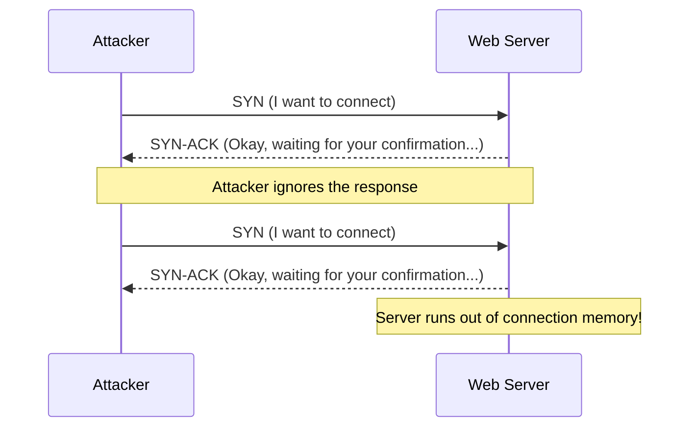

# Module 15: Volumetric DDoS & TCP Exhaustion
## 1. What is it? (Explain from scratch for a complete beginner)
Imagine a restaurant that takes reservations over the phone. If a group of pranksters repeatedly call the restaurant, start a reservation, but hang up before finishing, all the phone lines get tied up. Real customers can't get through, and the host is left waiting for the pranksters to finish their sentences. This is a TCP SYN Flood attack. The attacker starts thousands of network "handshakes" (SYN) with a server but never finishes them. The server exhausts its memory waiting for the final handshake (ACK), causing it to crash or ignore legitimate users.

## 2. Attack Architecture / Flow


## 3. Implementation / Code
```python
# Defensive Code: Detecting SYN Flood attacks by tracking TCP flags
def detect_syn_flood(packet_logs, max_unanswered_syns=500):
    # Track the difference between SYNs received and ACKs completed per IP
    pending_connections = {}
    
    for packet in packet_logs:
        src = packet['src_ip']
        flags = packet['tcp_flags']
        
        if src not in pending_connections:
            pending_connections[src] = 0
            
        if flags == 'SYN':
            pending_connections[src] += 1
        elif flags == 'ACK':
            pending_connections[src] -= 1
            
    # Check for IPs with too many uncompleted handshakes
    for ip, uncompleted in pending_connections.items():
        if uncompleted > max_unanswered_syns:
            print(f"[!] SYN FLOOD ALERT: {ip} has {uncompleted} half-open connections!")

# Example Usage
logs = [{'src_ip': '10.9.9.9', 'tcp_flags': 'SYN'} for _ in range(600)]
detect_syn_flood(logs)
```

## 4. Line-by-Line Explanation
- `def detect_syn_flood(...)`: Defines a function that scans network packets to find attackers exhausting server memory.
- `pending_connections = {}`: A dictionary to keep a running tally of open connections for each IP address.
- `if flags == 'SYN':`: If the packet is a "hello" (SYN), we add 1 to the tally of open connections.
- `elif flags == 'ACK':`: If the packet completes the handshake (ACK), we subtract 1 from the tally.
- `if uncompleted > max_unanswered_syns:`: If a single IP address has opened hundreds of connections but never finished them, we raise an alert.

## 5. Summary
TCP exhaustion attacks exploit the fundamental rules of how computers agree to communicate on the internet. By monitoring the ratio of initiated connections (SYN) to completed connections (ACK), defenders can identify and block IP addresses that are attempting to overwhelm the server's memory.