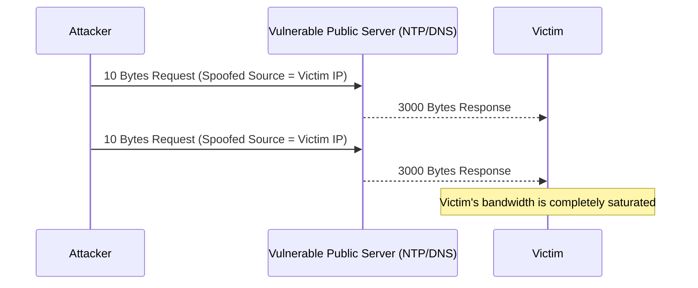

# Module 16: UDP Amplification Attacks
## 1. What is it? (Explain from scratch for a complete beginner)
Imagine sending a letter to a mail-order catalog company requesting their heaviest 500-page catalog. But instead of putting *your* return address on the envelope, you put the address of your enemy. The company sends the massive heavy catalog to your enemy. Now imagine doing this thousands of times. This is a UDP Amplification attack. An attacker sends a tiny request to a public server (like a DNS or NTP server) using a forged (spoofed) IP address of their victim. The public server replies with a massive chunk of data, inadvertently flooding and destroying the victim's internet connection.

## 2. Attack Architecture / Flow


## 3. Implementation / Code
```python
# Defensive Code: Detecting UDP Amplification based on inbound payload size and ports
def detect_udp_amplification(inbound_traffic):
    # Common ports abused for amplification (DNS, NTP, SSDP, Memcached)
    amplification_ports = {53, 123, 1900, 11211}
    threshold_bytes_per_sec = 5_000_000  # 5 MB/s
    
    victim_traffic_volume = {}
    
    for packet in inbound_traffic:
        if packet['protocol'] == 'UDP' and packet['src_port'] in amplification_ports:
            dst = packet['dst_ip']
            victim_traffic_volume[dst] = victim_traffic_volume.get(dst, 0) + packet['size_bytes']
            
    for victim_ip, volume in victim_traffic_volume.items():
        if volume > threshold_bytes_per_sec:
            print(f"[!] UDP Amplification Detected! {victim_ip} received {volume} bytes from amplification ports.")

# Example Usage
traffic = [{'protocol': 'UDP', 'src_port': 123, 'dst_ip': '192.168.1.10', 'size_bytes': 4000} for _ in range(2000)]
detect_udp_amplification(traffic)
```

## 4. Line-by-Line Explanation
- `amplification_ports = {53, 123, 1900, 11211}`: Sets containing the specific server ports commonly tricked into sending massive responses.
- `threshold_bytes_per_sec = 5_000_000`: Sets a baseline. If an internal IP receives more than 5MB per second of this specific UDP traffic, it's abnormal.
- `if packet['protocol'] == 'UDP' and packet['src_port'] in amplification_ports:`: Filters the traffic. We only care about UDP traffic originating from the risky ports.
- `victim_traffic_volume.get(dst, 0) + packet['size_bytes']`: Adds the size of the incoming packet to the running total for that victim's IP.
- `if volume > threshold_bytes_per_sec:`: Triggers the alarm if the volume exceeds safe limits.

## 5. Summary
UDP Amplification allows attackers to multiply their destructive power without needing a massive botnet. Defenders must monitor inbound UDP traffic from known vulnerable services (like DNS and NTP) to quickly detect and mitigate these massive volumetric floods.