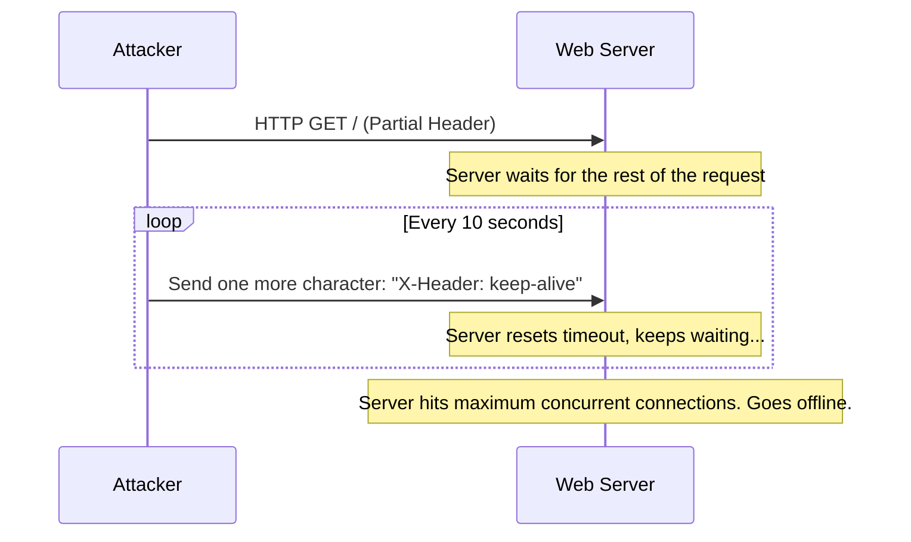

# Module 17: Application Layer Attacks (Slowloris)
## 1. What is it? (Explain from scratch for a complete beginner)
Unlike volumetric DDoS attacks that try to overwhelm a server with sheer force and millions of packets, Slowloris is a "low and slow" attack. Imagine someone walking up to a bank teller and speaking incredibly slowly, taking five minutes between every single word. The teller cannot help anyone else while they wait for the person to finish their sentence. Slowloris does this to web servers. It opens a web connection and sends pieces of a request at a painfully slow pace, keeping the server's connection slots occupied until legitimate users are entirely blocked out.

## 2. Attack Architecture / Flow


## 3. Implementation / Code
```python
# Defensive Code: Detecting Slowloris via Connection Timeout & Byte Rate
def detect_slowloris(active_connections, current_time):
    # Minimum bytes per second a legitimate client should send
    min_bytes_per_sec = 10
    
    for conn_id, conn_data in active_connections.items():
        duration = current_time - conn_data['start_time']
        
        # Only evaluate connections open longer than 30 seconds
        if duration > 30:
            bytes_per_sec = conn_data['bytes_received'] / duration
            
            if bytes_per_sec < min_bytes_per_sec:
                print(f"[!] Slowloris Alert! Connection {conn_id} is suspiciously slow: {bytes_per_sec:.2f} B/s. Terminating.")

# Example Usage
# Connection 1: Open for 45 seconds, but only sent 50 bytes total.
conns = {
    "conn_001": {'start_time': 100, 'bytes_received': 50}
}
detect_slowloris(conns, current_time=145)
```

## 4. Line-by-Line Explanation
- `min_bytes_per_sec = 10`: Defines our standard. Legitimate web requests transfer data much faster than 10 bytes a second.
- `duration = current_time - conn_data['start_time']`: Calculates exactly how many seconds the connection has been held open.
- `if duration > 30:`: Gives clients a grace period. We only analyze connections that have been open for an unusually long time.
- `bytes_per_sec = conn_data['bytes_received'] / duration`: Calculates the average speed of data transfer for this connection.
- `if bytes_per_sec < min_bytes_per_sec:`: If a connection is open a long time but transferring almost no data, it matches the Slowloris profile.

## 5. Summary
Application layer attacks like Slowloris prove that you don't need a massive amount of bandwidth to take down a server. Defenders must enforce strict timeouts and minimum data-transfer rates to prevent attackers from hoarding server resources with "low and slow" techniques.