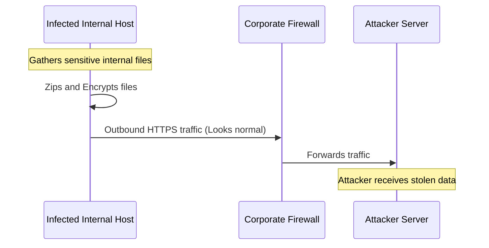

# Module 18: Data Exfiltration
## 1. What is it? (Explain from scratch for a complete beginner)
Data Exfiltration is the cyber equivalent of smuggling. Once an attacker has broken into a network and found sensitive data (like credit card numbers or secret blueprints), they have to get it out of the network without sounding the alarm. Because firewalls block incoming attacks, attackers often encrypt the stolen data and send it outbound, hiding it in normal-looking web traffic or file transfers so the security team thinks it's just an employee uploading a document.

## 2. Attack Architecture / Flow


## 3. Implementation / Code
```python
# Defensive Code: Baseline Outbound Traffic Anomaly Detection
def detect_exfiltration(daily_outbound_logs, baseline_mb=500, spike_multiplier=3):
    alerts = []
    
    for host_ip, bytes_sent in daily_outbound_logs.items():
        mb_sent = bytes_sent / (1024 * 1024)
        
        # If the host exceeds normal daily limits drastically
        if mb_sent > (baseline_mb * spike_multiplier):
            alerts.append(f"[CRITICAL] Exfiltration Alert: {host_ip} transferred {mb_sent:.2f} MB outbound! Normal is ~{baseline_mb} MB.")
            
    return alerts

# Example Usage
logs = {
    "10.0.0.15": 104857600,   # 100 MB (Normal)
    "10.0.0.99": 5368709120   # 5120 MB (Suspicious!)
}
for alert in detect_exfiltration(logs):
    print(alert)
```

## 4. Line-by-Line Explanation
- `baseline_mb=500`: Establishes that an average employee uploads about 500 MB of data to the internet per day.
- `spike_multiplier=3`: Sets a threshold. If someone uploads 3 times the baseline, it's highly suspicious.
- `mb_sent = bytes_sent / (1024 * 1024)`: Converts raw network bytes into readable Megabytes.
- `if mb_sent > (baseline_mb * spike_multiplier):`: Compares the host's daily outbound traffic against the established maximum threshold.
- `alerts.append(...)`: Generates a critical alert pointing directly to the IP address hoarding and smuggling data out of the network.

## 5. Summary
Preventing intruders from breaking in is only half the battle. Monitoring outbound traffic to detect anomalies and massive data transfers is critical for stopping Data Exfiltration. If you catch the smuggling attempt, the attacker leaves empty-handed.