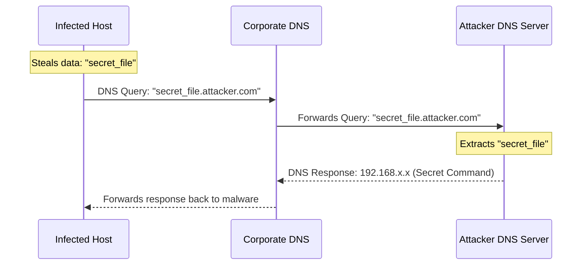

# Module 19: DNS Tunneling
## 1. What is it? (Explain from scratch for a complete beginner)
DNS (Domain Name System) is the phonebook of the internet; it turns names like "google.com" into IP addresses. Because almost every network allows DNS traffic to flow freely, attackers use it as a secret tunnel. Instead of asking for a real website, malware asks for a fake website containing hidden, stolen data (e.g., "password123.attacker.com"). The firewall sees a "normal" DNS request and lets it through. The attacker's server receives the request, strips off the data ("password123"), and replies with commands disguised as a DNS response.

## 2. Attack Architecture / Flow


## 3. Implementation / Code
```python
# Defensive Code: Detecting DNS Tunneling via Subdomain Length and Entropy
import math

def calculate_entropy(string):
    # Calculates the randomness (entropy) of a string.
    prob = [float(string.count(c)) / len(string) for c in set(string)]
    return -sum(p * math.log(p, 2) for p in prob)

def detect_dns_tunneling(dns_queries, length_threshold=45, entropy_threshold=4.0):
    for query in dns_queries:
        # Extract just the subdomain part (e.g., 'a8b7c6d5e4' from 'a8b7c6d5e4.evil.com')
        subdomain = query.split('.')[0]
        
        # Tunneling usually uses very long, random-looking subdomains to fit data
        if len(subdomain) > length_threshold or calculate_entropy(subdomain) > entropy_threshold:
            print(f"[!] DNS Tunneling Alert: Highly suspicious query -> {query}")

# Example Usage
queries = ["www.google.com", "mail.yahoo.com", "z3x9v2b4n7m1q8w5e2r0.attacker.com"]
detect_dns_tunneling(queries)
```

## 4. Line-by-Line Explanation
- `def calculate_entropy(string):`: A mathematical function that measures how "random" a string looks. Normal words have low entropy; encrypted data has high entropy.
- `subdomain = query.split('.')[0]`: Takes a full web address and isolates the very first part (the subdomain).
- `if len(subdomain) > length_threshold...`: Attackers need to stuff a lot of data into the subdomain, making it unnaturally long. This checks if it's too long.
- `or calculate_entropy(subdomain) > entropy_threshold:`: Checks if the subdomain looks like random garbage (encrypted data) rather than a real word like "mail" or "www".
- `print(...)`: Alerts the security team to the covert tunnel.

## 5. Summary
Attackers love DNS tunneling because DNS is rarely blocked or deeply inspected by firewalls. By applying mathematical concepts like entropy and length thresholds, defenders can spot encrypted data masquerading as normal internet phonebook lookups.