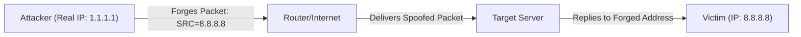

# Module 20: IP Spoofing
## 1. What is it? (Explain from scratch for a complete beginner)
When you send a physical letter, you write your return address in the top left corner. But nothing stops you from writing someone else's address there. IP Spoofing is the digital version of this. An attacker alters the network packet to forge the "Source IP address." They do this to hide their true identity, bypass firewalls that only trust specific IPs, or to trick servers into sending massive amounts of data to a victim (as seen in UDP Amplification). 

## 2. Attack Architecture / Flow


## 3. Implementation / Code
```python
# Defensive Code: Ingress Filtering (Anti-Spoofing Pseudo-code)
def verify_ingress_traffic(packet, interface_expected_subnet):
    '''
    Simulates a router interface checking if the source IP of a packet 
    actually belongs to the network connected to that interface.
    '''
    src_ip = packet['src_ip']
    
    # In a real scenario, this uses IP math (CIDR). We use a basic string check for simplicity.
    if src_ip.startswith(interface_expected_subnet):
        return "Packet Accepted: Source IP matches interface routing rules."
    else:
        # BCP38: Network Ingress Filtering principle
        return f"[!] SPOOFING DETECTED: Packet dropped. {src_ip} shouldn't come from this interface!"

# Example Usage
# Router Interface 1 is connected to the 10.0.0.x network.
valid_packet = {'src_ip': '10.0.0.5', 'dst_ip': '8.8.8.8'}
spoofed_packet = {'src_ip': '192.168.1.1', 'dst_ip': '8.8.8.8'}

print(verify_ingress_traffic(valid_packet, "10.0.0."))
print(verify_ingress_traffic(spoofed_packet, "10.0.0."))
```

## 4. Line-by-Line Explanation
- `def verify_ingress_traffic(...)`: Defines a function representing a security check on a router interface.
- `interface_expected_subnet`: Represents the valid IP addresses that exist on the network physically plugged into this router port.
- `if src_ip.startswith(interface_expected_subnet):`: Checks if the packet's return address matches the physical location it just came from.
- `return f"[!] SPOOFING DETECTED..."`: If a packet claims to be from an external IP but comes from an internal network cable (or vice versa), the router drops it immediately.

## 5. Summary
IP spoofing undermines trust on the internet. The primary defense against IP spoofing is Network Ingress Filtering (BCP38), where routers strictly verify that traffic entering their interfaces actually belongs to the IP subnets assigned to those interfaces.