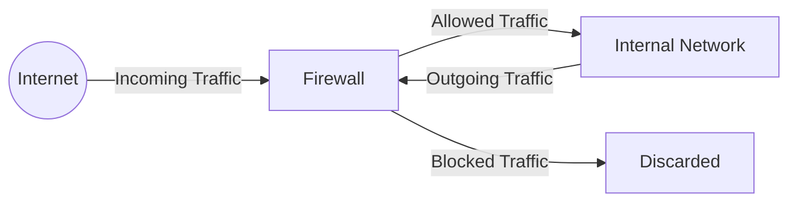

# Module 21: Firewalls (The Perimeter)
## 1. What is it? (Explain from scratch for a complete beginner)
A firewall is like a security guard at the entrance of a building. It sits between your computer network (or a single computer) and the internet, checking all the digital traffic trying to come in or go out. If the traffic follows the rules (like having the right ID badge), the firewall lets it through. If it doesn't, the firewall blocks it. This prevents hackers, viruses, and malicious data from entering your system.

## 2. System Architecture


## 3. Implementation
Here is a simple example of how you might use Python (using `iptc` library) to add a firewall rule in Linux to block an IP address, or conceptually how rules are defined:

```python
# Conceptual Python representation of adding a firewall rule
class SimpleFirewall:
    def __init__(self):
        self.block_list = []

    def add_rule(self, ip_address):
        self.block_list.append(ip_address)
        print(f"Rule added: Block all traffic from {ip_address}")

    def inspect_traffic(self, source_ip):
        if source_ip in self.block_list:
            return "Blocked"
        return "Allowed"

fw = SimpleFirewall()
fw.add_rule("192.168.1.100")
print(fw.inspect_traffic("192.168.1.100")) # Blocked
print(fw.inspect_traffic("10.0.0.5"))      # Allowed
```

## 4. Line-by-Line Explanation
1. `class SimpleFirewall:`: Creates a blueprint for our simulated firewall.
2. `def __init__(self): self.block_list = []`: Initializes the firewall with an empty list of blocked IPs.
3. `def add_rule(self, ip_address):`: Defines a method to add a new rule.
4. `self.block_list.append(ip_address)`: Adds the specified IP to the block list.
5. `print(...)`: Confirms the rule was added.
6. `def inspect_traffic(self, source_ip):`: Method to check incoming traffic.
7. `if source_ip in self.block_list:`: Checks if the incoming IP is in our banned list.
8. `return "Blocked"`: If it is, reject the traffic.
9. `return "Allowed"`: If not, let the traffic through.

## 5. Summary
Firewalls are the first line of defense in network security. They act as a barrier between your internal network and the wild internet, filtering traffic based on predefined rules to keep unauthorized or malicious traffic out while letting legitimate communication happen.
