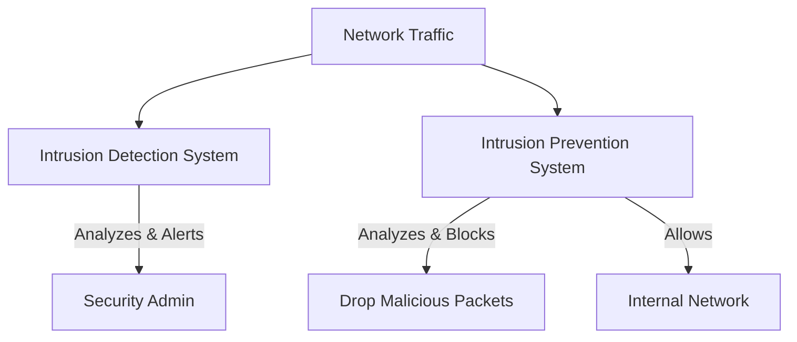

# Module 22: IDS and IPS (Intrusion Detection/Prevention)
## 1. What is it? (Explain from scratch for a complete beginner)
If a firewall is the security guard at the door, an **Intrusion Detection System (IDS)** is the security camera inside the building. It watches network traffic and alerts you if it sees anything suspicious (like a break-in attempt). An **Intrusion Prevention System (IPS)** takes it a step further: it's a security camera equipped with automated traps. When the IPS sees an attack, it doesn't just alert you; it actively blocks the attack from happening.

## 2. System Architecture


## 3. Implementation
Here is a conceptual Python example showing the difference between IDS and IPS logic:

```python
class SecuritySystem:
    def __init__(self, mode):
        self.mode = mode # 'IDS' or 'IPS'
        self.signatures = ["sql_injection", "malware_signature_xyz"]

    def analyze_packet(self, packet_content):
        for sig in self.signatures:
            if sig in packet_content:
                if self.mode == 'IDS':
                    return "ALERT: Malicious traffic detected!"
                elif self.mode == 'IPS':
                    return "BLOCKED: Malicious traffic stopped!"
        return "Allowed"

ids = SecuritySystem('IDS')
print("IDS:", ids.analyze_packet("normal_web_request"))
print("IDS:", ids.analyze_packet("some_text_with_sql_injection"))

ips = SecuritySystem('IPS')
print("IPS:", ips.analyze_packet("some_text_with_sql_injection"))
```

## 4. Line-by-Line Explanation
1. `class SecuritySystem:`: Blueprint for our IDS/IPS.
2. `def __init__(self, mode):`: Sets up the system to act as either an IDS or IPS.
3. `self.signatures = [...]`: A list of known bad patterns (signatures) to look for.
4. `def analyze_packet(self, packet_content):`: Takes a chunk of network data (packet) to inspect.
5. `for sig in self.signatures:`: Loops through known threats.
6. `if sig in packet_content:`: Checks if the threat pattern is in the packet.
7. `if self.mode == 'IDS': return "ALERT..."`: If it's an IDS, it just warns us.
8. `elif self.mode == 'IPS': return "BLOCKED..."`: If it's an IPS, it actively blocks the data.
9. `return "Allowed"`: If no threats match, traffic passes safely.

## 5. Summary
An IDS monitors and alerts on potential attacks but doesn't stop them, whereas an IPS monitors, alerts, and actively takes action to block the threats. Together with firewalls, they provide deep layered security for networks.
