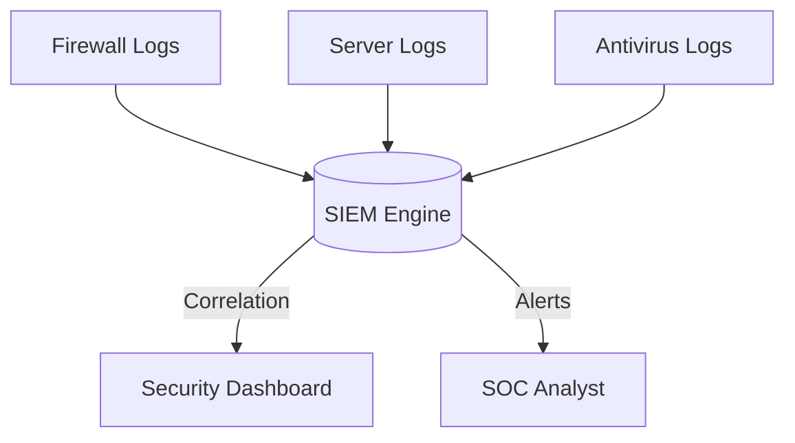

# Module 23: SIEM (Security Information and Event Management)
## 1. What is it? (Explain from scratch for a complete beginner)
Imagine a massive factory with thousands of sensors, alarms, and cameras. It would be impossible for one person to watch them all individually. A **SIEM (Security Information and Event Management)** system is like the central control room. It collects logs (records of events) from firewalls, computers, IDS/IPS, and servers, puts them all in one place, and analyzes them to find hidden patterns. If someone logs in from New York and China at the exact same time, the SIEM connects the dots and sounds a unified alarm.

## 2. System Architecture


## 3. Implementation
Here is a Python script demonstrating how a SIEM correlates events to detect a "Brute Force" attack (multiple failed logins followed by a success):

```python
from collections import defaultdict
import time

class MiniSIEM:
    def __init__(self):
        self.failed_logins = defaultdict(int)

    def process_log(self, user, action):
        if action == "LOGIN_FAILED":
            self.failed_logins[user] += 1
            if self.failed_logins[user] > 3:
                print(f"SIEM ALERT: Possible Brute Force Attack on {user}!")
        elif action == "LOGIN_SUCCESS":
            if self.failed_logins[user] > 3:
                print(f"CRITICAL SIEM ALERT: Compromised account {user} (Brute Force Succeeded)!")
            self.failed_logins[user] = 0 # Reset on success

siem = MiniSIEM()
siem.process_log("admin", "LOGIN_FAILED")
siem.process_log("admin", "LOGIN_FAILED")
siem.process_log("admin", "LOGIN_FAILED")
siem.process_log("admin", "LOGIN_FAILED") # Triggers alert
siem.process_log("admin", "LOGIN_SUCCESS") # Triggers critical alert
```

## 4. Line-by-Line Explanation
1. `from collections import defaultdict`: Imports a helpful dictionary to count things.
2. `class MiniSIEM:`: Creates our SIEM class.
3. `self.failed_logins = defaultdict(int)`: Keeps track of how many times each user fails to log in.
4. `def process_log(self, user, action):`: Simulates receiving a log entry.
5. `if action == "LOGIN_FAILED":`: If the log says the login failed...
6. `self.failed_logins[user] += 1`: Increase the fail count for that user by 1.
7. `if self.failed_logins[user] > 3:`: If they failed more than 3 times...
8. `print(...)`: Generate a warning alert.
9. `elif action == "LOGIN_SUCCESS":`: If they finally log in...
10. `if self.failed_logins[user] > 3:`: And they previously failed many times, this means the hacker guessed the password!
11. `print(...)`: Generate a CRITICAL alert.
12. `self.failed_logins[user] = 0`: Reset the counter.

## 5. Summary
A SIEM aggregates data from across the entire IT environment and correlates it to detect complex attacks that a single security device (like a firewall) would miss. It is the central nervous system of a cybersecurity operation.
