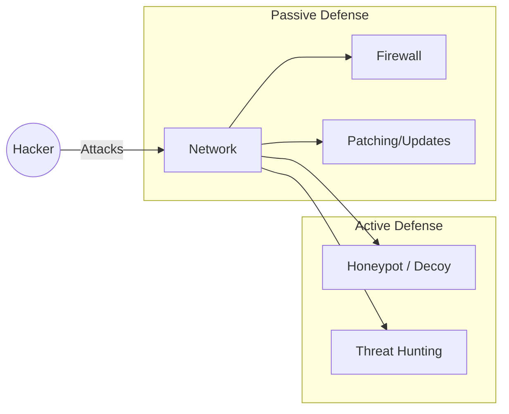

# Module 24: Passive vs Active Defense
## 1. What is it? (Explain from scratch for a complete beginner)
In cybersecurity, **Passive Defense** is like building a strong castle: thick walls (firewalls), strong locks (passwords), and security cameras (IDS). You wait for the enemy to attack and hope your defenses hold. **Active Defense** is sending out scouts, setting booby traps, and actively hunting for threats. Instead of just waiting, you try to confuse the attackers, waste their time (using honeypots), or actively trace where they are coming from.

## 2. System Architecture


## 3. Implementation
Here is a Python example of a simple Active Defense technique called a "Honeypot" (a fake service meant to trap hackers):

```python
import socket

def simple_honeypot():
    # Bind to port 22 (SSH - a common target for hackers)
    s = socket.socket(socket.AF_INET, socket.SOCK_STREAM)
    s.bind(('0.0.0.0', 2222)) # Using 2222 for testing so we don't need root
    s.listen(5)
    print("Honeypot active. Listening for attackers...")
    
    try:
        while True:
            client_socket, address = s.accept()
            print(f"ACTIVE DEFENSE ALERT: Connection from attacker at {address}")
            # Send fake SSH banner to fool the attacker
            client_socket.send(b"SSH-2.0-OpenSSH_8.2p1 Ubuntu-4ubuntu0.1\r\n")
            client_socket.close()
    except KeyboardInterrupt:
        print("Honeypot shut down.")

# simple_honeypot() # Uncomment to run (will block execution)
print("Honeypot script ready to deploy.")
```

## 4. Line-by-Line Explanation
1. `import socket`: Imports the library needed for network communication.
2. `def simple_honeypot():`: Defines our active defense trap.
3. `s = socket.socket(...)`: Creates a network socket.
4. `s.bind(('0.0.0.0', 2222))`: Opens port 2222 on the machine to listen for connections.
5. `s.listen(5)`: Starts listening.
6. `client_socket, address = s.accept()`: When an attacker connects, it grabs their IP address.
7. `print(...)`: Logs the attacker's IP.
8. `client_socket.send(...)`: Sends a fake server banner to make the hacker think they found a real server, wasting their time.
9. `client_socket.close()`: Disconnects them abruptly.

## 5. Summary
Passive defense focuses on hardening the environment and preventing breaches, while active defense involves proactively engaging with, deceiving, or hunting the attackers to disrupt their operations and gather intelligence.
