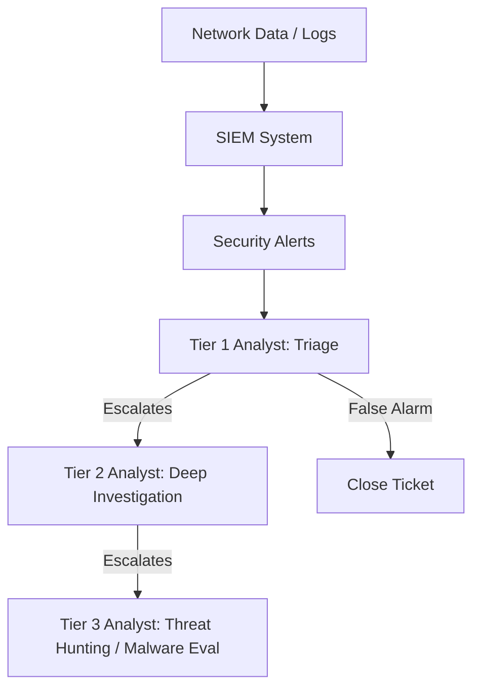

# Module 25: The SOC (Security Operations Center)
## 1. What is it? (Explain from scratch for a complete beginner)
A **Security Operations Center (SOC)** is a physical or virtual room filled with cybersecurity professionals working 24/7. Think of it like a military command center or a 911 dispatch center, but for computer networks. The SOC team constantly monitors the network, uses tools like SIEMs, investigates alerts, and responds to cyber incidents in real-time to stop hackers before they steal data.

## 2. System Architecture


## 3. Implementation
A SOC uses ticket management. Here is a Python script simulating how a SOC Analyst might triage an alert:

```python
class SOCTicket:
    def __init__(self, alert_id, severity, description):
        self.alert_id = alert_id
        self.severity = severity
        self.description = description
        self.status = "Open"

def triage_alert(ticket):
    print(f"Investigating Ticket {ticket.alert_id}: {ticket.description}")
    
    if ticket.severity == "Low":
        print("Action: False positive confirmed. Closing ticket.")
        ticket.status = "Closed"
    elif ticket.severity == "High":
        print("Action: True positive confirmed! Escalating to Incident Response (Tier 2).")
        ticket.status = "Escalated"
    
    print(f"Ticket Status: {ticket.status}\n")

# Simulate SOC alerts arriving
alert1 = SOCTicket(101, "Low", "Failed login from known employee IP.")
alert2 = SOCTicket(102, "High", "Ransomware encryption detected on Server DB-01!")

triage_alert(alert1)
triage_alert(alert2)
```

## 4. Line-by-Line Explanation
1. `class SOCTicket:`: Defines a tracking ticket for a security alert.
2. `def __init__(...)`: Assigns an ID, severity, description, and sets status to "Open".
3. `def triage_alert(ticket):`: A function representing the Tier 1 analyst's job.
4. `if ticket.severity == "Low":`: If the alert is minor...
5. `ticket.status = "Closed"`: Mark it as a false alarm or resolved.
6. `elif ticket.severity == "High":`: If the alert is critical...
7. `ticket.status = "Escalated"`: Pass the ticket up to the senior analysts for immediate action.
8. The final lines create two simulated alerts and pass them through the triage process.

## 5. Summary
The SOC is the human element of cybersecurity. While firewalls and antiviruses automate defense, the SOC is the team of experts that monitor the tools, investigate complex threats, and orchestrate the response when a breach actually happens.
