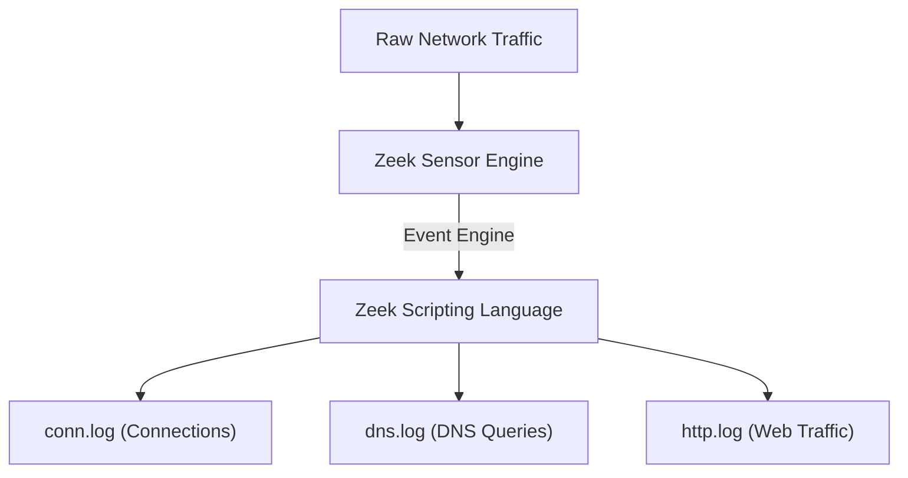

# Module 26: Zeek Network Security Monitor (Architecture)
## 1. What is it? (Explain from scratch for a complete beginner)
**Zeek** (formerly known as Bro) is a powerful, open-source network analysis framework. Unlike a firewall that blocks traffic, or an IDS that only looks for signatures of attacks, Zeek is like a network "flight data recorder." It quietly watches all network traffic and generates highly detailed, structured logs (like spreadsheets) of exactly who talked to whom, what files were downloaded, and what protocols were used. It allows security analysts to look back in time to see exactly what happened during a hack.

## 2. System Architecture


## 3. Implementation
Zeek uses its own scripting language. Here is an example of a Zeek script that prints a message to the console every time someone connects to an SSH server (Port 22):

```zeek
# Zeek Script (save as ssh_monitor.zeek)
event connection_established(c: connection)
    {
    # Check if the destination port is 22 (SSH)
    if ( c$id$resp_p == 22/tcp )
        {
        print fmt("SSH Connection Detected! Source: %s -> Destination: %s", c$id$orig_h, c$id$resp_h);
        }
    }
```
*Note: This is Zeek script syntax, not Python.*

## 4. Line-by-Line Explanation
1. `# Zeek Script`: A comment.
2. `event connection_established(c: connection)`: This is an event handler. Zeek triggers this block of code every time a network connection is successfully established. The `c` variable holds all the data about the connection.
3. `if ( c$id$resp_p == 22/tcp )`: `c$id` contains the connection IDs. `resp_p` stands for Responder Port (the destination port). We check if it is port 22 (SSH) over TCP.
4. `print fmt(...)`: The format print command.
5. `c$id$orig_h`: The Originator Host (Source IP address).
6. `c$id$resp_h`: The Responder Host (Destination IP address).
7. If someone connects via SSH, Zeek instantly prints their IP and the server's IP.

## 5. Summary
Zeek is a passive network monitor that translates complex network packets into easily readable, highly detailed logs. Its powerful scripting language allows analysts to customize exactly what data they want to extract, making it an essential tool for threat hunting and incident response.
