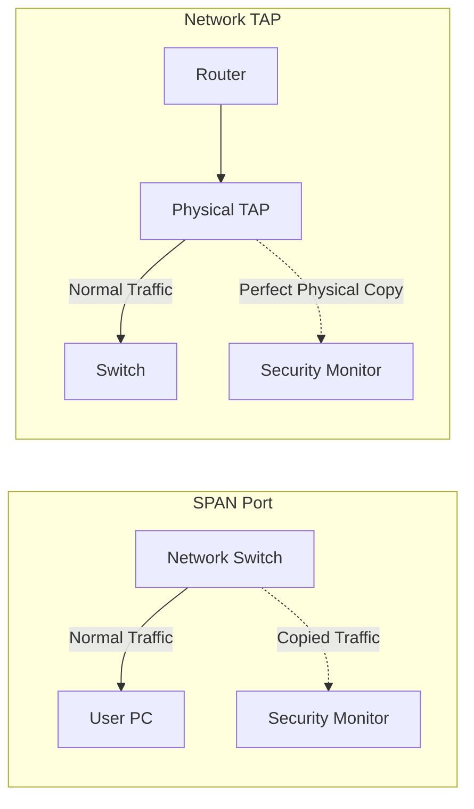

# Module 27: Taps and SPAN Ports (Hardware)
## 1. What is it? (Explain from scratch for a complete beginner)
To monitor a network (using an IDS or Zeek), you need to actually *see* the traffic. Because modern networks use switches (which only send traffic to the specific computer it's meant for), you can't just plug in and see everything. 
You have two ways to get a copy of the traffic:
1. **SPAN Port (Port Mirroring):** You tell the network switch to copy all traffic from port 1 and send the copy out of port 2 (where your monitor is plugged in).
2. **Network TAP:** A physical piece of hardware you plug the cables into. It physically splits the light or electrical signal and sends a perfect, unalterable copy to your monitor.

## 2. System Architecture


## 3. Implementation
There is no code for this, as it is a physical/networking configuration. However, we can simulate the concept in Python to understand how traffic copying works conceptually:

```python
class NetworkSwitch:
    def __init__(self):
        self.span_port = None

    def configure_span(self, monitor_device):
        self.span_port = monitor_device
        print("SPAN Port configured. Copying traffic to monitor.")

    def route_traffic(self, packet, destination):
        # 1. Normal routing
        print(f"Routing '{packet}' to {destination}")
        
        # 2. SPAN / Mirroring logic
        if self.span_port:
            print(f"--> SPAN PORT COPY: Sending copy of '{packet}' to {self.span_port}")

switch = NetworkSwitch()
switch.configure_span("Zeek_IDS_Sensor")
switch.route_traffic("GET /bank_details HTTP/1.1", "Web_Server")
```

## 4. Line-by-Line Explanation
1. `class NetworkSwitch:`: Simulates a network switch.
2. `self.span_port = None`: By default, mirroring is off.
3. `def configure_span(self, monitor_device):`: Tells the switch which device should receive the copied traffic.
4. `def route_traffic(...)`: Simulates a packet passing through the switch.
5. `print(...)`: Represents the packet successfully going to its normal destination.
6. `if self.span_port:`: Checks if mirroring is turned on.
7. `print(...)`: If on, it sends an exact copy of the data to the security monitor.

## 5. Summary
Taps and SPAN ports are the physical and logical mechanisms used to feed network traffic into security tools. Taps are physical, fail-safe devices that guarantee 100% visibility, while SPAN ports use software on a switch to mirror traffic, which is cheaper but can drop packets if the switch gets too busy.
