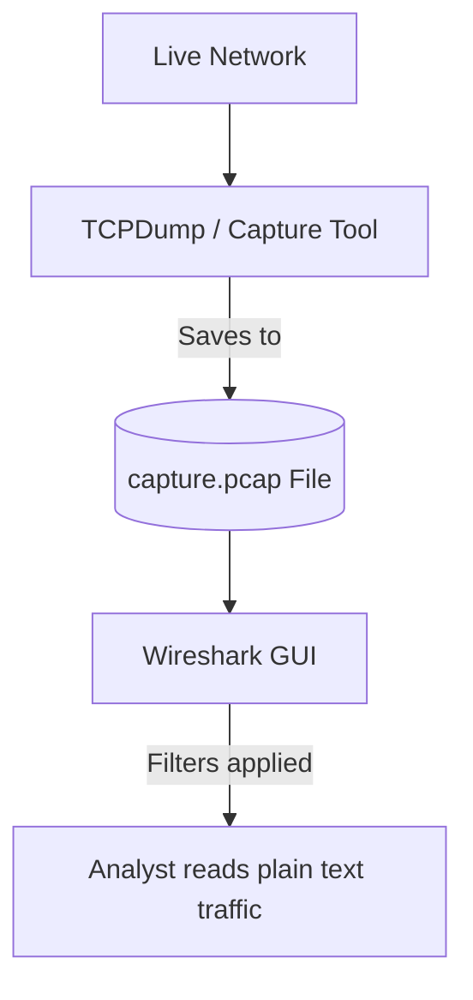

# Module 28: PCAP Analysis (Wireshark)
## 1. What is it? (Explain from scratch for a complete beginner)
**PCAP (Packet Capture)** is a file format that stores recorded network traffic. Think of it like an audio recording of a phone call, but for computers. **Wireshark** is the most famous tool used to open, read, and analyze these PCAP files. If a hacker breaches your system, you can open the PCAP file in Wireshark to read exactly what commands they typed, what files they stole, and how they got in.

## 2. System Architecture


## 3. Implementation
While Wireshark is a GUI tool, we can use the Python library `scapy` to programmatically analyze a PCAP file or live packets. Here is how you extract basic info from a packet using Python:

```python
from scapy.all import IP, TCP, rdpcap

def analyze_packet_concept():
    # Simulating a captured packet (IP layer + TCP layer + Raw Data)
    simulated_packet = IP(src="192.168.1.10", dst="10.0.0.5") / TCP(dport=80) / b"GET /admin_login HTTP/1.1"
    
    # Analyze it like Wireshark would
    if IP in simulated_packet:
        source = simulated_packet[IP].src
        destination = simulated_packet[IP].dst
        print(f"Source IP: {source}")
        print(f"Dest IP:   {destination}")
        
    if TCP in simulated_packet:
        print(f"Dest Port: {simulated_packet[TCP].dport}")
        
    if simulated_packet.haslayer('Raw'):
        print(f"Payload:   {simulated_packet.getlayer('Raw').load.decode('utf-8')}")

analyze_packet_concept()
```

## 4. Line-by-Line Explanation
1. `from scapy.all import IP, TCP`: Imports Scapy, a powerful Python tool for packet manipulation.
2. `simulated_packet = ...`: We manually craft a network packet to simulate reading one from a PCAP file. It has an IP address, a TCP port (80 for HTTP), and raw text payload.
3. `if IP in simulated_packet:`: Checks if the packet contains Internet Protocol data.
4. `simulated_packet[IP].src`: Extracts the sender's IP address.
5. `if TCP in simulated_packet:`: Checks if it uses the TCP protocol.
6. `simulated_packet.haslayer('Raw')`: Checks if there is actual application data (like a web request) inside the packet.
7. `...load.decode('utf-8')`: Extracts the raw text, decoding it so it is human-readable.

## 5. Summary
PCAP files are the ultimate source of truth in network security, containing the raw bytes of communication. Tools like Wireshark (and Python's Scapy) allow security analysts to dissect these files packet-by-packet to uncover the exact anatomy of a cyberattack.
