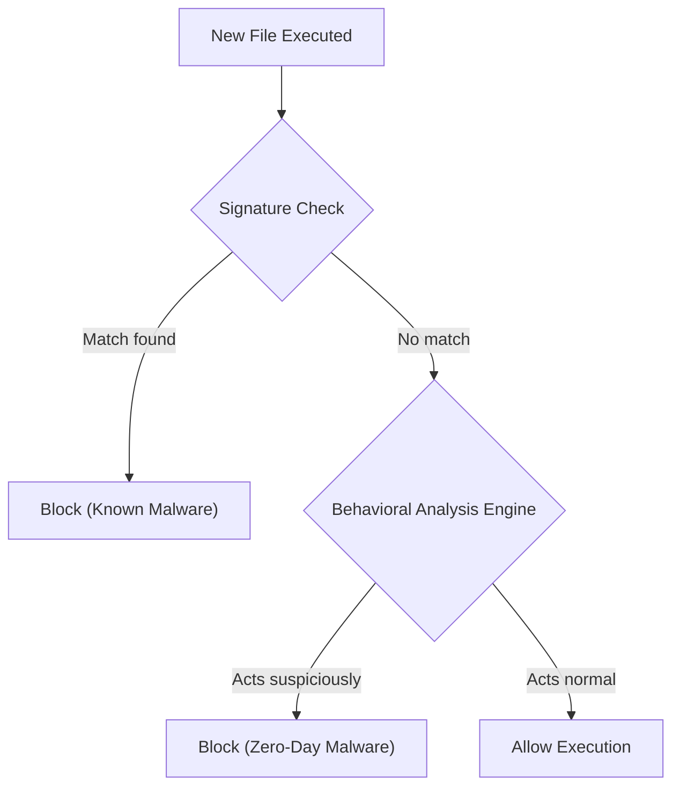

# Module 29: Behavioral Heuristics vs Signatures
## 1. What is it? (Explain from scratch for a complete beginner)
Antiviruses and security tools catch bad guys in two main ways. 
**Signatures** are like police "Wanted" posters. If a file's fingerprint perfectly matches a known virus on the poster, it's blocked. But what if the hacker creates a brand new virus? The signature won't match.
That's where **Behavioral Heuristics** come in. This is like a security guard watching how someone *acts*. If a brand new program suddenly tries to quietly delete all your backup files and encrypt your hard drive, the behavioral engine stops it, not because it recognizes the program's face, but because its *behavior* is malicious.

## 2. System Architecture


## 3. Implementation
Here is a Python script demonstrating the difference between checking a signature (hash) and checking behavior (actions):

```python
class SecurityAgent:
    def __init__(self):
        self.known_signatures = ["bad_hash_123", "virus_hash_456"]
    
    def scan_file(self, file_hash, file_actions):
        # 1. Signature Analysis
        if file_hash in self.known_signatures:
            return "BLOCKED: Known signature matched!"
            
        # 2. Behavioral Heuristics Analysis
        suspicious_score = 0
        for action in file_actions:
            if action == "disable_antivirus":
                suspicious_score += 50
            if action == "encrypt_files":
                suspicious_score += 50
                
        if suspicious_score >= 100:
            return "BLOCKED: Suspicious behavior detected (Ransomware-like)!"
            
        return "ALLOWED: File appears safe."

agent = SecurityAgent()

# Scenario 1: Known virus
print("Test 1:", agent.scan_file("virus_hash_456", ["print_hello"]))

# Scenario 2: Brand new virus (Zero-day) doing bad things
print("Test 2:", agent.scan_file("brand_new_hash_999", ["disable_antivirus", "encrypt_files"]))

# Scenario 3: Normal program
print("Test 3:", agent.scan_file("good_hash_001", ["read_config_file", "show_ui"]))
```

## 4. Line-by-Line Explanation
1. `class SecurityAgent:`: Represents our antivirus software.
2. `self.known_signatures = [...]`: A database of known "Wanted" posters (file hashes).
3. `def scan_file(self, file_hash, file_actions):`: Examines both the file's ID (hash) and what it tries to do.
4. `if file_hash in self.known_signatures:`: **Signature Check.** If the hash matches, block it instantly.
5. `suspicious_score = 0`: **Behavior Check.** We start keeping a score of how shady the program acts.
6. `if action == "disable_antivirus": suspicious_score += 50`: Legitimate programs rarely do this.
7. `if suspicious_score >= 100:`: If it crosses a threshold, block it, even if we've never seen the file hash before.

## 5. Summary
While signature-based detection is fast and perfectly accurate for known threats, it is useless against new, unseen malware. Behavioral heuristics analyze what a program attempts to do, allowing security systems to catch brand new "zero-day" attacks based purely on malicious actions.
