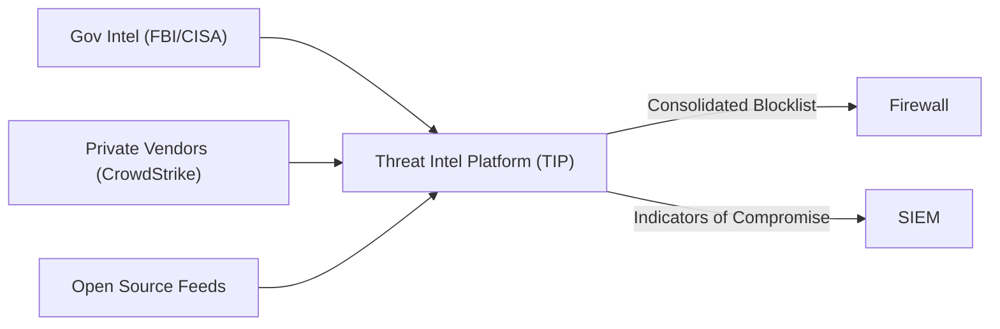

# Module 30: Threat Intelligence Fusion
## 1. What is it? (Explain from scratch for a complete beginner)
**Threat Intelligence** is information about hackers, their tools, and their IP addresses. **Fusion** is the process of taking threat intelligence from many different sources (the FBI, cybersecurity companies, open-source lists) and combining it into one central system. Your security tools (like your SIEM or Firewall) then consume this "fused" list. If the FBI reports a new Russian hacking server IP, your Threat Intelligence Fusion center instantly updates your firewall to block it, before the hacker ever targets you.

## 2. System Architecture


## 3. Implementation
Here is a Python script showing how a Fusion system might pull IP addresses from multiple feeds, remove duplicates, and generate a master blocklist:

```python
def fetch_gov_intel():
    return ["198.51.100.1", "203.0.113.5"] # Simulated data

def fetch_osint_intel():
    return ["203.0.113.5", "104.28.1.1"] # Notice the duplicate

def threat_intelligence_fusion():
    print("Initiating Threat Intel Fusion...")
    
    # 1. Gather data from all sources
    gov_ips = fetch_gov_intel()
    osint_ips = fetch_osint_intel()
    
    # 2. Fuse and deduplicate (using a Python Set)
    master_blocklist = set()
    master_blocklist.update(gov_ips)
    master_blocklist.update(osint_ips)
    
    print(f"Fusion Complete. Generated Master Blocklist with {len(master_blocklist)} unique IPs.")
    
    # 3. Deploy to security tools
    print("Deploying to Firewall...")
    for ip in master_blocklist:
        print(f" -> Adding FW Block Rule: {ip}")

threat_intelligence_fusion()
```

## 4. Line-by-Line Explanation
1. `def fetch_gov_intel():`: Simulates downloading a threat list from a government agency.
2. `def fetch_osint_intel():`: Simulates downloading a list from an open-source community.
3. `master_blocklist = set()`: Creates a Python `set`. Sets are data structures that automatically remove duplicate entries.
4. `master_blocklist.update(gov_ips)`: Adds the government IPs to the set.
5. `master_blocklist.update(osint_ips)`: Adds the OSINT IPs. The duplicate "203.0.113.5" is ignored automatically.
6. `for ip in master_blocklist:`: Loops through the final, clean list of bad IP addresses.
7. `print(f" -> Adding FW Block Rule: {ip}")`: Simulates sending an API command to the firewall to block the bad guys.

## 5. Summary
Threat Intelligence Fusion takes raw data about cyber threats from multiple global sources, cleans it, and transforms it into actionable, automated defense. It allows organizations to proactively protect themselves based on the experiences and intelligence gathered by the rest of the world.
