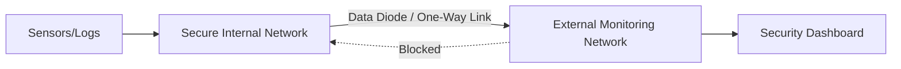

# Module 31: The Unidirectional Network Problem

## 1. What is it? (Explain from scratch for a complete beginner)
Imagine a high-security military base that needs to receive weather updates from the outside world but cannot risk letting any secret data leak out. A unidirectional network, often implemented with a "data diode," solves this by allowing data to travel in only one direction. In cybersecurity, the Unidirectional Network Problem refers to the challenge of getting data out of a highly secure system (like the PS26145 architecture) for monitoring or processing without ever allowing inbound connections that hackers could exploit.

## 2. Architecture / Flow (MUST include a Mermaid flowchart/diagram)


## 3. Implementation (Include Python/React code snippets)
```python
import socket

# UDP is often used for unidirectional communication since it does not require a handshake
def send_secure_data(data):
    udp_ip = "192.168.1.100" # External monitoring server
    udp_port = 5005
    
    sock = socket.socket(socket.AF_INET, socket.SOCK_DGRAM) # UDP
    sock.sendto(data.encode(), (udp_ip, udp_port))
    print("Data sent unidirectionally. No response expected.")

send_secure_data("ALERT: Unauthorized Access Attempt Detected")
```

## 4. Line-by-Line Explanation
1. `import socket`: Brings in the Python library for networking.
2. `def send_secure_data(data)`: Defines a function that takes the data we want to send.
3. `udp_ip = "192.168.1.100"`: Sets the IP address of the external, less-secure network receiving the data.
4. `udp_port = 5005`: Sets the communication port.
5. `sock = socket.socket(...)`: Creates a network socket specifically for UDP (User Datagram Protocol). UDP is connectionless, meaning it just fires data and forgets it, perfect for one-way links.
6. `sock.sendto(...)`: Encodes the data and sends it out.
7. `print(...)`: A simple print statement confirming the action.

## 5. Summary
Unidirectional networks are essential for protecting critical infrastructure. By using hardware data diodes or connectionless protocols like UDP, systems can safely export logs and alerts without opening up a channel for attackers to get in.
